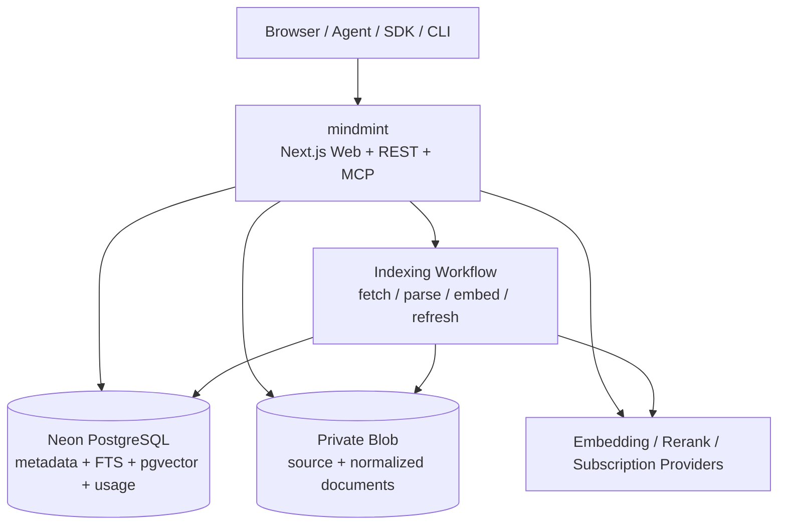

# mindmint 开发与部署架构

- 版本：2.0（简化版）
- 更新日期：2026-08-16
- 状态：MVP 架构基线
- 产品需求：[requirement.md](./requirement.md)

## 1. 架构目标

本架构服务于一个明确的 MVP：公开知识库免费查询，付费用户获得更高额度和个人私有知识库。

系统参考 Context7 的核心模式：

- 后端提供一个稳定的 Library Search 与 Context API；
- MCP、SDK、CLI 和 Web 都是同一 API 的轻量入口；
- 知识库使用稳定 ID、不可变版本和来源侧配置；
- 查询使用旧版本立即响应，过期内容在后台刷新；
- 商业模式采用订阅与用量，不在查询链路中处理发布者分成。

### 1.1 简化原则

1. MVP 使用一个应用、一个数据库和一个对象存储，不拆分 Web、API、Admin 和 Jobs 为独立项目。
2. PostgreSQL 同时保存业务数据、任务状态、全文索引和向量索引。
3. 长任务使用一个后台 Workflow 入口，不引入通用 Event Bus、Kafka 或自管 Queue。
4. REST API 是核心能力；Web、MCP、SDK 和 CLI 不复制业务逻辑。
5. 公开与私有库共用同一数据模型，只在访问策略和套餐能力上不同。
6. 不实现 Quote、Fund Hold、Ledger、Publisher Revenue、Payout 或 Aptos。
7. 先把单库检索、Citation 和版本更新做正确，再考虑多库路由。

## 2. 固定技术栈

| 层 | MVP 选择 | 说明 |
| --- | --- | --- |
| 语言 | Strict TypeScript | Web、API、Workflow、MCP、SDK 和测试统一使用 |
| 应用 | Next.js App Router | 页面、REST API、MCP Endpoint 和管理界面位于同一项目 |
| 部署 | Vercel 单 Project | 首发不拆微服务 |
| 后台任务 | Vercel Workflow | 抓取、解析、Embedding、刷新和删除 |
| 数据库 | Neon PostgreSQL | 用户、Library、Version、Usage、Subscription 和任务状态的权威 |
| 检索 | PostgreSQL FTS + pgvector HNSW | 关键词和向量混合检索 |
| 对象存储 | Vercel Private Blob | 上传文件和规范化文档；公开网站内容可按策略只保存规范化版本 |
| 身份 | Sign in with ChatGPT + API Key | Web 会话和 Agent 调用 |
| 付款 | 外部 Subscription Provider | Checkout、订阅、发票和银行卡数据由 Provider 管理 |
| 遥测 | OpenTelemetry + Vercel Observability | 日志不得包含 Query、凭证或私有正文 |

Redis、独立向量数据库、S3 Object Lock、Kubernetes 和多区域写入都不是 MVP 依赖。只有生产数据证明 PostgreSQL 或平台限额成为瓶颈时才增加组件。

## 3. 部署拓扑



单个 Vercel Project 包含页面、Route Handler、MCP Handler 和 Workflow 定义。所有环境使用独立的 Neon Branch/Project、Blob Store、Provider Key 和订阅测试环境。

### 3.1 运行边界

- 普通 API 请求只执行认证、授权、额度检查、短查询和短事务；
- 抓取网站、克隆仓库、解析 PDF、生成 Embedding 和重建索引进入 Workflow；
- Workflow 每个步骤都从 PostgreSQL 重读状态，允许安全重试；
- 查询路径不等待刷新，新索引未完成时继续使用当前版本；
- 管理界面调用公开的应用 API，不直连数据库。

## 4. 代码结构

MVP 保持单仓库和单应用，避免过早建立大型 Monorepo：

```text
app/
  api/v1/                 # REST API
  mcp/                    # Streamable HTTP MCP endpoint
  dashboard/              # 登录后管理界面
  libraries/              # 公共目录和详情
  pricing/                # 套餐页面
components/
db/
  schema.ts
  migrations/
lib/
  auth/                   # Session、API Key、User Context
  libraries/              # Library、Source、Version 用例
  ingestion/              # Parser、Chunker、Citation、Safety
  retrieval/              # Search、Rerank、Dedup、Formatter
  plans/                  # Plan、Quota、Subscription、Usage
  providers/              # Blob、Embedding、Payment Adapter
workflows/
  index-library.ts
  delete-library.ts
packages/
  sdk/                    # REST 稳定后发布
  mcp-stdio/              # 可选本地包装器
```

约束：

- Route Handler 只调用 `lib/` 中的用例；
- MCP Handler 和 Web Playground 复用与 REST 相同的检索函数；
- Provider SDK 只出现在 `lib/providers/` 或 Workflow；
- 枚举、输入输出 Schema 和错误码集中定义，不能在各入口分别维护；
- `packages/` 只保留真正需要独立发布的客户端包。

## 5. 数据模型

### 5.1 核心表

| 表 | 主要字段和职责 |
| --- | --- |
| `user` | 账户身份与状态 |
| `api_key` | Key Hash、前缀、Owner、Scope、状态 |
| `plan_version` | 套餐能力、请求额度和解析额度 |
| `subscription` | Provider Customer/Subscription ID、Plan、状态和周期 |
| `library` | 稳定 ID、Owner、可见性、生命周期、当前版本 |
| `source` | 类型、URL、配置、凭证引用和刷新策略 |
| `library_version` | 不可变版本、Source Digest、Parser/Embedding Version、状态 |
| `document` | 规范化文档与来源元数据 |
| `chunk` | 正文、Token 数、Citation、FTS Vector、Embedding |
| `usage_event` | 只追加的请求、解析和返回 Token 用量 |
| `workflow_operation` | Index、Refresh、Delete 的状态、Digest、Attempt 和错误 |
| `report` | 举报、审核和处置结果 |

### 5.2 关键字段

- ID 使用 UUIDv7；对外 Library ID 使用不可枚举但可读的 `/publisher/slug`；
- 所有私有资源包含 `owner_user_id`；
- `library.current_version_id` 是唯一线上指针；
- `chunk` 必须包含 `library_id`、`version_id`、`document_id` 和 Citation；
- `usage_event` 使用唯一 `request_id` 防止重复计量；
- API Key 只保存 Hash、Prefix 和 Last Four；
- Provider Credential 使用加密后的 Secret Reference，不保存到 Source JSON。

### 5.3 访问控制

查询 Library 时使用同一条访问规则：

```text
library.visibility = public
OR library.owner_user_id = caller.user_id
```

应用查询和向量检索都必须带 `library_id + version_id`。私有库不能先全局召回再在应用层过滤。

PostgreSQL RLS 可以在私有库功能上线前启用；即使使用 RLS，应用层仍要进行明确授权检查并记录拒绝原因。

## 6. Library 与版本

### 6.1 稳定标识

- 最新版本：`/publisher/library`
- 指定版本：`/publisher/library/v1`
- Library Slug 修改时保留旧 ID Redirect；
- 私有 Library ID 不出现在公共搜索和错误详情中。

### 6.2 来源配置

`knowledge-market.json` 的 JSON Schema 由应用提供，首版字段包括：

- `title`、`description`；
- `include`、`exclude`；
- `rules`；
- `versions`；
- `claim.url`、`claim.public_key`。

对于 Git 仓库，配置文件位于根目录；对于网站和 `llms.txt`，配置文件必须位于被认领的来源域名下。平台抓取配置并比对 Claim URL 与 Public Key 后授予管理权。

### 6.3 Publication Pointer

`library_version` 一旦 Ready 就不可修改。发布事务只做：

1. 验证 Version Ready、安全检查通过且属于同一 Library；
2. 更新 `library.current_version_id`；
3. 把上一个版本标记为 Superseded，但继续保留；
4. 追加 Published Event。

查询在请求开始时固定 Version ID，因此刷新期间不会混合两个版本。

## 7. Ingestion Workflow

```text
create operation
  -> validate source and plan capability
  -> fetch immutable source snapshot
  -> scan malware / prompt injection / unsafe URLs
  -> discover supported documents
  -> parse and normalize
  -> create documents and citations
  -> chunk and count tokens
  -> create embeddings
  -> build FTS and HNSW index
  -> compute quality metrics
  -> mark version ready
  -> atomically publish
```

### 7.1 幂等与恢复

- Operation 使用 `(library_id, source_digest, operation_type)` 唯一约束；
- 每个 Workflow Step 写入稳定状态并可重复执行；
- 外部模型调用保存 Input Digest 和 Provider Request ID；
- 失败 Version 保留错误摘要，但不得成为当前版本；
- 定时 Recovery 扫描超时的 `pending/running` Operation 并恢复；
- 删除操作先撤销访问，再异步清理 Blob、Document、Chunk 和 Embedding。

### 7.2 自动刷新

公开库查询时读取 `last_successful_refresh_at`：

- 未过期：正常返回；
- 已过期且没有活动 Refresh：创建后台 Refresh Operation；
- 已过期且 Refresh 进行中：继续返回当前版本；
- 来源没有变化：更新检查时间，不创建新 Version；
- Refresh 失败：记录错误并保持旧版本可用。

刷新阈值由 Library 热度分级，具体天数存配置而不是写死在业务代码中。私有库默认手动刷新。

## 8. 查询链路

### 8.1 Library Search

`GET /api/v1/libraries/search` 只搜索调用者可见的 Library 元数据，排序考虑：

- 名称匹配；
- Query 与 Description/Tags 的相关性；
- 来源是否已认领或验证；
- Trust Score；
- Benchmark Score；
- Chunk 覆盖量和新鲜度。

返回候选，不自动替用户访问多个知识库。

### 8.2 Context Retrieval

```text
authenticate or identify anonymous caller
  -> resolve plan and quota
  -> load library and pin current version
  -> enforce public/private access
  -> reserve one request unit
  -> FTS + vector recall within the pinned version
  -> reciprocal-rank fusion
  -> rerank, deduplicate and safety filter
  -> trim to max_tokens
  -> append usage event
  -> return chunks + citations + version metadata
```

如果查询失败且没有返回结果，请求是否计入额度由 Plan Policy 决定，但同一 `request_id` 只能产生一个 Usage Event。

### 8.3 输出格式

权威 JSON 格式包含：

- Library ID 和 Version；
- Chunk Text、Score 和 Token Count；
- Source URL、Document Title、Section 和可选行号；
- Trust、Benchmark 和 Freshness 摘要；
- Request ID 和 Usage。

Text Formatter 只把同一 JSON 结果渲染成适合 Agent Context 的 Markdown，不再次查询数据库。

## 9. MCP、SDK 与 CLI

### 9.1 MCP Server

远程 `/mcp` 使用 Streamable HTTP，并保持无服务器会话状态。每个请求从 Header 中读取 API Key 或 OAuth Token。

只注册：

- `resolve-library`
- `query-library`

两个工具标记为 Read Only、Idempotent、Open World。工具参数使用严格 Schema，并兼容少量常见别名，但权威字段名保持稳定。

### 9.2 SDK

TypeScript SDK 只包装 REST API：

```ts
const client = new KnowledgeMarket({ apiKey });

await client.searchLibraries({
  libraryName: "Next.js",
  query: "authentication middleware",
});

await client.getContext({
  libraryId: "/vercel/next.js",
  query: "authentication middleware",
  format: "json",
});
```

SDK 负责认证 Header、超时、有限重试、错误映射和 JSON/Text 类型，不包含检索逻辑。

### 9.3 CLI 与 Skills

REST 与 SDK 稳定后增加：

- `km library <name> <query>`
- `km docs <library-id> <query>`
- `km setup` 安装 Agent Skill 或 MCP 配置；
- `km remove` 删除生成的配置。

CLI 是分发渠道，不是 MVP 后端依赖。

## 10. 套餐、额度与订阅

### 10.1 请求额度

额度检查使用 PostgreSQL 中的 Plan Version 和 Usage 汇总：

- Anonymous：IP + 短周期严格限流；
- Free：API Key/User + 每月 1,000 API Calls；
- Pro：$5 / 月 Subscription + 每月 2,000 API Calls；
- Additional Calls：每个 $5 加购包增加当前账期 2,000 API Calls；

额度判定和 Usage Event 在同一个短事务中完成。首发不需要 Redis；如果 PostgreSQL 计数成为热点，再增加 Redis 作为限流加速层，但最终 Usage 仍以 PostgreSQL 为准。

计费只读取成功受理的 API Call 数。解析 Token、返回 Token、Chunk 数和模型 Token 仍可写入 Usage Event 作为观测字段，但不能参与价格或扣费计算。

### 10.2 Subscription

- Checkout 和 Customer Portal 由 Payment Provider 托管；
- Webhook 按 `(provider, external_event_id)` 唯一约束去重；
- Subscription 保存 `active | past_due | canceled | trialing` 等最小状态；
- 套餐变更保存新 Plan Version，不改写旧 Usage；
- 查询链路不计算金额，不进行资金冻结；
- 月末账单、税务和退款使用 Provider 能力，应用只展示同步状态和链接。

## 11. 安全

### 11.1 来源安全

- 只允许 `https` 和受支持的 Git Provider；
- 抓取前解析 DNS，并阻止私网、Metadata Endpoint、Loopback 和重定向绕过；
- 限制页面数、文件大小、压缩比、抓取深度、时间和并发；
- 上传文件隔离扫描；
- Prompt Injection 分类器在入库前运行，可疑 Chunk 隔离并进入审核；
- Parser 和模型调用使用最小出网权限和明确超时。

### 11.2 查询安全

- MCP Tool Description 明确禁止发送 Secret、个人数据、完整代码或完整对话；
- Query 和私有 Chunk 不写普通日志或 Analytics；
- 公开内容被视为不可信数据，不允许影响系统指令、工具权限或认证；
- 私有检索必须在 SQL 召回前完成访问过滤；
- API Key 使用高熵随机值，只保存 Hash，并支持 Scope、撤销和最后使用时间；
- 所有入口有统一 Rate Limit、最大 Query 长度和最大返回 Token。

## 12. 可观测性与错误

所有请求关联：

- `request_id`
- `trace_id`
- `user_id` 或匿名主体摘要
- `library_id`
- `version_id`
- `workflow_operation_id`（如有）

普通日志只记录状态、时长、计数和稳定错误码，不记录 Query、Chunk、Credential 或 API Key。

最小错误码：

- `library_not_found`
- `library_not_ready`
- `library_suspended`
- `access_denied`
- `quota_exceeded`
- `invalid_api_key`
- `query_too_large`
- `no_relevant_context`
- `source_fetch_failed`
- `parse_failed`
- `index_failed`
- `subscription_required`
- `provider_unavailable`

指标覆盖 API 延迟、检索命中率、无结果率、Refresh Age、Workflow Pending Age、Embedding 成本、额度拒绝和私有访问拒绝。

## 13. 本地开发与环境

### 13.1 本地模式

- Next.js/Vinext 开发服务器；
- 本地 PostgreSQL + pgvector，或 Neon Development Branch；
- Blob 使用本地兼容 Adapter 或独立 Development Store；
- Embedding、Rerank 和 Payment 使用 Stub；
- Workflow 可以同步执行小型 Fixture，E2E 使用真实异步模式。

不得使用 Production 数据、凭证或未经脱敏的数据库副本。

### 13.2 环境变量

```text
DATABASE_URL
BLOB_READ_WRITE_TOKEN
EMBEDDING_PROVIDER_API_KEY
RERANK_PROVIDER_API_KEY
PAYMENT_PROVIDER_SECRET
PAYMENT_WEBHOOK_SECRET
APP_BASE_URL
API_KEY_HASH_SECRET
CREDENTIAL_ENCRYPTION_KEY
```

Client Bundle 中不得出现数据库、Blob、模型或 Payment Secret。

## 14. 测试门槛

### 14.1 必须自动化验证

- 公共 Library 提交、解析、发布和查询；
- 私有 Library Owner 和陌生用户访问矩阵；
- 同一查询固定 Version，不混用刷新中的 Chunk；
- Refresh 失败时旧版本继续可用；
- FTS、向量、融合、重排、去重和 Citation Golden Tests；
- Prompt Injection、Malware、SSRF 和恶意压缩文件；
- API Key 创建、一次性显示、撤销和 Scope；
- Anonymous、Free、Pro 的额度边界和并发请求；
- Webhook 重放、乱序和签名失败；
- 删除私有 Library 后 API、搜索、Blob 和缓存均不可读取；
- REST、MCP 和 Web Playground 对同一请求返回相同 Version 与 Citation。

### 14.2 性能基线

- Library Search 与 Context Retrieval 分别定义 p50/p95/p99；
- 单次请求限制最大候选 Chunk、最大 Rerank 数和最大返回 Token；
- 索引任务限制单 Library 文件数、总字节、总 Token 和执行时间；
- 达到数据库连接或 HNSW 容量阈值后再评估读副本、Redis 或外部 Vector Store。

## 15. 实现顺序

1. 收敛现有站点文案与 Free/Pro 产品模型。
2. 建立 PostgreSQL Schema、Migration、Library ID 和统一 Contract。
3. 实现公共 GitHub/文档网站 Ingestion 与不可变 Version。
4. 实现单库 FTS + pgvector 检索、Citation 和 JSON/Text Formatter。
5. 实现 Library Search、公开 Catalog 和 Library Detail Playground。
6. 实现 REST API 与远程 MCP 的两个工具。
7. 实现账户、API Key、Anonymous/Free Quota 和 Usage Dashboard。
8. 实现 Pro Subscription、个人私有 Library 和 Owner 访问控制。
9. 实现 Claim、自动刷新、Trust/Benchmark 和公共库审核。
10. 发布 TypeScript SDK、CLI、Skills 和更多 Connector。

多库自动路由、按知识库定价、发布者收益和链上存证不在本实现序列中；需要新的需求和架构评审后才能加入。

## 16. 参考实现边界

Context7 公开仓库可参考的部分是 MCP Server、CLI、SDK、AI SDK Tools、Skills、插件结构和公开文档。其生产 API、Parser、Crawler 和索引后端并未开源，因此本项目只借鉴它的产品边界与接入模式，不假设其私有后端实现。

参考：

- [Context7 GitHub](https://github.com/upstash/context7)
- [Context7 API Guide](https://context7.com/docs/api-guide)
- [Adding Libraries](https://context7.com/docs/adding-libraries)
- [Keeping Libraries Fresh](https://context7.com/docs/library-updates)
- [Context7 Plans](https://context7.com/plans)
