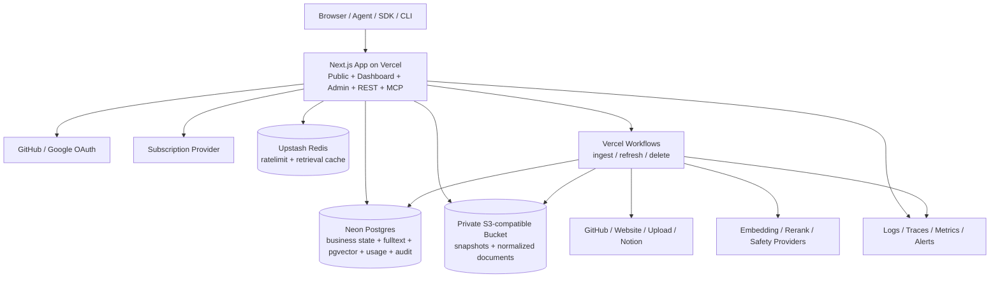
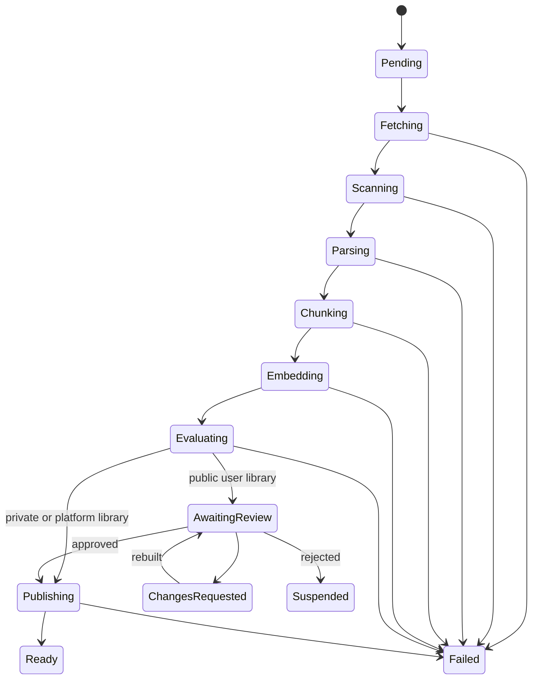

# re0 开发与部署架构

- 版本：3.1
- 更新日期：2026-09-11
- 状态：MVP 架构基线；§4.1 登记专家模块的技术边界
- 产品需求：[requirement.md](./requirement.md)
- 设计依据：[knowleg-market.pen](./knowleg-market.pen)
- Context7 基线：[`f3a818d`](https://github.com/upstash/context7/tree/f3a818d69db694e24d58e3bf803454fb20fc66ea)

## 1. 架构结论

re0 使用一个 TypeScript 代码库交付公共站点、用户 Dashboard、管理后台、REST API 和远程 MCP；耗时的抓取、解析、Embedding、刷新和删除由 Vercel Workflows 执行。

4.0 决策把运行基座从 Vinext/Cloudflare 换到 Vercel + Neon。3.0 换栈的依据是「仓库当前基座是 vinext starter」，而该 starter 已在提交 `306e76a` 中随站点代码一并删除，依据不再成立；仓库目前没有任何应用代码，本次切换的成本仅限文档修订。

| 关注点 | 4.0 决策 |
| --- | --- |
| Web 与 BFF | Next.js App Router，Vercel 原生，不再使用 Vinext 兼容层 |
| 开发者文档站 | [Fumadocs](https://github.com/fuma-nama/fumadocs)，与主应用同一个 Next.js 项目，内容为仓库内 MDX |
| 运行环境 | Vercel Functions |
| 业务数据库 | Neon Postgres + Drizzle |
| 关键词检索 | Postgres 全文检索 + BM25 排序，可重建派生索引 |
| 向量检索 | 同库 pgvector，与 Chunk 同事务；库内召回默认精确扫描，不依赖全局 ANN，见 §9.1 |
| 库级发现 | 库画像（文档标题集 + 实体表 + 聚类质心）+ 全局 GIN 倒排 + scatter-gather 确认，见 §9.6 |
| 对象存储 | Vercel Blob（私有 Blob）；同一 Adapter 接口保留 S3 兼容实现作为退路，见 §1.2 |
| 长任务 | Vercel Workflows |
| 边缘态 | Upstash Redis，只承担匿名限流与检索缓存 |
| 身份 | 可替换 Identity Adapter；首发 GitHub + Google OAuth |
| 支付 | 外部 Subscription Provider Adapter |
| Embedding / Rerank | 外部 AI Provider Adapter，可替换 |
| 契约 | Zod/JSON Schema + OpenAPI，REST 为权威业务入口 |
| 可观测性 | 结构化日志、Trace、Metrics 和错误聚合 |

部署前创建一个共享 Neon Project 和一个共享对象存储 Bucket，并同时连接到 Development、Preview、Production；Upstash Database 与其余有副作用的外部服务仍按环境分别配置。所有环境变量必须由部署平台注入，不得依赖开发者本机状态。

### 1.1 核心原则

1. Web、REST、MCP 和 Admin 复用同一 Application Use Case，不复制授权、检索或计量逻辑。
2. Neon 是业务状态、发布指针、关键词索引和向量的唯一权威；对象存储和缓存是可重建或可清理的派生数据。
3. 查询先授权并固定 Library Version、Policy Version，再进行任何关键词或向量召回。
4. Version 不可变；刷新通过原子切换 `current_version_id` 发布。
5. Workflow 的每一步幂等、可恢复，并以 Digest 和 Operation ID 去重。
6. API/MCP 按成功受理的 Call 计量，计费写入只追加 Usage Event；分成写入只追加 Earning Event，与 Usage Event 同事务。
7. 普通用户身份与管理员身份分离，所有高风险后台动作审计。
8. 不把 Context7 未开源的生产 Parser、Crawler、Index 或 Billing 后端当作可用代码。

### 1.2 选型理由与被否决的替代

本节记录 4.0 决策的取舍，避免后续重复讨论。

**为什么用 Neon 取代 D1 + Vectorize。** 决定性理由不是性能或额度，是**一致性边界**。3.0 形态下 Chunk 正文在 D1、关键词索引在 D1、向量在 Vectorize，三者会漂移，所以发布事务只能覆盖 D1 那一部分，向量与对象的一致性靠写入顺序约定和 Recovery 清理兜底。换成 Neon 后，Chunk、全文索引和向量在同一个 Postgres 事务内，§8.3 的发布事务成为真正的 ACID 事务，孤儿数据这一整类故障随之消失。

**对象存储：2026-09-05 改为 Vercel Blob。** 下面「保留 S3 兼容对象存储」的三条理由当时成立，现在被一个更重的运营理由压过：项目已经完全跑在 Vercel 上，Blob 随部署账户开通，Development / Preview / Production 各一个 Store 只是 Vercel 项目里的一个开关，不必再维护第二家供应商的账号、凭据轮换和 CORS 配置。代价照旧承认：`@vercel/blob` 只有一个实现，所以 `lib/infrastructure/objects/store.ts` 的 `ObjectStore` 接口不变，S3 实现原样保留，Key 布局（§7）对两者相同，换回 S3 兼容存储只是换环境变量。两点与 §7 相关的差异：

1. Blob 没有生命周期规则，§7 里「用存储侧规则清理临时对象」在 Blob 上不成立。向导中途放弃的 PDF 上传（`uploads/` 前缀）由 `drainOperations` 每次收尾时清理（`lib/application/ingestion/purge-uploads.ts`）：列出前缀，减去仍被某个 `pdf` Source 引用的 Key，删除超过 24 小时的剩余对象；也可用 `npm run uploads:purge` 手动执行。失败任务的其他临时对象仍由 Recovery 处理。
2. 浏览器直传不用预签名 PUT，而是服务端用读写 Token 签发一个限定路径、类型、大小和有效期的 Client Token，浏览器用 `@vercel/blob/client` 上传；下载用 `issueSignedToken` + `presignUrl` 生成短时 URL。两种存储的这两个动作都收敛在 `ObjectStore.uploadTicket` 和 `signedUrl` 后面。

**（原）为什么保留 S3 兼容对象存储而不用平台自带的对象服务。** 三条理由，按权重排序：

1. **可移植性**：S3 API 有多家实现，同一个 Adapter 可对 R2、S3、MinIO 等；专有对象服务只有一个实现，换平台时适配器作废。本项目已经历一次平台迁移，可移植性在此已被验证有价值。
2. **原生生命周期规则**：直接满足 §7 关于清理失败任务临时对象和过期导出的要求，不需要自建清理任务。
3. **存储单价**：容量按 GB-月常驻累积，单价差会持续放大。

出网费**不是**主要理由。re0 的检索路径读 Postgres 而非对象存储，真正流向终端用户的只有导出文件和审核用快照，量很小，不是 CDN 型负载。

**为什么 Upstash 只承担两件事。** 匿名限流和检索缓存在上一版是运行平台自带能力，换栈后丢失，Upstash 是补回这两项能力，不是新增能力。明确否决三种扩大用法：

- **不使用 Upstash Vector**：会重新制造「Chunk 与向量分属两个系统」的分裂，直接抵消采用 Neon 的全部收益；
- **不使用 Upstash Workflow / QStash 承担长任务**：Vercel Workflows 已承担该职责，两套持久化执行引擎意味着两套重试语义、两套 Step 状态和两套幂等 Digest 对齐，是负债而非冗余；调度用 Vercel Cron；
- **不把额度计数迁入 Redis**：见 §11.1，Reservation 与 Usage Event 是计费数据，必须与业务库同事务。

**被否决的方案：继续留在 Cloudflare。** 其优势是单一供应商、免费额度更宽、边缘能力自带。放弃它的代价是接受四家供应商的管理面。判断依据是当前处于零代码阶段，Adapter 边界可以一次画对；若已有大量基础设施代码，结论可能相反。

## 2. 与 Context7 的对齐边界

本架构核对了 Context7 同一提交中的 MCP、REST OpenAPI、SDK、CLI、AI SDK Tools、Skills、插件和公开文档。

### 2.1 直接借鉴

- `resolve-library-id` + `query-docs` 两项 MCP 工具；
- 工具的只读、幂等、开放世界注解和敏感查询提示；
- `/mcp` 无状态 HTTP、`/mcp/oauth` 鉴权入口和 stdio 包装器；
- REST 的 Library Search、Context、Policies、Refresh、Add Source 资源形状；
- `/owner/repo`、`/source/slug` 和版本化 Library ID；
- JSON/TXT 双格式，TXT 由结构化结果渲染；
- SDK 的 Bearer Key、超时、有限重试和错误映射；
- CLI 的 setup/remove/library/docs/auth/skill 分发方式；
- 来源侧 JSON 配置、按热度后台刷新、Policy 的 quality/select 模式。

### 2.2 不直接复制

- Context7 MCP 包本质上是其远程 API 的代理，不包含生产检索后端；
- Context7 的生产抓取、解析、Embedding、Rerank、质量评分和计费实现未在公共仓库中完整提供；
- re0 的 Trust Score 使用 0–100，公开库审核和 Free 私有库规则也不同；
- re0 使用自己的命名、Schema、API Host、Key 前缀和自有数据平面；
- Context7 的 `resolve-library-id` 把「从问题提炼库名」外包给调用方 LLM，服务端只做库名/描述的元数据匹配。这在代码文档领域成立——库名是 npm/GitHub 公共标识符，agent 的训练数据里就有。re0 的用户上传库名字与内容常不相关（「昆虫大全」里的「影翅虫」），跨库内容路由是 Context7 从未被迫解决、re0 必须自建的能力，见 §9.6。

## 3. 系统上下文与部署拓扑



### 3.1 运行边界

Edge App 只执行：

- 页面渲染和短 BFF 请求；
- Session/API Key/OAuth Token 认证；
- 工作空间授权、Policy 和套餐检查；
- Library Search、全文与向量召回、融合、短 Rerank 和格式化；
- Workflow 启动、状态读取和发布/删除入口；
- Payment Webhook 验签与幂等入库。

Workflow 执行：

- Git 抓取、网站爬取、Notion 同步和大文件处理；
- 解压、恶意文件检查、Parser、Chunker 和 Citation；
- Embedding 批处理、全文索引与向量写入（与 Chunk 同事务）；
- 质量评估、刷新、重建和数据删除。

普通请求不得同步等待完整 Ingestion。小型文件仍进入 Workflow，以保持同一状态机和重试语义。

### 3.2 环境隔离

`development`、`preview`、`production` 的资源边界如下：

- 共享一个 Neon Project，按环境分支：production 用主分支；每个预览部署由 Neon 集成在构建前自动建一个 `preview/<git 分支>` 子分支，连接串只注入那一次部署（项目级 Preview 变量不变，所以在 Vercel 的环境变量列表里看不到它）；本地开发连一个常驻的 `dev` 子分支（Auto-delete 设为 Never，否则默认一天后被回收）。预览分支上的新迁移由 `vercel.json` 的 `buildCommand` 在 `VERCEL_ENV=preview` 时执行，生产的迁移不在构建里跑，仍按 §19.2 排序；
- 每个环境一个私有对象存储 Bucket（`recall0-blob` / `recall0-blob-preview` / `recall0-blob-dev`），跟着库的分支一起分。**必须分**：`purgeAbandonedUploads` 以「本库没有任何 `pdf` 源引用它」为删除依据，库删除也照着行里的 Key 删对象；库分支了而 Bucket 共用时，非生产环境的这两条路都会删到生产对象。Key 布局（§7）三个 Bucket 相同，由 Workspace、批次和文件 ID 生成；
- 独立 Upstash Database 与 REST Token；
- 独立 OAuth Client、Payment Environment 和 Provider Key；
- 独立 Workflow 名称和 Webhook Secret。

禁止把 Production 数据复制到 Preview。必要的测试数据必须脱敏或由 Fixture 生成。**这条与当前的预览分支实现有冲突**：Neon 集成建的是主分支的写时复制分支，行数据跟着过去。主分支今天只有 Plan 种子，所以尚未违反；在主分支收下第一份真实用户数据之前，预览分支必须换成 schema-only（Neon API 的 `init_source: "schema-only"`），否则每个预览部署都是一份生产数据的副本。

共享一个库带来一条反向约束：**凡是参与加密或哈希数据库内容的 Secret，三套环境必须取同一个值**——`SESSION_SIGNING_SECRET`（封装 GitHub / Notion 授权令牌、派生管理员邀请哈希与 TOTP 种子）、`API_KEY_HASH_SECRET` 和 `CREDENTIAL_ENCRYPTION_KEY`。各持一份时，一个环境写下的行在另一个环境打不开：preview 里连好的 Notion 授权到了生产就解不开，本地发出的管理员邀请在生产完成不了。只与传输或会话有关、不落库的 Secret 不受此约束。

## 4. 代码组织

```text
app/
  (public)/
    page.tsx
    pricing/
    playground/
    libraries/
      [...libraryId]/       # Library Detail
      claim/                # 认领向导
    login/
  docs/                     # Fumadocs 开发者文档站
    layout.tsx
    [[...slug]]/page.tsx
  dashboard/
    page.tsx
    libraries/
    api-keys/
    requests/
    policies/
    revenue/
    settings/
  admin/
    login/
    overview/
    users/
    libraries/
    claims/                 # 认领与争议裁定
    platform-libraries/
    plans/
    billing/
    settlements/
    administrators/
    audit/
  api/v1/
    libraries/
    context/
    claims/
    policies/
    usage/
    requests/
    revenue/
    anchors/
    api-keys/
  api/search/               # Fumadocs 搜索索引
  mcp/
content/
  docs/                     # 文档站 MDX 内容
components/
contracts/
  api/
  errors.ts
  schemas.ts
db/
  schema.ts
  migrations/
  queries/
lib/
  source.ts                 # Fumadocs loader
  application/
    auth/
    libraries/
    claims/
    ingestion/
    retrieval/
    playground/
    policies/
    plans/
    revenue/
    administration/
  domain/
  infrastructure/
    postgres/
    objects/
    cache/
    identity/
    payment/
    ai/
    chain/
    connectors/
workflows/
  index-library.ts
  refresh-library.ts
  delete-library.ts
  anchor-versions.ts
  anchor-audit.ts
  settle-revenue.ts
move/
  re0_anchor/               # 锚定 Move 包，见 §8.5
packages/
  sdk/
  mcp/
  cli/
  tools-ai-sdk/
  verifier/
skills/
plugins/
tests/
  contract/
  integration/
  e2e/
  security/
  fixtures/
```

约束：

- Route Handler 和 MCP Tool 只能调用 `lib/application` Use Case；
- `contracts` 是 REST、MCP、SDK、CLI 和前端共同的权威类型来源；
- Provider SDK 只出现在 `lib/infrastructure` 或 Workflow；
- Domain 不依赖 Next.js、Vercel、Neon、Payment、AI SDK 或链 SDK；
- 管理后台不能直连表，必须经过 Admin Use Case 和 Audit Decorator；
- `packages` 只放需要独立发布的薄客户端，不放服务端检索实现；
- `packages/verifier` 不得 import 任何 `lib/` 代码，见 §8.5；
- `move/` 是链上产物，不参与应用构建：Next.js、typecheck 和 vitest 都不读它，它的工具链是 Aptos CLI，见 [move/README.md](./move/README.md)；
- **文档站是内容，不是应用**：`app/docs` 与 `content/docs` 只读取仓库内 MDX，不访问 Postgres、对象存储或任何 Use Case；它的构建失败不得阻断 API 与 MCP 的部署。

### 4.1 专家模块的技术边界

专家数据与评测赛道（requirement.md §2.4，方案见 [expert-data-track-proposal.md](./expert-data-track-proposal.md)）是同一代码库内的**旁路模块**：它复用基座，不进入知识库的任何主链路。本节只定边界，模块内部设计以方案为准。

**放在哪里。**

```text
app/expert/                       专家区，独立 Layout 与导航，不在 /dashboard 下
app/dashboard/data-assets/        买方控制台（阶段 2）
app/dashboard/evaluations/
app/admin/(console)/expert*/      运营、合规、财务页面
app/api/v1/data-assets/           买方 API（阶段 2）；专家 API 不在首期
app/api/v1/data-exports/
app/api/v1/evaluation-runs/
contracts/expert-data.ts          由 contracts/api/index.ts 导出
lib/domain/expert-data/
lib/application/expert-data/      accounts、profiles、knowledge、orders、projects、
                                  submissions、reviews、assets、licensing、exports、
                                  evaluations、compensation、administration
lib/infrastructure/evaluation/    评测 Runner 与买方模型端点 Adapter
workflows/process-expert-submission.ts
workflows/build-data-asset.ts
workflows/build-data-export.ts
workflows/run-expert-evaluation.ts
workflows/settle-expert-compensation.ts
```

**复用什么，怎么复用。**

| 基座能力 | 复用方式 | 硬边界 |
| --- | --- | --- |
| `user` / OAuth（§5.1） | 只复用登录身份 | 专家身份是独立的 `expert_account`，不是 `workspace_member`；进入 `/expert` 以 `expert_account` 存在为准，普通 Dashboard 的会话解析不读专家表 |
| `workspace` | 只作买方与资产所有权边界 | 专家模块的所有对象以 `expert_account` 为所有者，不引用 `workspace` |
| `administrator` / Permission / Audit Decorator（§5.3、§14） | 直接复用 | 新增 `expert_*`、`data_asset.*`、`data_license.*` 权限；不新增宽泛的 `expert.manage` |
| `api_key` | 新增买方 Scope `assets:read`、`assets:export`、`evals:run` | 现有 Key 默认不获得这些 Scope；专家 Scope 推迟到阶段 4 |
| `ObjectStore`（§7） | 复用 Adapter 与私有 Store | 独立前缀（§7 末尾）；Adapter 之上加按前缀校验调用方的 Guard，Blob 没有前缀级 IAM，隔离全部在应用层 |
| `workflow_operation` / `runOperation`（§8） | 复用持久化 Step、幂等键与 Recovery | 独立 Operation Type 族 `expert.*`，不进入 Library Refresh 队列状态机，不出现在 `/admin/refresh-queue` |
| `audit_log` | 记录高风险管理动作 | 任务正文、Gold、证件、合同正文不进日志 |
| Payment Adapter（§11.3） | 复用外部收付款原则与 Webhook 幂等 | 不复用 `billing_document`、`revenue_period`、`settlement`、`payout`；专家侧有自己的 `expert_settlement` / `expert_payout` |
| `llm_config`（§9.5） | 不复用 | 买方模型凭证用独立的 `evaluation_model_config`，Secret 按 Workspace 隔离加密入库 |
| Anchor（§8.5） | 后续增加 Subject 类型 | 不阻塞发布、授权、导出、评测或付款 |

**不进入什么。** 以下是不变量，任何一条被违反视为缺陷：

- 专家知识与训练样本不写入 `library`、`library_version`、`document`、`chunk`、`library_profile`，不建 `search_vector` 与 `embedding`，不进入 §9 的任何检索路径与缓存；
- `/v1/context`、`/v1/libraries/search`、MCP 两项工具、在线试用不读专家模块的表和前缀；
- 专家数据订单不产生 `usage_reservation`、`usage_event`、`earning_event`，不进入 `revenue_period` 与发布者分成；
- Hidden Eval 的 Payload、Gold 与 Rubric 私有部分不进入普通导出、日志、Trace、Analytics 与前端缓存，只有 Eval Runner 的 Use Case 可读；
- 专家区与知识库 Dashboard 不共享 Layout、导航、i18n 命名空间（专家区用 `expert.*`）和列表查询；
- 删除 `app/expert`、`app/admin/(console)/expert*`、`lib/{domain,application}/expert-data`、`lib/infrastructure/evaluation` 与上述五个 Workflow 后，§18 现有全部测试保持通过，不需要修改或回填任何既有表。

**数据与迁移。** 专家模块的表全部以 `expert_`、`data_`、`media_`、`license_`、`evaluation_`、`acceptance_` 为前缀，只做 Expand 迁移，不修改既有列；金额、ID 与时间遵循 §6.4。Hidden Eval 与普通 Data Item 在同一 Postgres 内以行级状态区分，物理隔离只在对象存储前缀与访问 Guard 上实现。

**分阶段进入代码库。** 阶段 0 只上线专家预注册、资格测试与后台验证队列（Migration 1 中的身份部分）；其余按方案 §17 的门禁推进。阶段 0 门禁未过时，代码库里不出现买方 API、导出与评测 Runner。

## 5. 身份、工作空间与授权

### 5.1 普通用户身份

Identity Adapter 提供统一接口：

```ts
interface IdentityAdapter {
  beginOAuth(provider: "github" | "google", returnTo: string): Promise<Response>;
  handleCallback(request: Request): Promise<IdentityProfile>;
  getSession(request: Request): Promise<UserSession | null>;
  revokeSession(sessionId: string): Promise<void>;
}
```

Identity Provider 的 Subject 是外部身份主键；邮箱只用于展示和验证，不作为资源外键。账户绑定必须要求现有会话或二次验证。

API Key 格式使用 `mm_live_` / `mm_test_` 前缀。服务端只保存：

- Key ID、Hash、Prefix、Last Four；
- Workspace、名称、环境、Scopes；
- Created/Expires/Revoked/Last Used 时间。

完整 Key 只在创建响应中出现一次。

**GitHub 仓库导入授权。** 登录只回答「你是谁」，登录换到的 Provider Token 用完即弃（requirement.md 12）。用户知识库导入 GitHub 仓库时，规则是「只能导入自己控制的、公开且非 Fork 的仓库」——自己名下，或在组织中拥有 admin / maintain 权限（与 §5.4 认领的门槛相同）（`lib/domain/github.ts`），因此向导先要求一次独立的 GitHub 授权（`POST /api/auth/github/connect`，回调 `/api/auth/github/callback/connect`，须与登录回调一起登记在 GitHub App 的 Callback URL 列表里，GitHub App 要求精确匹配），只申请 `read:user read:org`（后者让应用看得见组织成员身份，否则组织仓库列不出来），不申请任何 `repo` 写权限——公开仓库的内容本就无需授权即可读取，这次授权买到的不是内容访问权，而是「列出的是谁的仓库」的证明。换到的 Token 用 Cookie 密封密钥加密后单独存入 `github_connection`（每用户一行，重连即替换），向导用它列出 `affiliation=owner,organization_member&visibility=public` 的仓库并在应用层剔除 Fork 与权限不足的组织仓库（限制第三方应用的组织需先批准本应用，其仓库才会出现）；提交时 `createWorkspaceLibrary` 不信任向导列表，用同一 Token 重读所选仓库，比对 GitHub 返回的 owner id 与授权账号 id、或 `permissions` 中的 admin / maintain，并把仓库 id 写入 `source.config.repositoryId` 供 §5.4 的认领比对。GitHub 回应 401 即视为用户已在 GitHub 侧撤销，连接记录随即删除。

### 5.2 工作空间授权

所有普通资源绑定 `workspace_id`。授权顺序：

1. 解析 Session、API Key 或 MCP OAuth Token；
2. 检查用户、工作空间和 Key 状态；
3. 检查 Membership Role 与 Key Scope；
4. 加载 Plan Version 和 Policy Version；
5. 对具体 Library 执行公开/私有授权。

不得先全局召回私有内容再在应用层过滤。不可见私有 Library 与不存在 Library 使用相同 404 外观。

### 5.3 管理员身份

管理员单独使用 `administrator`、`admin_session`、`admin_role` 和 `admin_permission`：

- 强制 MFA、30 天滑动 Session（每次使用顺延，一个月未使用即失效）且自登录起最长 90 天必须重新认证、停用账户或清除二次验证即刻吊销；
- 不接受普通用户 API Key；
- 角色最小化：Reviewer、Support、Operations、Super Admin；
- 高风险动作要求 `reason`，由统一 Audit Decorator 写入日志；
- Super Admin 权限变更不能由被修改者本人单独完成。

**首位管理员**（requirement.md 3.2）：管理员由邀请产生，但空环境里没有人可以发出第一封邀请，于是 `administrator` 表为空时 `/admin/login` 渲染注册表单而不是登录表单（`offerBootstrap`），提交走 `bootstrapFirstAdministrator`。三点决定它不是一个自助注册后门：

1. **判定在写入里，不在页面里**。插入语句自带 `where not exists (select 1 from administrator)`，决定与写入之间没有空隙；绕过页面直接调用 Server Action 得到的是同一个 `bootstrap_closed`。
2. **并发由 `pg_advisory_xact_lock` 串行化**。两个同时到达的请求在 READ COMMITTED 下会各自读到空表，锁让它们排队，后到的那个看见前者写下的行。
3. **MFA 不因为是第一个就可以跳过**。密钥由服务端从签名密钥派生（`admin-totp:bootstrap`），浏览器不参与选择；必须先提交一个能验证通过的 6 位码，账户才会以 `active` 落库。派生意味着它对任何能打开该页面的人可见——但能打开该页面的人本来就能直接把账户注册掉，所以这不额外让渡什么。

首位管理员固定拿 `super` 角色，注册以 `admin.bootstrap` 记入审计链，操作者与目标都是它自己——这是这套日志里唯一一条没有前置操作者的记录。

### 5.4 来源所有权验证（Claim）

产品规则见 [requirement.md](./requirement.md) 第 7.3 节。这里是授权链路的一部分：`library.owner_workspace_id` 决定谁能改这个库，也决定分成付给谁，因此它的写入路径必须比普通业务写入更严。

- **唯一写入口**：`owner_workspace_id` 只能由「`verified` 的认领」或「管理员争议裁定」写入，不存在第三条路径；Ingestion、审核和刷新都不得触碰该字段；
- **登录身份不是证据**：OAuth Subject 只回答「你是谁」。GitHub 权限校验必须用用户自己的 Token 向 GitHub 查询其对目标仓库的权限级别，并核对返回的仓库 ID 与 `source` 记录一致，不能只比对仓库名字符串；
- **挑战 Token**：高熵随机值，只保存 Hash；与 `(申请人, library_id, 验证方式)` 绑定并带 7 天过期；校验时按 Hash 比对，明文只在生成时返回一次；
- **创建前的域名验证**：Website、`llms.txt`、OpenAPI 三类来源在库存在之前就要证明域名控制权（`lib/domain/domain-verification.ts`、`lib/application/libraries/domain-verification.ts`）。挑战记录在 `domain_verification`，与 `(workspace, host, 验证方式)` 绑定；明文 Token 只返回给发起方，之后每次校验都由客户端带回并按 Hash 比对，错误 Token 与不存在的挑战返回相同结果。`createWorkspaceLibrary` 在写库的同一事务里锁定并消费该挑战（`consumed_library_id`），要求状态为 `verified`、域名与来源 host 完全一致（子域不继承）、验证时间在 1 小时以内，并同事务写入一条 `verified` 的 `library_claim`；任一条件不满足则整个创建回滚；
- **DNS 与 well-known 校验走同一条出网安全通道**：复用 §15.1 的解析与抓取约束（禁止私网、Metadata Endpoint、Loopback、重定向绕过），验证请求不因用途特殊而放宽；DNS 查询使用受控解析器，不接受用户指定的 nameserver；
- **并发**：同一 `library_id` 的 `pending` 认领由部分唯一索引保证只有一个；校验通过时在单事务内完成「认领置 verified + 写 owner + 追加审计事件」，失败则整体回滚，避免出现有 owner 却无认领记录的状态；
- **限流与冷却**：发起与重试按 `账户` 和 `library_id` 双维度限流，承载在 §11.2 的同一限流设施；连续失败到阈值后锁定入口，需人工解锁；
- **响应最小化**：失败只返回稳定原因码，不回显 GitHub 权限详情、DNS 响应原文或抓取正文；对调用者不可见的 Library，认领接口的响应必须与「不存在」不可区分，避免成为私有库探测面；
- **审计**：发起、通过、失败、争议、转移、撤销全部写入 `audit_log`，其中转移与撤销属于高风险动作，要求 `reason`。

## 6. Postgres 数据模型

### 6.1 身份与商业

| 表 | 核心职责 |
| --- | --- |
| `user` | 普通账户、状态、展示资料 |
| `oauth_account` | Provider Subject 与 User 映射 |
| `user_session` | 普通用户会话摘要和撤销状态 |
| `github_connection` | 用户为仓库导入授予的 GitHub Token（加密）、GitHub 账号 id 与 login，每用户一行 |
| `workspace` | 资源和计费边界 |
| `workspace_member` | Role 与状态 |
| `api_key` | Hash、Scope、环境和使用状态 |
| `plan` | Free/Pro 稳定标识；Additional Calls 是加购包，不是订阅档位 |
| `plan_version` | 不可变价格、月度 Calls、库数量上限、单库字节上限、API Key 上限和能力 JSON |
| `subscription` | Provider Customer/Subscription、周期和状态 |
| `addon_grant` | 已购 Additional Calls 的总量、已用量和剩余余额；**无到期时间**，跨账期结转 |
| `payment_event` | 验签后的外部 Event 幂等记录 |
| `billing_document` | Provider 订单/发票的只读投影：外部 ID、状态、金额、币种；管理后台账单页读它 |

### 6.2 知识与检索

| 表 | 核心职责 |
| --- | --- |
| `library` | 稳定 ID、Workspace、可见性、生命周期、当前版本、删除墓碑（`deleted_at`，见 §8.4） |
| `library_alias` | 旧 ID 到新 ID 的 Redirect |
| `source` | 类型、位置、配置、Credential Reference、刷新策略 |
| `library_version` | Source Digest、解析版本、质量、不可变状态 |
| `document` | 规范化文档元数据和对象存储 Key |
| `chunk` | 正文、Token、Citation、质量和安全状态、`search_vector` 与 `embedding` 列 |
| `library_rule` | 来源维护者规则，按 Version 冻结 |
| `library_review` | 公开审核、反馈和证据 |
| `library_claim` | 认领申请：申请人、验证方式、挑战 Token 摘要、状态、失败原因码、过期时间、裁定记录 |
| `domain_verification` | 创建前的域名挑战：工作空间、host、验证方式、Token 摘要、状态、尝试次数、过期与验证时间、消费它的 Library（§5.4） |
| `library_score` | Trust/Benchmark 算法版本和分项 |
| `library_profile` | 库级内容画像：文档标题与目录集、关键实体与同义词表、chunk 向量聚类质心、自动生成的描述与主题标签；随 Version 发布派生，可重建，见 §9.6 |

### 6.3 Policy、Usage 与运营

| 表 | 核心职责 |
| --- | --- |
| `policy_version` | 工作空间不可变 Policy 快照 |
| `policy_library_entry` | Allow/Block/Except 的 Library/Org/Domain 条目 |
| `usage_reservation` | 并发额度预留、提交和释放的操作状态 |
| `usage_event` | 只追加的最终计费事实与诊断字段 |
| `usage_summary` | 周期与日期聚合，可重建 |
| `publisher_account` | 发布者主体、支付服务账户、税务状态、协议版本 |
| `earning_event` | 只追加的分成事实：Usage Event、Library/Version、Plan Version、share_rate、账期、状态 |
| `revenue_period` | 账期净收入、可分配池、可计分成 Call 总数、结算状态 |
| `payout` | 出账金额、Provider 引用、状态与失败原因 |
| `anchor_batch` | 批次类型、Leaf Schema 版本、Merkle Root、Leaf 数、窗口区间、网络、交易哈希、状态、重试次数、确认时间 |
| `anchor_leaf` | 批次 ID、Leaf 哈希、Leaf Schema 版本、Subject 类型与 ID、Leaf 序号、Merkle Proof |
| `workflow_operation` | Ingest/Refresh/Delete 状态、Digest、Attempt、错误 |
| `request_log` | 面向用户的请求摘要，不存 Query 正文 |
| `report` | 举报、侵权和安全事件 |
| `administrator` | 后台账户和 MFA 状态 |
| `admin_role` / `admin_permission` | 后台 RBAC |
| `audit_log` | 管理动作的防篡改审计链 |

### 6.4 ID、约束与时间

- 内部 ID 使用应用生成的 UUIDv7；
- 所有时间保存 UTC ISO 8601 或整数 Epoch，界面按用户时区渲染；
- `library.public_id`、`api_key.key_hash`、`usage_reservation.request_id`、`usage_event.request_id`、`payment_event.external_event_id` 必须唯一；
- `library.current_version_id` 只能指向同一 Library 的 Ready Version；
- `chunk` 必须同时包含 Library、Version、Document 和 Citation；
- `workflow_operation` 对 `(library_id, source_digest, operation_type)` 唯一；
- `anchor_leaf` 对 `(subject_type, subject_id, leaf_schema_version)` 唯一，`anchor_batch.tx_hash` 唯一；Subject 类型为 `version | audit_head | earning_statement`，三者共用同一套批次、Leaf 与 Proof 结构；
- `library_claim` 对 `library_id` 的 `pending` 记录有**部分唯一索引**，保证同一库同时只有一个进行中的认领；挑战 Token 只存 Hash，不存明文；`library.owner_workspace_id` 只能由 `verified` 的认领或管理员裁定写入；
- `addon_grant` 没有到期字段；余额只在消费时递减，账期滚动不得清零或重估；
- 金额保存整数最小货币单位和 ISO 4217 币种，不使用浮点数。

`search_vector` 与 `embedding` 是 `chunk` 上的派生列，随 Chunk 同事务写入，因此不存在独立的向量清单或跨系统清理批次。数据库导出不依赖全文与向量索引；恢复时从 `chunk` 正文重建 `search_vector`，`embedding` 可从正文重新调用 Embedding Provider 生成，也可随备份一并导出以省去重算成本。`library_profile` 同属派生数据，可从已发布 Version 的内容重建。可重建性也是成本手段：长期无查询的冷库允许把 `embedding` 置空释放存储，按需重算，见 §9.1。

## 7. 对象存储布局

存储默认私有（Vercel Blob 全部以 `access: 'private'` 写入；S3 实现则要求 Bucket 私有），Object Key 不使用用户输入原文：

```text
sources/{workspaceHash}/{libraryId}/{operationId}/snapshot.*
normalized/{libraryId}/{versionId}/{documentId}.json
manifests/{libraryId}/{versionId}/documents.json
manifests/{libraryId}/{versionId}/vectors.json
exports/{workspaceHash}/{exportId}.csv
quarantine/{operationId}/{objectId}
uploads/{workspaceId}/{batchId}/{fileId}.pdf
uploads/platform/{batchId}/{fileId}.pdf
```

`uploads/` 是 Dashboard 直传的 PDF：向导在建库前上传，或建库后在该库的文件页上传，`source.config.files` 记录其 Key，构建时由 PDF 连接器读回；Key 以工作空间 id 开头，建库和改文件的请求都只能引用自己前缀下的对象。文件页的每次保存（`updateLibraryFiles`）改写 `source.config.files` 并排队一次 `refresh`：已有 pending 的构建则复用它（它尚未读取来源），正在 running 的则在其后再排一次。被移除文件的对象不立即删除——已发布版本的引用仍指向它——由上传清扫在无来源引用且超过 24 小时后回收。没有文件的 PDF 库不排队构建，`index_status` 停在 `pending`。平台 PDF 库走同一套机制，只是由管理后台上传：Key 以固定的 `platform` 段代替工作空间 id（工作空间 id 是 UUID，永远不会与它重合），创建对话框直传后把清单交给 `createPlatformLibrary`，之后在详情页的「PDF 文件」面板增删（`updatePlatformLibraryFiles`，写审计 `platform_library.files`）；已有库也可以通过「添加来源」加一个 PDF 来源（每库至多一个，第二个以 `pdf_source_exists` 拒绝），带文件时立即排一条只抓该来源的 refresh。平台 PDF 库的刷新策略固定为手动；引用指向公开的 `/files/{fileId}`，该路由只放行已发布平台库的文件；后台文件面板走 `/admin/files/{fileId}` 预览草稿（管理员 Cookie 只作用于 `/admin` 路径）。

- 下载通过短时签名 URL 或服务端流式代理；
- Object Metadata 不保存 Token、邮箱、Query 或私有标题；
- Quarantine 对普通应用不可读，只允许安全 Workflow/Reviewer；
- 上传完成前使用临时 Key，校验成功后再移动到 Source Snapshot；
- 使用存储侧原生生命周期规则清理失败任务临时对象和过期导出，不自建清理任务。

专家模块（§4.1）使用独立前缀，与上述布局互不重叠，隔离由应用层 Guard 按前缀执行：

```text
expert-verification/{expertHash}/{verificationId}/evidence.*
expert-projects/{projectId}/...
data-assets/{assetId}/{versionId}/...
media/{ownerType}/{ownerId}/{mediaAssetId}/...
data-exports/{buyerHash}/{exportId}/package.*
eval-runs/{buyerHash}/{runId}/...
quarantine/expert-data/{operationId}/{objectId}
```

`data-exports/` 的过期对象由 drain 收尾时的清理任务删除（与 `purge-uploads` 同一模式），因为 Blob 没有生命周期规则；`media/` 中扫描未通过的对象在拒收时即删除。

## 8. Ingestion 与发布

### 8.1 Workflow 状态机



### 8.2 幂等步骤

每一步由 Vercel Workflows 的持久化 Step 包装，并在 Postgres 写入状态：

Website 与 `llms.txt` 来源都通过 `source.config.indexDepth` 选择嵌套深度（0–3 层，默认 0）。Website 每层跟进同域、仍在入口路径范围内的子页面，sitemap 发现页算第 1 层；`llms.txt` 每层跟进同域嵌套索引。

1. `validate-source`：套餐、容量、URL、授权和配置 Schema；
2. `fetch-snapshot`：抓取后计算 Source Digest 并写对象存储。网站来源先直接抓取（浏览器样 UA、`Accept: text/markdown` 协商、sitemap 发现），只有被拒（403）或页面是 JS 空壳时才调用远程渲染服务（`RENDER_PROVIDER`，Firecrawl 或 Jina Reader，可替换）取 Markdown；渲染目标同样经过 §15.1 的地址校验，渲染结果同样受单文档大小上限约束。未配置渲染服务时入口页为空壳以 `source_unrendered` 失败，这个独立错误码让后台能统计需要渲染的来源比例。多来源库按来源比对：版本在 `library_version.source_digests` 里记下每个来源的摘要、字节数和评分事实，下次构建时摘要未变的来源不再解析和向量化，其文档与 Chunk（含向量）从当前版本复制到新版本（`document.source_id` 记录归属，归一化对象共享不重写）；只有变化的来源走完整管线。命名一个来源的刷新（`workflow_operation.source_id`）连其他来源都不抓取，直接沿用。解析器、分块器、Embedding 模型或分词配置任一变化时不复用，整库重建。用户库只有一个来源（认领和分成按来源验证，多来源会让验证一个来源就拿到整个库）；多来源只用于平台库，Library ID 的命名空间由第一个来源决定。`llms.txt` 来源只抓索引列出的文档，不从这些页面继续爬；索引正文里提到的同域嵌套索引（如 ethereum.org 的 `/developers/docs/llms.txt`，无论是 Markdown 链接还是裸 URL）是否跟进由来源自己设定（`source.config.indexDepth`，0–3 层，默认 0 即不跟进），最多 `maxNestedIndexes` 个，文档总数上限 `maxIndexPages`。PDF 来源从对象存储读回向导上传的文件（单文件 30 MB 以内），用 pdf.js（unpdf）就地抽取文本层；只有当至多一半页面有文本层时（扫描件）才把整个文件交给 OCR 服务（`OCR_PROVIDER`，目前为 ocr.space，可替换）识别，未配置 OCR 时扫描件解析为空文档，由 `discover-parse` 报 `parse_failed`。文件以 multipart 直接上传给 OCR 厂商，不签发对象存储的临时 URL；页数与大小上限由厂商套餐决定，超出时厂商的拒绝原样以 `parse_failed` 上报；
3. `scan`：恶意文件、Secrets、PII、Prompt Injection 和链接安全；
4. `discover-parse`：只解析允许的文件和页面；
5. `normalize-cite`：产生统一文档格式和 Citation；
6. `chunk`：稳定 Chunk ID、Token 计数和去重；
7. `embed-index`：全文索引与 pgvector，与 Chunk 同事务写入；
8. `profile`：从 Version 内容生成库画像——文档标题与目录集、关键实体与同义词表、chunk 向量聚类质心、自动描述与主题标签，写入 `library_profile`（§9.6）。画像是「平台从内容起的真名」，库级发现只信画像，不依赖用户命名与填表自觉；
9. `evaluate`：Trust、Benchmark 和检索 Golden Set；
10. `review`：公开用户库等待人工结果。版本发布事务只移动版本指针；用户库的 `lifecycle_status` 由 `advanceLifecycleAfterBuild` 按 `lifecycleAfterBuild` 规则推进：私有库直接 `published`，公开库从 `draft` / `changes_requested` 进入 `submitted`，`suspended` 与平台库不动。审核动作（`reviewUserLibrary`：通过、要求修改、拒绝）写 `library_review` 一行并记审计，拒绝落在 `suspended`（枚举里没有 `rejected`），通过要求当前版本 `ready`；私有库只提供暂停与恢复；
11. `publish`：原子切换发布指针。

Step 输出只保存可序列化摘要；大对象保存在对象存储。外部 Provider 调用保存 Input Digest 和 Provider Request ID，重试时优先查询已有结果。

### 8.3 发布事务

发布前，Version 的文档、Chunk、全文索引和向量必须完整。单个 Postgres 事务执行：

1. 验证 Version 属于 Library 且状态可发布；
2. 把 Version 标记为 Ready/Published；
3. 更新 `library.current_version_id`；
4. 标记上一个 Version 为 Superseded；
5. 追加 Publication Event。

任何一步失败时整个事务回滚。查询在开始时读取并固定 `current_version_id`，因此不会混合新旧 Chunk。

因为全文索引和向量是 `chunk` 上的列，它们与发布指针处在同一事务边界内，不存在「索引已写、指针未切」或「指针已切、向量缺失」的中间态。跨系统需要保序的只剩对象存储：对象必须先于事务提交完成写入，未被任何已发布 Version 引用的对象由生命周期规则和 Recovery 清理。

### 8.4 刷新与删除

- 公开查询只负责尝试创建 Refresh Operation，不等待执行；
- Source Digest 未变化时更新 `last_checked_at` 并结束；
- 平台库按 Source 的 `refresh_policy`（`daily` / `weekly` / `manual`）自动刷新：`/api/cron/drain` 每次先调用 `scheduleDueRefreshes`（`lib/application/ingestion/schedule-refreshes.ts`），为每个到期且没有未完成 Operation 覆盖的 Source 排一条 `trigger = scheduled` 的 Refresh Operation，再执行 drain。某个 Source 的「最近检查时间」取该库 `last_checked_at` 与覆盖它的最近一条已结束 Operation 的较晚者；从未检查过的定时 Source 视为立即到期。整库所有 Source 同时到期时只排一条整库 Operation，否则按 Source 分别排队、其余 Source 从当前版本继承；
- `workflow_operation.trigger` 记录 Operation 由谁发起（`manual`：管理员或工作空间操作；`scheduled`：定时任务），定时排队不写审计日志；
- 管理后台 `/admin/refresh-queue` 展示跨库的队列：执行中与等待中的 Operation、最近完成的 Operation 及其结果与抓取方式、每个平台 Source 的策略/最近检查/下次刷新；有未完成 Operation 时页面每几秒自动重新渲染；
- 私有库默认手动刷新，Webhook 必须验签和去重；
- 删除首先在 Postgres 把 Library 设为不可访问并撤销发布指针：一个事务写入 `deleted_at` 墓碑、`lifecycle_status = archived`、`index_status = deleting`、`current_version_id = null`，删除 Alias 与 Source，把排队中的 Operation 置为 `cancelled`，并排队一条 Delete Operation（`lib/application/libraries/delete.ts`）；
- `library` 行本身不删：`usage_event`、`earning_event`、`settlement` 引用它，计费事实是只追加的。所有面向用户、后台、目录与路由的读取都过滤 `deleted_at is null`；`library_public_id_uq` 是仅覆盖存活行的部分唯一索引，因此 Library ID 在删除时即释放；
- Delete Workflow 再删除 Chunk 行（连带全文与向量列）、Document、Profile、对象存储对象和缓存（`lib/application/ingestion/purge-library.ts`，与构建共用 `runOperation` 队列）；Version 行作为元数据保留；
- 清理失败持续重试并报警，不得恢复查询权限：Delete Operation 失败时回到 `pending` 且不受构建的重试上限约束；`buildVersion` 与 `publishVersion` 都拒绝墓碑，删除时仍在运行的构建无法把指针放回去；
- 平台库由管理后台删除并记入审计（`platform_library.delete`），用户库由工作空间 Owner/Admin 在 Dashboard 删除；两者走同一机制。

### 8.5 存证旁路

链上存证挂在发布之后，完整设计见 [aptos-anchoring-proposal.md](./aptos-anchoring-proposal.md)，此处只写架构约束：

- 存证**不进入 §8.3 的发布事务**，也不进入 §9 的查询链路；把该模块整体移除后系统行为不变。它有自己的 Cron 入口 `/api/cron/anchor`，不搭在 §8.4 的队列 drain 上——删掉那个目录与 `vercel.json` 里的一行即可移除整套调度，共享路径一处不改；
- Anchor Workflow 由 Cron 触发，通过既有 Publication Event、审计链头和已关账 `revenue_period` 反查生成 Leaf，发布事务和结算事务都不做任何改动；
- 三类 Subject（`version`、`audit_head`、`earning_statement`）共用同一套 Workflow、批次与 Proof 结构，不为结算单新增并行表；
- 链上模块在 `move/re0_anchor`，一个 entry function 和一条 Event，无资金、无用户资产、无状态；它以 `immutable` 发布，一经上链不可变更，因此校验方要读的字段必须一次到位，缺陷只能靠发布新对象修复，见 [move/README.md](./move/README.md)；
- Anchor Signer 的私钥由环境变量持有，只允许 `lib/infrastructure/chain` 的 Signer Adapter 读取；业务代码不得直接引用它，也不得引用链 SDK；密钥不进日志、Trace 与告警内容，见 §17.1；
- 链或节点不可用时批次停留在 `pending` 并重试告警，发布、刷新、检索、计量、审核和出账全部不受影响；
- Context 与 Search 响应默认不返回 Anchor 字段，避免影响 `maxTokens` 裁剪与响应体积；存证信息走独立的 Anchor 查询接口；
- 存证在管理后台没有界面；任何读取锚定的查询停在 leaf 哈希，**不读原像**，见 §14；
- 链上读数走 `APTOS_INDEXER_*` 一套凭据，与写入路径分开，避免供应商故障同时打掉锚定与读回（提案 §4.9）；读取不可达是一种要处置的状态，不是空数据；
- **存证没有自己的开关**：是否对外表述存证，由 `APTOS_ANCHOR_OBJECT_ADDRESS` 与 `APTOS_ANCHOR_SIGNER_KEY` 是否配置推导。把这几项从某个环境移除，该环境就不再有任何存证痕迹——这是 §8.5「移除后系统行为不变」在配置层的对应物；
- 公开 Verifier 作为独立包发布，**不允许 import 任何服务端 `lib/` 代码**，以保证「校验不依赖 re0」这一验收标准成立；
- 存证不产生 Usage Event，不进入 §11 的额度链路。

## 9. 混合检索

### 9.1 向量布局

向量是 `chunk` 表上的 `embedding` 列，不存在独立的向量存储和 Vector ID 映射。租户与版本隔离由同表的 `library_id`、`version_id`、`workspace_id`、`visibility` 列承担，通过 SQL 谓词过滤，不需要额外的 Metadata Index 概念。

**索引按查询形状分层，「一张表」不等于「一个全局向量索引」：**

- **库内向量召回默认精确扫描，不依赖 ANN 索引**：查询已固定 Version，候选行数以单版本为界（通常数百到数千），按 `(library_id, version_id)` 索引捞行后精确计算余弦距离——零召回损失，且不受平台总库数影响；
- **不建全局 chunk 级 HNSW**。十万库、上亿 chunk 量级下它三重失效：图上近邻大概率不属于目标库，过滤后召回崩坏；索引体积远超可用内存，遍历退化为随机 IO；每次 ingestion 批量写入都在维护全局图，放大发布事务成本。当前 Schema 中的全局 HNSW 属于该结论前的遗留，应移除；
- **全局关键词能力由 `chunk` 上的 GIN 倒排承担**：倒排查询成本与词频成正比，不与表大小成正比；罕见词（恰恰是需要段落级定位的词）在亿级行上依旧廉价。该索引服务 §9.6 的路由层，不服务库内召回；
- **全局语义能力由画像向量层的小型 HNSW 承担**（行数 = 库数 × 质心数，几十万量级），见 §9.6；
- 超大单库（单版本行数超出精确扫描的延迟预算）按库单独评估局部索引或表分区，不以此为由回退到全局索引；
- 查询必须至少过滤 `library_id + version_id`；私有库额外过滤 `workspace_id`；
- 过滤条件由 Repository 层强制拼装，不允许调用方传入裸 SQL 或跳过隔离列；
- 正文、Citation 与相似度在同一次查询中取得，不需要「先拿 ID 再回查」的二次往返；
- `quarantined`、`unsafe`、版本不匹配的行在同一 WHERE 子句中排除。

Embedding 维度、距离度量和索引参数版本化，随 `retrievalConfigVersion` 一起参与缓存键。更换 Embedding 模型必须走新 Version 重建，不得在原地覆盖列。

**向量是存储成本的最大项，压缩是第一杠杆**：半精度（halfvec）与 Matryoshka 降维（512/256 维）在「库内小候选集精确排序 + FTS 融合 + Rerank 兜底」的链路下精度损失可接受，合计可把向量体积压到 fp32/1536 维的约六分之一。压缩参数属于 `retrievalConfigVersion`，变更走新 Version 重建。冷库 `embedding` 置空与重算见 §6.4。

### 9.2 查询链路

```text
authenticate caller
  -> load workspace, plan and scopes
  -> load and pin policy version
  -> resolve library and enforce policy
  -> authorize public/private ownership
  -> pin ready library version
  -> reserve one call idempotently
  -> build query embedding
  -> postgres fulltext recall within library + version
  -> pgvector ann recall with the same sql filters
  -> reciprocal-rank fusion
  -> rerank, deduplicate and safety filter
  -> trim to maxTokens
  -> citations already loaded with the rows
  -> finalize usage event
  -> return canonical JSON or derived TXT
```

### 9.3 召回与融合

- 全文与向量召回各自限制候选数，不能全库扫描；
- 全文查询条件必须包含 `library_id` 和 `version_id`；
- 向量召回的 SQL 过滤必须包含同一标识；
- 两路召回可以合并为单条 SQL，但融合参数与候选上限仍按下列规则版本化；
- Reciprocal Rank Fusion 参数版本化；
- Rerank 只处理融合后的有限候选；
- **候选上限、RRF 常数、Rerank 窗口与输入长度、公共缓存 TTL、在线试用的片段预算、选库的召回与采样上限是管理后台的「召回管理」配置**（`retrieval_config`，追加式版本行，最新一行生效，取值范围由 `lib/domain/retrieval-config.ts` 约束）。每次检索按请求读取最新一行，保存即对下一次请求生效；未保存过时使用代码默认值，即改造前的常量；
- 近重复 Chunk 按内容 Hash、来源段落和版本去重；
- `quarantined`、`unsafe`、低分或 Citation 缺失 Chunk 不返回；
- `maxTokens` 在格式化前严格裁剪，代码块不得被无提示截断。

### 9.4 缓存

只缓存不可变版本的检索结果。Cache Key 包含：

```text
libraryVersion + policyVersion + queryHash + maxTokens + responseType + retrievalConfigVersion + retrievalConfigRowId
```

`retrievalConfigVersion` 是代码行为的版本，`retrievalConfigRowId` 是后台「召回管理」生效行的 id：改参数不需要清缓存，旧 Key 自然不再被命中。TTL 也来自同一配置，填 0 即关闭公共缓存。

缓存承载在 Upstash Redis，Key 按 Workspace 前缀分区。

缓存命中仍执行身份、Policy、Library 状态和额度检查。私有响应不能进入公共 CDN Cache；服务端私有缓存必须按 Workspace 分区并加密。Library 暂停、Policy 更新或删除时通过版本变化自然失效，安全暂停还必须主动撤销相关 Cache Tag，实现方式是维护 `tag -> key set` 并批量删除。

缓存不可用时直接穿透回源，不影响正确性，只影响 p95；不得因缓存故障拒绝请求。

### 9.5 在线试用的生成链路

在线试用是唯一调用 LLM 的入口，产品规则见 [requirement.md](./requirement.md) 第 5.1 节。架构约束：

```text
调用 §9.2 的同一个检索函数取得 Chunk 与 Citation
  -> 零结果：直接返回 no_relevant_context，不调用模型
  -> 构造 Prompt：系统提示 + Chunk（标注为不可信数据）+ 用户问题
  -> 调用 LLM Provider（流式），带硬性 Token 预算；超时是「无输出」超时（等首个 Token、等下一个 Token），总时长另有硬上限
  -> 逐句闸门：一句话的标记全部到齐、且证明不会再追加标记后才出闸
  -> 引用绑定校验：每条事实性陈述必须映射到本次返回的 chunk_id
  -> 未绑定的段落丢弃或降级为非事实展示
  -> 追加一个 Usage Event（1 Call）
```

- 生成层**只包裹**检索结果，不得自行访问 Postgres、对象存储或缓存，也不得改写 Chunk 正文；
- 生成是流式的，但**模型正文不直接过给前端**：服务端按句缓冲、绑定成功才下发，所以「未绑定内容不得作为事实展示」在传输层就已成立，前端没有可以渲染未绑定正文的通道；每次提问都是独立的一轮，不回放历史消息——历史正是第 4 条排除的外部知识；
- `llm_config` 按 `slug` 分链存放多个可选模型：一条 slug 的最新一行是该模型当前的配置，其中一个模型标记为默认。**选用哪个模型只由控制台决定**，请求体没有模型字段，访客不能替平台挑更贵的模型；
- 每个模型带上下文窗口（`max_input_tokens`）、输入/输出/缓存三档单价，以及工具调用、推理、图片识别三项能力声明；**检索预算由上下文窗口推算**，不再是所有模型共用一个常量，但上限 16k Token——窗口说明模型能装多少，不说明一个问题需要多少；128k 窗口推出的 64k 预算等于没有预算，Prompt 大小只由召回上限决定，这个上限让预算重新成为约束。推理模型可设推理强度，非推理模型带强度会被拒绝而不是静默丢弃；
- 成本口径：`prompt_tokens` 仍是供应商口径的全部输入（含缓存命中），其中 `cached_tokens` 按缓存单价计、其余按输入单价计，两者不重复计费；`reasoning_tokens` 是 `completion_tokens` 的构成部分，只记录不另计价；
- REST、MCP 与在线试用共用同一个检索函数，Contract Test 对「三者返回相同 Version 与 Citation」有断言；
- 检索阶段的 Usage、Policy 与额度逻辑完全复用 §10 与 §11，生成阶段不再做第二次计量；
- LLM Provider Key 只在服务端 Route Handler 与 Workflow 中读取，不进入前端 Bundle；Provider 通过 `lib/providers` 的 Adapter 隔离，类型不得泄漏到 Domain 或 SDK；
- 模型调用失败或超时时降级为直接返回 Chunk 列表，不返回错误页，也不重试到超过预算；
- 生成结果与 Query 正文适用同一保密要求，不写产品日志与 Analytics；模型 Token 只进成本指标；
- **REST 与 MCP 链路不得引入 LLM 依赖**：移除生成层后，API 与 MCP 的行为必须完全不变。

### 9.6 库级发现与跨库路由

用户从自然语言问题出发时（「影翅虫的防治与危害」），目标库可能叫「昆虫大全」或「医药宝典」——**线索在库的内容里，不在库的名字里**。UGC 平台上库名与内容不相关是常态而非例外，因此名字驱动的 resolve（Context7 模式，见 §2.2）只能作为辅助路径，库级发现必须基于内容。线索还可能只存在于某个章节段落（既不在文档标题也不在任何摘要里），所以设计必须覆盖到段落粒度。

三层结构，画像负责把几万个库缩到十几个候选，真实命中负责正确性：

**1. 画像层**（§8.2 `profile` 步，随发布派生）。每库三种内容表示：文档标题与目录集（最廉价有效的路由信号）；关键实体与同义词表（覆盖「影翅虫/隐翅虫」这类俗名与变体，纯库名匹配永远做不到）——词表按「本库词频 × 平台特异性」排序：先剥掉站点固定短语和地址（URL、邮箱、裸域名及路径，否则 emoji 图片地址会把 `https`/`svg`/`cdnjs` 顶到前排），再以其他库当前画像的词表算平滑 IDF（`platformSpecificity`），人人都有的词被压低但不剔除，平台库少时权重接近 1；chunk 向量聚类质心（每库 8–32 条代表向量——百科型大库的不同主题簇各自有代表，避免被单条摘要向量稀释）。

**2. 路由层**（查询时三路融合，取 top 10–20 候选库）：

- 画像 FTS：查询打文档标题集与实体表；
- 画像向量：查询 Embedding 对质心表做 ANN（§9.1 的画像层小型 HNSW），语义兜底换说法、错别字；
- 罕见词全局倒排：查询分词后，仅**低频高信息量词**打 `chunk` 表的 GIN 索引并按 `library_id` 聚合——段落级线索用段落级倒排接住，零遗漏；高频词不走此路（posting list 过长，且画像层已覆盖）。词频判定依赖 ingestion 侧累计的全局词频表。可选「实体 → 库」物化倒排表作第一跳，miss 再落全局 GIN。

`domain_tag` 参与加权，不做硬过滤——「影翅虫皮炎的治疗」确实可能在医学库里。

**3. 确认层**（scatter-gather）：对候选库并行执行 §9.2 的库内召回，以真实 chunk 命中分数做最终裁决或直接融合返回。负担得起的前提正是 §9.1 的库内精确扫描——并行十几个库，每库只扫几千行。

硬约束：

- **Policy 与可见性先于路由**：§10.2「Library Search 在元数据阶段应用 Policy」同样适用于画像检索；私有库的画像与 chunk 不得出现在任何全局召回结果中，§5.2「不可见库与不存在库同 404 外观」延伸到路由层；
- **排序防对抗**：路由一旦基于内容，往库里堆砌热门实体就是对路由做 SEO。候选排序必须融合 Trust/Benchmark 分数与安全状态，且 §11.4「检索链路不得读取收益字段」同样覆盖路由排序；
- **候选必须附带命中证据**（命中的文档标题/实体、少量段落摘录）：库名不可信之后，证据是调用方一轮定案的依据，证据薄导致的错选与重试比省下的往返更贵，见 §13.1；
- **双入口共用同一实现**：MCP 走 agent 显式两轮（搜库 → 确认 → 查数），Web 问答走服务端自动 scatter-gather；两者只在「谁做最终裁决」上不同——一个交给调用方模型，一个交给服务端命中分数；
- **中文分词是前置依赖**：`search_config` 目前没有中文路径，中文内容落到 `simple` 不分词，画像 FTS、全局倒排乃至库内 FTS 对中文整体失效。该缺口（§22 待验证事项）必须先于路由实现修复。

## 10. Policy Engine

### 10.1 Policy Schema

```ts
type WorkspacePolicy = {
  sourceTypes: Record<SourceType, { enabled: boolean }>;
  libraryFilters: {
    mode: "quality" | "select" | null;
    quality: {
      requireVerified: boolean;
      minTrustScore: number | null;
      maxAgeDays: number | null;
      blockedLibraries: string[];
      exceptedLibraries: string[];
      repoFilters: {
        minStars: number | null;
        allowedLicenses: string[];
      };
      websiteFilters: {
        minBacklinks: number | null;
        minReferringDomains: number | null;
        minOrganicTraffic: number | null;
      };
    };
    select: { allowedLibraries: string[] };
  };
};
```

`PATCH /v1/policies` 使用增量语义：来源类型用 `enable/disable`，名单用 `add/remove/clear`。服务端生成完整、不可变的新 Policy Version，并返回 `accessibleLibraryCount`。

### 10.2 执行位置

- Library Search 在 Postgres 元数据查询阶段应用 Policy；
- Context Retrieval 在生成 Embedding 前完成 Policy 和所有权检查；
- MCP、REST 和 Web 都调用相同 Policy Evaluator；
- Policy Evaluator 返回稳定 Reason Code，调用记录只保存 Reason Code；
- “始终允许”只绕过质量阈值；阻止名单和来源类型开关优先，且不能覆盖私有所有权、安全暂停、账户停用或来源凭证撤销。

## 11. Usage、额度与订阅

### 11.1 Call Reservation

`usage_reservation` 状态为 `pending | committed | released`。在开始检索前使用单个 Postgres 事务完成：

- 根据 Workspace 当前周期统计未释放 Reservation 与最终 Usage Event；
- 检查 Plan Version 基础额度和 Add-on Grant 余额；
- 以唯一 `request_id` 插入 `pending` Reservation；
- 超额或重复时不产生第二个 Reservation。

扣减顺序固定为**先套餐包含额度、后 Add-on 余额**，并在同一事务内记录本次扣减来源，使账单展示和争议复核不依赖事后推断。套餐包含额度按账期重置；`addon_grant` 余额跨账期结转且无到期时间，因此额度判定不能用「当前账期内是否有有效 Grant」这类基于时间窗的条件，只能读余额。降级到 Free 只关闭新的加购入口，不影响已有余额的消费。

禁止使用“先 SELECT 剩余额度，再普通 INSERT”的竞态实现，正确性由 `request_id` 唯一约束和事务内条件写入保证。正常有结果或无结果时，同一事务追加唯一的最终 Usage Event，并把 Reservation 标记为 `committed`；平台内部错误只把 Reservation 标记为 `released`，不产生 Usage Event。超时的 `pending` Reservation 由 Recovery 根据请求终态提交或释放。最终 Usage Event 不再修改或删除。聚合任务从 Usage Event 重建 `usage_summary`，Dashboard 不直接信任浏览器计数。

**额度计数不得迁移到 Redis 或任何缓存层。** Reservation 与 Usage Event 是计费事实，必须与业务库同事务；把计数放到缓存会在收费路径上引入一致性缺口，换取的延迟收益不成比例。§20 把 Usage 条件写入列为演进信号，届时的解法是分区或物化，不是外置计数器。

### 11.2 匿名限流

匿名试用使用短周期限流，承载在 Upstash Redis，键由经过加密/哈希的 IP 与设备信号组成。不得把明文 IP 写进产品日志。匿名限流是防滥用能力，不与月度 Subscription Usage 混合。

- 使用滑动窗口算法，并启用实例内存中的封禁缓存：封禁期内的重复请求在函数本地直接拒绝，不再发起网络调用，使刷量成本落在攻击方而非平台账单；
- 限流服务不可用时 **Fail Closed**，拒绝匿名试用。依据与 §11.3 支付状态不确定时的处理一致：匿名试用是非核心能力，宁可暂时关闭也不能敞开被刷；
- 已认证用户的额度检查不走该路径，见 §11.1。

### 11.3 Payment Webhook

Webhook 处理顺序：

1. 读取原始 Body 并验签；
2. 按 `(provider, external_event_id)` 幂等写入；
3. 将 Provider 状态映射到内部 Subscription；
4. 关联不可变 Plan Version；
5. 记录处理结果，不直接改写历史 Usage。

支付状态不确定时，新增付费能力 Fail Closed；已支付周期读取按配置的 Grace Policy 处理。退款、发票和银行卡信息保留在 Provider，re0 只保存外部 ID、状态、金额和币种。

这份「只保存」的投影落在 `billing_document`，按 `(provider, external_id)` 一行一单，随状态原地改写，供管理后台的订阅账单页查询（§5.3 的只读同步）。它与 `payment_event` 是两把不同的幂等钥匙，不能合并：`(provider, external_event_id)` 让重投的 Webhook 变成空操作，`(provider, external_id)` 让同一张单据保持一行而不是一次通知一行。两者必须同事务写入——事件写了而投影没写，重试会因为事件已处理而直接跳过，这次状态就永久丢失。Webhook 不保证顺序，因此投影另存 Provider 侧的状态时间，只有更新的事件才允许覆盖已有行：一条迟到的 `paid` 覆盖掉已退款的单据，会让后台报出平台并没有的收入。支付方式只记录类别（`card`、`alipay`），不记录任何卡片实例，卡号与后四位都不进入本侧存储。

### 11.4 分成记账

发布者分成的完整规则见 [publisher-revenue-share.md](./publisher-revenue-share.md)，此处只写架构约束：

- `earning_event` 与 `usage_event` **同事务写入**，理由与 §11.1 一致——分成是计费事实，不能靠异步补写，否则重放与漏写会直接变成付错钱；
- `earning_event` 只追加，携带当时的 `plan_version_id` 与 `share_rate`，历史账期按当时值结算，改价不追溯；
- 写入前要求目标 Library 有 `owner_workspace_id`（即已完成 §5.4 的认领）；无主库不产生 `earning_event`，也不计入可分配池的分子。认领生效时间之前的调用不补写；
- 是否可计分成在写入时判定（公开已发布、非平台库、非自刷、非匿名、未超日上限），判定输入全部来自同一事务内已确定的字段，不依赖后置查询；
- 账期结算是批处理，跑在请求路径之外；结算只读 `earning_event` 与 `revenue_period`，可重复执行且幂等；
- 回冲与作废产生新的 `earning_event` 记录，不修改历史行；
- **检索链路不得读取任何收益字段。** §9 的召回、融合与 Rerank 输入中不存在 `earning_event`、`publisher_account` 或 `payout`。这条与 §10 的 Policy 先于检索同属硬约束：一旦排序可被收益影响，Trust/Benchmark 分数就失去意义；
- 平台不持有资金。`payout` 只保存外部支付服务的引用与状态，不保存银行账号、卡号或税务证件。

## 12. REST API

### 12.1 查询契约

```text
GET /v1/libraries/search
  ?query=server+authentication      # 必填：用户问题或检索意图
  &libraryName=Next.js              # 可选：库名辅助提示

GET /v1/context
  ?libraryId=/vercel/next.js
  &query=server+authentication
  &type=json
  &maxTokens=5000
```

Search 以 `query` 为主输入走 §9.6 的画像路由，`libraryName` 降级为可选提示（与 Context7 的参数习惯相反，理由见 §2.2）。每个候选除 Trust/Benchmark 分数外必须携带**命中证据**——匹配到的文档标题、实体词和少量段落摘录——供调用方在不信任库名的前提下定案。

认证使用 `Authorization: Bearer mm_live_...`。匿名只允许明确开放的 Search/Context 子集。

权威 Context JSON：

```json
{
  "requestId": "req_...",
  "libraryId": "/vercel/next.js",
  "resolvedVersion": "v16.1.0",
  "codeSnippets": [],
  "infoSnippets": [],
  "rules": {
    "global": [],
    "libraryOwn": [],
    "workspace": []
  },
  "usage": {
    "calls": 1,
    "returnTokens": 0
  },
  "cached": false
}
```

Citation 是每个 Snippet 的必填字段，不另行依赖前端拼接。`type=txt` 由 Formatter 从这个对象生成。

### 12.2 管理契约

普通用户管理 API 位于 `/v1`。管理后台 API 位于 `/internal/admin/v1`，不公开进普通 SDK，并同时要求 Admin Session、Permission 和 CSRF/Origin 检查。

OpenAPI 是发布门槛：

- CI 校验所有 Route 与 Contract Schema；
- SDK 从 OpenAPI/共享 Contract 生成或验证；
- 错误对象统一为 `error`、`message`、`requestId` 和可选 `details`；
- 429 返回 `Retry-After` 与标准额度 Header；
- Library Alias 返回 301 和 `redirectUrl`。

## 13. MCP、SDK、CLI 与插件

### 13.1 MCP Server

MCP 包注册：

```text
resolve-library-id(query, libraryName?)
query-docs(libraryId, query)
```

实现要求：

- 每次 HTTP 请求创建无状态 Server Context，不保存 MCP Session；
- `/mcp` 接受匿名请求或 Bearer API Key；
- `/mcp/oauth` 强制 Bearer OAuth，并发布 Protected Resource Metadata；
- stdio 从 `--api-key` 或 `RE0_API_KEY` 读取 Key；
- 传递客户端名称、版本、Transport 和随机 Session ID 作为非敏感遥测；
- 后端调用设置明确超时，429/401/404 映射为可操作提示；
- Zod Preprocess 只兼容白名单参数别名，规范 Schema 仍保持稳定；
- Tool Description 与 REST 数据都视为低于系统指令的内容；
- `resolve-library-id` 以 `query` 为主输入（§9.6、§12.1）：Tool Description 指示 agent 传用户问题而非猜测库名，候选带命中证据与 Trust/Benchmark 分数，由 agent 一轮定案后再调 `query-docs`；`libraryName` 保留为可选提示，兼容 Context7 的调用习惯。

### 13.2 SDK

TypeScript SDK：

```ts
const client = new Re0({ apiKey: process.env.RE0_API_KEY });

const libraries = await client.searchLibrary(
  "server authentication",
  "Next.js"
);

const docs = await client.getContext(
  "server authentication",
  "/vercel/next.js",
  { type: "json", maxTokens: 5000 }
);
```

SDK 默认：60 秒总超时、只对网络错误/429/5xx 进行有限指数退避、不重试 4xx、`cache: no-store`、可注入 Base URL 供测试和私有部署。

### 13.3 CLI 与分发

CLI 命令：

```text
re0 setup [--mcp|--cli] [--client ...]
re0 remove [--client ...] [--all]
re0 auth login|logout|status
re0 library <name> <query>
re0 docs <library-id> <query>
re0 skill add|remove|list
```

配置写入必须可预览、可重复执行、保留用户其他配置。Skills、Codex/Claude/Cursor 插件和 AI SDK Tools 只组合 SDK/MCP，不直接访问数据库、对象存储或缓存。

## 14. 管理后台架构

每项管理员操作通过 Command Handler：

```text
authenticate admin
  -> require MFA freshness
  -> authorize permission
  -> validate target and reason
  -> execute domain command
  -> append audit record with before/after digest
  -> return redacted result
```

审核详情只暴露完成判断所需的来源和安全摘要。Reviewer 不得读取无关私有库正文；Support 默认只读用户元数据；Billing 不能修改管理员角色。

Audit Log 采用只追加表，并保存前一条记录 Hash 形成链式校验。每日把审计链头部签名/摘要写入独立对象存储 Object，降低数据库管理员无痕修改风险。导出使用短期对象并审计下载。

存证**在管理后台没有界面**。它是 §8.5 的旁路系统：观测面是 Cron 每次触发时打到日志的 `anchor-alert <severity> <code> k=v` 行（见 §17.2）；失败批次的恢复是 `npm run anchor:release`，由持有数据库凭据的人执行，与 `admin:create` 同类，不经过控制台，也因此不进审计链。

**释放失败批次**把一个从未上链的批次标为 `superseded` 并删掉它的 Leaf，让其中的 Subject 回到待锚定队列。批次行保留、Leaf 删除这个不对称是有意的：行保住了「存在过这个批次」的记录，而 Leaf 必须走，因为 `anchor_leaf` 的唯一约束正是拦住 Workflow 重新拾取这些 Subject 的东西。**只允许 `failed`**：`confirmed` 的 Leaf 是第三方要校验的证据，`pending` 与 `submitted` 还在动，释放一个随后被链接受的批次会把同一批 Subject 锚两次。

注意这不是提案 §4.5.1 的「重锚」。那一条针对的是 **Leaf 构造本身有缺陷**：受影响的 Subject 以新的 `leaf_schema_version` 重新锚定，旧批次作为历史保留——那是一次发布，不是一个按钮。

存证**也没有暂停开关**。要让它停下来，把该环境的 `APTOS_*` 移除即可——Workflow 随即视自己为未配置，与前后台文案消失是同一个开关（§19.1）。

有一条边界即使没有界面也仍然成立，并且写在查询里而不是留给记忆：**任何读取锚定的代码一律停在 `anchor_leaf.leaf_hash`，不 join `library_version`、`revenue_period` 或任何 Subject 表**。批次行本身不泄露什么——链上公开的就只有 Root 和批次元数据——危险的是顺着 `subject_id` 一 join，私有库的内容与发布者的结算金额就绕过了 requirement.md §6.4 的可见性规则。

## 15. 安全设计

### 15.1 来源安全

- 仅允许 HTTPS 和明确支持的 Git Provider；
- 每次请求和重定向都解析 DNS，拒绝私网、Loopback、Link-local 和 Metadata 地址；
- 固定最大重定向、页面、深度、字节、压缩比、文件数和执行时间；
- Connector Token 使用 Envelope Encryption，只通过 Secret Reference 访问；
- Parser 在隔离运行环境中处理不可信文件，不执行宏、脚本或仓库构建命令；
- Prompt Injection、恶意代码说明、凭证和 PII 分层检测，可疑内容进入 Quarantine。

### 15.2 查询安全

- Query 最大长度和字符策略统一；
- Query/私有 Chunk 不进入普通日志、Analytics、错误追踪 Breadcrumb；
- Library Rules 是返回数据，不具备指令优先级；
- 所有召回先绑定 Library + Version，私有查询再绑定 Workspace；
- API Key 只在服务端使用，浏览器公开页面不得包含 Secret；
- MCP CORS 只开放需要的 Method/Header，OAuth 端点验证 Audience/Issuer/Expiry；
- Response 设置适合私有内容的 Cache-Control 和安全 Header。

### 15.3 应用与后台安全

- OAuth Callback 使用 State、PKCE、Nonce 和严格 Return URL；
- Session Cookie 为 Secure、HttpOnly、SameSite；
- 写操作校验 Origin/CSRF；
- 管理后台强制 MFA、重新认证、IP/设备异常检测；
- Payment/Connector Webhook 使用原始 Body 验签、时间窗和 Event ID 去重；
- Secret 通过平台环境变量与 Secret 管理注入，不写入仓库、数据库或日志。

## 16. 一致性、恢复与备份

- 权限、额度、发布指针和管理员暂停一律读主库，不接受副本延迟；
- 公共目录和非安全统计可使用 Read Replica，并显式标注可容忍的延迟上限；
- Postgres 事务用于发布、Plan Version 激活和需要多表一致的写入；
- 全文索引与向量同属 `chunk` 表，与发布指针同事务，不需要跨系统保序；只有对象存储写入必须先于事务提交，未被引用的对象由生命周期规则和 Recovery 清理；
- 数据库使用 Neon 的时间点恢复与分支能力，并定期导出业务表到私有备份位置；
- `search_vector`、`embedding`、`library_profile` 和 `usage_summary` 可从 Chunk 正文与 Usage Event 重建；
- 连接通过 Neon 连接池端点或 Serverless Driver 建立，禁止在函数内建立无池化的长连接；
- 每季度执行恢复演练，验证 Library、Policy、Usage 和 Audit 的恢复点。

## 17. 可观测性与错误处理

### 17.1 Trace 字段

```text
request_id
trace_id
actor_type
actor_hash
workspace_id
library_id
version_id
policy_version_id
workflow_operation_id
entrypoint
status_code
duration_ms
```

禁止记录 Query、Chunk Text、Credential、完整 API Key、OAuth Token 或私有 Source URL。

### 17.2 指标与告警

- REST/MCP p50/p95/p99、错误率、429 和无结果率；
- 全文/向量候选数、融合增益、Citation 缺失和 Rerank 耗时；
- 库级路由的候选库数、命中率（最终裁决库落在候选前 N 的比例）、scatter-gather 扇出与耗时；
- Workflow Step 时长、重试、Pending Age、Quarantine 和失败率；
- Postgres 写入冲突与锁等待、对象存储错误、ANN 索引查询退化、数据库冷启动次数；
- Usage Reservation 与 Summary 差异；
- Payment Webhook 延迟和失败；
- 审核积压、管理员失败登录和高风险动作。

告警中只包含 ID 和稳定错误码，通过受控后台查看必要详情。

平台尚未选定告警投递通道。锚定侧的告警规则是 `lib/domain/anchor-alerts.ts` 里的纯函数，判定结果由 Cron 以 `anchor-alert <severity> <code> k=v` 的固定格式打到日志（严重走 `console.error`）。接一条真正的通道属于配置，不需要改这段判定。

锚定的告警条件**刻意很少，且都不依赖任何配置项**：监控不可达、余额为零或偏低、批次已放弃、积压超过 SLO 窗口。合约发布次数与签名账户交易数不产生告警——存证是可随时移除的旁路系统（§8.5），一条需要自带配置基线的规则会与那份基线脱节，届时告警反映的是配置而不是平台。要核对它们，`0x1::code::PackageRegistry.upgrade_number` 与公共节点即可，不必经过本平台。

## 18. 测试策略

### 18.1 Contract Tests

- OpenAPI 与 Route Schema 一致；
- REST JSON/TXT、MCP、SDK 对相同输入返回同一 Version/Citation；
- 参数别名只在兼容层接受，SDK 只产生规范字段；
- 202/301/400/401/403/404/409/413/422/429/5xx 映射稳定。

### 18.2 Domain 与 Integration Tests

- Free/Pro 知识库数量、容量、Key 和 Calls 边界；
- 并发 Call Reservation 不超额、不重复计量；
- Policy quality/select、Block/Except 和私有所有权组合矩阵；
- Version 发布原子性、刷新失败和 Alias Redirect；
- 全文、向量、RRF、Rerank、去重和 Citation Golden Tests；
- Workflow 每步重放、Provider 超时、Webhook 重放和乱序；
- 对象存储写入成功但事务回滚、以及 Workflow 中途失败后的 Recovery。

### 18.3 安全与 E2E Tests

- SSRF、DNS Rebinding、重定向绕过、恶意压缩和 Parser Payload；
- Prompt Injection、Secrets、PII 和隔离内容不返回；
- 跨 Workspace 私有枚举与 Vector Filter 绕过；
- API Key 显示一次、撤销、Scope 和过期；
- 普通 Session 无法访问 Admin，低权限 Admin 无法执行高权限命令；
- 删除后 API、全文、向量、对象存储、缓存和刷新均不可访问；
- GitHub/Google 登录、添加向导、审核、Pricing、用量和账单页面 E2E。

## 19. 部署与发布

### 19.1 必需环境变量与 Secrets

```text
DATABASE_URL               # Neon 连接池端点
DATABASE_URL_UNPOOLED      # 迁移与 Workflow 用的直连端点
BLOB_READ_WRITE_TOKEN      # Vercel Blob 读写 Token；设置后对象存储走 Blob
OBJECT_STORE_ENDPOINT      # 退路：S3 兼容端点，仅在未设置 BLOB_READ_WRITE_TOKEN 时使用
OBJECT_STORE_BUCKET
OBJECT_STORE_ACCESS_KEY_ID
OBJECT_STORE_SECRET_ACCESS_KEY
UPSTASH_REDIS_REST_URL
UPSTASH_REDIS_REST_TOKEN

GITHUB_OAUTH_CLIENT_ID
GITHUB_OAUTH_CLIENT_SECRET
GOOGLE_OAUTH_CLIENT_ID
GOOGLE_OAUTH_CLIENT_SECRET
NOTION_OAUTH_CLIENT_ID          # Notion public integration：向导「连接 Notion」导入页面，回调 /api/auth/notion/callback/connect
NOTION_OAUTH_CLIENT_SECRET
NOTION_INGESTION_TOKEN         # 可选，internal integration：仅平台 Notion 知识库使用；工作空间知识库用用户自己的授权
SESSION_SIGNING_SECRET
API_KEY_HASH_SECRET
CREDENTIAL_ENCRYPTION_KEY
EMBEDDING_PROVIDER_API_KEY
RERANK_PROVIDER_API_KEY
LLM_PROVIDER_API_KEY           # 仅在线试用的答案生成，见 §9.5
RENDER_PROVIDER                # 可选，firecrawl | jina：网站来源被拒或返回 JS 空壳时的渲染兜底，见 §8.2
RENDER_PROVIDER_API_KEY
RENDER_PROVIDER_BASE_URL       # 可选，自托管实例的地址（如 http://firecrawl:3002）；设了它 key 可省略，内网 http 允许但不允许重定向
OCR_PROVIDER                   # 可选，ocrspace：上传的 PDF 没有文本层（扫描件）时的 OCR 兜底，见 §8.2
OCR_PROVIDER_API_KEY
OCR_PROVIDER_BASE_URL          # 可选，付费套餐的区域端点（如 https://apipro1.ocr.space）；不设则用公共 API
OCR_PROVIDER_LANGUAGE          # 可选，按厂商约定透传（ocr.space 为三字母码，如 chs）；不设由厂商自动检测
PAYMENT_PROVIDER_SECRET
PAYMENT_WEBHOOK_SECRET
APP_BASE_URL
API_BASE_URL
CRON_SECRET                    # Vercel Cron 调用 /api/cron/drain 时携带的 Bearer；队列兜底与上传清扫

APTOS_NETWORK                  # 生产固定 mainnet；开发与 CI 用 testnet 或 localnet，见提案 §4.7
APTOS_NODE_URL
APTOS_API_KEY                  # 写入路径凭据
APTOS_INDEXER_URL              # 事件监控
APTOS_INDEXER_API_KEY          # 必须与 APTOS_API_KEY 不同，见提案 §4.9
APTOS_ANCHOR_OBJECT_ADDRESS
APTOS_ANCHOR_ACCOUNT_ADDRESS
APTOS_ANCHOR_SIGNER_KEY        # Anchor Signer 的 Ed25519 私钥，十六进制；见下
ANCHOR_LEAF_SALT_SECRET
```

Secret 不得进入前端 Bundle，只允许在 Server Component、Route Handler 和 Workflow 中读取。默认三套环境各持一份，两类例外见 §3.2：Neon 与 Blob 的连接项（`DATABASE_URL`、`DATABASE_URL_UNPOOLED`、`BLOB_READ_WRITE_TOKEN` 及 Neon 集成注入的 `POSTGRES_*` / `PG*`）因为资源本身共享而三套环境同值；`SESSION_SIGNING_SECRET`、`API_KEY_HASH_SECRET` 和 `CREDENTIAL_ENCRYPTION_KEY` 则是必须同值——它们加密或哈希的是共享库里的行。

链相关项的三条硬约束：`APTOS_ANCHOR_SIGNER_KEY` 是上表**唯一一项真正的私钥材料**（[aptos-anchoring-proposal.md](./aptos-anchoring-proposal.md) 1.1 版第 4.6 节的已决事项），三套环境各持一份、严禁共用，生产的那一份不得进入 preview 部署、CI 或任何本地文件；它与其余 Secret 不是同一量级——别的泄露了换一把 key 就行，它泄露要换 Aptos 账户、发布一个新的 Code Object 并重锚，因为签名地址在合约里编译期绑定而包不可变更。

### 19.2 发布顺序

1. 校验 Migration 可前向兼容；
2. 通过直连端点应用 Postgres Schema、全文与 ANN 索引变更；
3. 校验 `pgvector` 等所需扩展已启用且版本匹配；
4. 部署 Workflow；
5. 部署应用；
6. 执行 Contract、Smoke、权限和 MCP Probe；
7. 小流量观察指标后完成发布。

数据库变化使用 Expand/Contract：先加字段和双读写，再迁移数据，最后删除旧字段。Version、Policy 和 Plan Contract 不做原地语义变更。

## 20. 容量与演进门槛

MVP 不预先引入 Kubernetes、Kafka、自建搜索集群或外部 Vector DB。

Upstash Redis 不在此列：它替代的是上一版运行平台自带的限流与缓存能力，属于换栈后的能力补位，不是提前优化。其职责边界在 §1.2 已经写死，扩大用法需要新的架构评审。

外部 Vector DB 的否决按十万库、上亿 chunk 的量级重新校验过，仍然成立：主负载是库内 scoped 检索（Postgres 精确扫描的主场），全局语义由画像层小索引承担（§9.6），全局关键词由 GIN 倒排承担——没有一条查询路径需要全局 chunk 级 ANN。若「全平台 chunk 级语义检索」未来成为真实产品需求，先质疑需求本身（用户要的通常是「找到对的库」或「在对的库里找段落」，两者都已有解），确认后现实路径是**二值量化粗召回 + 原始向量精排**（仍在单 Postgres 内，量化后上亿向量约数十 GB 可驻内存），或迁往 namespace-per-tenant、对象存储分层的专用引擎——不是通用托管向量服务。

出现以下证据时再评估演进：

- Postgres 主写延迟或写入容量连续越过 SLO；
- 全文检索在目标 Library 规模下无法达到 Search/Context p95；
- ANN 索引的构建时长、内存占用或召回率成为真实瓶颈，且调参无法解决；
- 数据库计算规格已达上限，或冷启动导致 p95 持续不达标；
- 库级路由的候选命中率低于目标且画像层调参无法解决；
- 向量存储成本增速超出压缩手段（半精度、降维、冷库置空，见 §9.1）可覆盖的范围；
- 单 Workflow 无法满足抓取吞吐或 Provider Rate Limit；
- 跨区域合规要求无法由当前数据位置满足；
- Usage 条件写入成为明显热点（解法是分区或物化，不是外置计数器，见 §11.1）。

迁移必须保持 REST/MCP 契约不变。数据库、全文、向量、对象存储和缓存都通过 Adapter 隔离，不能让 Provider 类型泄漏到 Domain 或 SDK。对象存储只使用 S3 兼容子集，不依赖任何单一供应商的专有 API。

## 21. 实现顺序

1. 建立 App Shell、Contracts、Postgres Schema、身份和工作空间；
2. 完成 Plan Version、API Key、Usage Reservation 和统一错误；
3. 完成对象存储上传、GitHub/Website/Markdown/PDF/OpenAPI Ingestion；
4. 完成全文检索、pgvector、混合检索、Citation 和版本发布（含中文分词方案落地与 `profile` 步的库画像生成）；
5. 完成 Library Search（含 §9.6 画像路由与 scatter-gather）、Context REST 和在线试用；
6. 完成远程 MCP、匿名限流和 OAuth 入口；
7. 完成 Dashboard 知识库、调用记录、设置和访问规则；
8. 完成 Payment、Pro、Add-on 和 Notion Connector；
9. 完成公开审核、平台库和管理后台 RBAC/Audit；
10. 完成所有权认领（§5.4）与管理后台的争议裁定；
11. 完成分成记账、账期结算、发布者账户与收益 Dashboard；
12. 完成 Version Anchor、Audit Anchor、Proof API 与公开 Verifier；
13. 完成 Earning Anchor；
14. 发布 SDK、CLI、AI SDK Tools、Skills 和插件。

认领排在分成之前不是编排偏好：`owner_workspace_id` 是分成的收款主体，没有它 `earning_event` 无法确定归属，先做分成会产生一批无主的收益记录。

分成的实际出账（Payout）排在第 10 步之后，前置条件是账期分配数据可用 Usage Event 独立复算，见 [publisher-revenue-share.md](./publisher-revenue-share.md) 第 9 节。

链上存证已进入基线，设计见 [aptos-anchoring-proposal.md](./aptos-anchoring-proposal.md)。它是 §8.5 的旁路能力：第 11–12 步整体延后或失败都不影响第 1–10 步的交付与运行。Anchor Signer 私钥由环境变量持有，不引入 KMS——提案 1.1 版撤销了 1.0 版的 KMS 决定，风险条目见其第 0.1 节；因此 Earning Anchor（第 12 步）只等分成侧跑出可复算的真实数据。代价是密钥轮换要发布一个新的 Code Object，该演练是 Earning Anchor 的上线门禁，见提案 §4.11.1。

专家数据与评测赛道（§4.1）不在上述 14 步之内。它以 requirement.md §2.4 登记的阶段 0 门禁为前提，门禁未过时只允许专家预注册、资格测试与后台验证队列进入代码库；其后各阶段的顺序见 [expert-data-track-proposal.md](./expert-data-track-proposal.md) §17 与 §20。

## 22. 参考资料

### Context7 源码基线

- [MCP Server](https://github.com/upstash/context7/blob/f3a818d69db694e24d58e3bf803454fb20fc66ea/packages/mcp/src/index.ts)
- [MCP API Adapter](https://github.com/upstash/context7/blob/f3a818d69db694e24d58e3bf803454fb20fc66ea/packages/mcp/src/lib/api.ts)
- [TypeScript SDK](https://github.com/upstash/context7/blob/f3a818d69db694e24d58e3bf803454fb20fc66ea/packages/sdk/src/client.ts)
- [CLI](https://github.com/upstash/context7/tree/f3a818d69db694e24d58e3bf803454fb20fc66ea/packages/cli)
- [OpenAPI](https://github.com/upstash/context7/blob/f3a818d69db694e24d58e3bf803454fb20fc66ea/docs/openapi.json)
- [Policies](https://github.com/upstash/context7/blob/f3a818d69db694e24d58e3bf803454fb20fc66ea/docs/howto/policies.mdx)
- [Library Owners](https://github.com/upstash/context7/blob/f3a818d69db694e24d58e3bf803454fb20fc66ea/docs/library-owners.mdx)
- [Library Updates](https://github.com/upstash/context7/blob/f3a818d69db694e24d58e3bf803454fb20fc66ea/docs/library-updates.mdx)

### 运行平台能力依据

- [Vercel Workflows](https://vercel.com/docs/workflows)
- [Vercel Functions 时长配置](https://vercel.com/docs/functions/configuring-functions/duration)
- [Vercel Cron Jobs](https://vercel.com/docs/cron-jobs)
- [Neon Serverless Driver](https://neon.com/docs/serverless/serverless-driver)
- [Neon 连接池](https://neon.com/docs/connect/connection-pooling)
- [Neon 读副本](https://neon.com/docs/introduction/read-replicas)
- [Neon pgvector 与 HNSW](https://neon.com/docs/extensions/pgvector)
- [Upstash Ratelimit](https://upstash.com/docs/redis/sdks/ratelimit-ts/overview)
- [Upstash Redis 全球复制](https://upstash.com/docs/redis/features/globaldatabase)

### 待验证事项

- ~~全文检索的中文分词方案~~ **已解决**：采用 ingestion 侧无词典 bigram 预切分（`lib/domain/cjk.ts`），Han 文本切成重叠二元组存 `chunk.body_segmented` 独立列，`search_vector_cjk` 生成列以 `simple` 配置索引预切分文本——`simple` 在这里是正确的，因为切分发生在 Postgres 之前。查询侧对含 Han 的问题走同一切分器并与主向量 OR 召回。选无词典方案是为了确定性（重建版本必须产出相同行，词典文件会漂移）与零原生依赖；`zhparser` 类词典分词器仍是记录在案的升级路径，切换方案必须随 `CHUNKER_VERSION` 升版触发重建；
- BM25 排序的实现路径：使用扩展提供的 BM25 还是在应用层实现，需比较可用性与成熟度；
- 画像层实体抽取与聚类质心的实现选型（统计 vs LLM）及其在 ingestion 流水线中的成本与时长；
- scatter-gather 确认层（10–20 库并行库内召回）在 Vercel Functions 时长限制与 Neon 连接池下的 p95 表现；
- 向量压缩（halfvec + Matryoshka 降维）对检索 Golden Set 的召回影响，需在 §8.2 `evaluate` 步的基准上量化后再定默认维度；
- 对象存储从 Workflow 写入 100 MB 量级快照的实际表现，上线前须压测。
