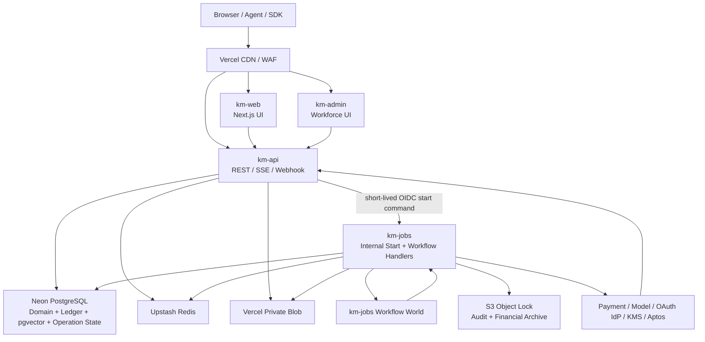

# Knowledge Market 开发与部署架构

- 版本：1.0
- 更新日期：2026-08-14
- 状态：开发与部署基线
- 产品需求：[requirement.md](./requirement.md)

## 1. 文档边界

本文是开发、测试和部署的唯一架构文档，负责回答：系统如何拆分、数据放在哪里、关键流程如何保证一致、本地如何运行、线上如何发布和恢复。

产品范围和验收以 `requirement.md` 为准。本文不得改变发布者收益、权限、账务、隐私或 Aptos 的产品语义。

## 2. 固定技术栈

| 层 | 选择 | 边界 |
| --- | --- | --- |
| 语言 | Strict TypeScript | Web、API、Workflow、SDK、CLI、迁移和测试统一使用；Move 合约除外 |
| Web | Next.js App Router | 部署到 Vercel；Edge 只做静态、路由和无权威写入的轻逻辑 |
| API | Vercel Node.js Functions + SSE | 处理认证、业务命令、Webhook 和短事务 |
| 异步 | Vercel Workflow | 持久 Step、Retry、Sleep、Hook、恢复和部署版本绑定 |
| 关系数据 | Neon PostgreSQL | 身份、权限、业务、版本、账务和异步领域状态的唯一关系型权威 |
| 对象 | Vercel Private Blob | 原始文件、规范化制品、账单、Proof 和大导出；元数据仍以 Neon 为准 |
| 不可变归档 | AWS S3 Object Lock | Audit Manifest、财务归档和 Legal Hold；使用 Versioning + WORM，不能以普通 Blob 代替 |
| 检索 | Neon pgvector HNSW + Neon FTS/Trigram | 首发在同一 Singapore 数据库完成向量、关键词、权限和版本过滤；外部 Vector 仅作为后续可替换投影 |
| 缓存 | Upstash Redis | 限流、缓存、短期进度；不得决定余额、授权或 Publication |
| 链上 | Aptos Move + TypeScript SDK | 仅发布隐私承诺；Signer 位于外部 KMS/HSM |
| 遥测 | OpenTelemetry + Vercel Observability | 普通日志不是审计和财务证据的唯一存储 |

Production 使用的 Node.js、TypeScript、Next.js、Workflow SDK 和全部 Provider SDK Major 必须在 lockfile 与 Release Manifest 中冻结。

## 3. 架构原则

1. Neon 是余额、权限、Publication、价格版本和领域异步状态的权威。
2. Search、Redis、Analytics、Workflow Event Log 和 Aptos 都是投影或外部证据，不是业务权威。
3. API Handler 只做有界工作；长任务拆成可重入 Workflow Step。
4. 不建立通用 Inbox、Outbox、Event Bus 或换名后的消息 Spool。
5. 跨系统不承诺 Exactly Once；使用确定性 Operation、唯一约束、原子 Claim、Provider 幂等和 Reconciliation 收敛。
6. 权限在发现、报价、执行、交付四个检查点重复执行。
7. 所有资金事务短小、原子、可重试并 Fail Closed；任何不确定结果先查询或对账。
8. 每个 Artifact 固定其知识、索引、权限、价格、Tokenizer、Router 和模型版本。
9. Production、Staging、Preview/Development 的 Project、数据库、缓存、索引、对象和凭证彼此隔离。

## 4. 部署拓扑



Production 首发固定为 Singapore 单写区域：Vercel Node.js Functions 使用 `sin1`，Neon 使用 AWS Asia Pacific Singapore，Upstash Redis Primary 使用 Singapore，Private Blob 使用 Singapore，S3 Object Lock Bucket 使用 `ap-southeast-1`。全球 Edge 只负责接入、缓存和 WAF，不形成多区域数据库写入。任何 Provider 无法满足批准的数据驻留范围时必须在上线门槛中显式拒绝，而不是静默跨区。

### 4.1 Vercel Project 边界

| Project | 职责 | 禁止事项 |
| --- | --- | --- |
| `km-web` | 统一用户 Dashboard、公开页面、静态资产 | 直写 Neon、持有 Provider 或 Signer Key |
| `km-api` | REST/SSE/Webhook、Identity、Policy、Quote、Retrieval | 长任务、万能数据库角色、跨 Project 直接调用 Workflow `start()` |
| `km-jobs` | 内部启动 Endpoint、Workflow 定义和 Handler、恢复、对账、构建 | 公共访问、宽 Audience Token、跨环境启动 |
| `km-admin` | 管理员 UI、审核和财务/安全命令入口 | 直连数据库、绕过 `km-api` Policy |

每个环境只有一个由 `km-jobs` 拥有的 Workflow World。Workflow 定义、`start()` 和 Handler 必须属于同一 Project/Deployment 边界。

### 4.2 首发部署基线与迁移边界

- 首发只使用 Vercel、Neon、Upstash Redis、Vercel Private Blob、S3 Object Lock 和外部 Provider，不引入 Railway、Kubernetes、自管 Queue 或常驻 Worker 集群。
- `km-web`、`km-admin`、`km-api` 和 `km-jobs` 分别部署为四个 Vercel Project；Frontend、API 与 Workflow 可以独立发布、授权和限额，但共享同一套 Contract 和领域代码。
- API Handler 只处理认证、校验、短事务、Webhook 和可恢复 SSE；索引、OCR、模型调用、结算、Proof、删除、对账和恢复进入 Vercel Workflows。
- 外部计算平台不是首发依赖。只有连续生产数据证明 `km-jobs` 的持续 CPU、时长、区域或容量无法满足已批准 SLO/TCO 时，才通过 ADR 迁移 `km-jobs`；迁移不得改变 API、Neon Schema、Ledger、Workflow Operation 语义或 Web 部署。
- `packages/application` 和 `packages/adapters` 必须让 Workflow Runtime、Object Store、Vector Search、KMS/HSM 与 Provider 可替换；业务代码不得直接依赖某个候选迁移平台的 SDK。

## 5. Monorepo

```text
apps/
  web/                 # km-web
  api/                 # km-api
  jobs/                # km-jobs + workflows/
  admin/               # km-admin
packages/
  contracts/           # OpenAPI、JSON Schema、状态和错误码的唯一类型源
  application/         # Use Case、Command/Query Handler、事务与 Operation 编排
  domain/              # 纯领域模型、状态机、不变量
  db/                  # Schema、Migration、Repository、Transaction
  policy/              # 授权和 Obligation
  pricing/             # Money、Quote、Entitlement、Metering
  ledger/              # Journal、Hold、Revenue、Reconciliation
  retrieval/           # Router、Search、Dedup、Citation
  adapters/            # Blob、Immutable Archive、Redis、Vector、Provider、Aptos
  observability/       # Trace、Metric、Audit helper
tooling/
  scripts/             # Seed、Migration、Reconcile、Release、DR
  fixtures/            # 合成测试数据和 Golden Vector
```

依赖方向必须是 `apps -> application -> domain`，`application -> adapters/db/policy/pricing/ledger/retrieval`，Adapter 实现领域 Port。`domain` 不导入 Next.js、Vercel、Neon 或 Upstash SDK。`packages/contracts` 生成 OpenAPI 和 JSON Schema，禁止 API、Workflow 与数据库各自维护不同枚举。

生产构建使用一个 lockfile，不在运行时动态安装或下载未固定代码。

## 6. API 与运行时

### 6.1 外部 API

最小资源集合：

- `/v1/knowledge-bases`、`/sources`、`/versions`、`/publications`
- `/v1/catalog/search`、`/trust-list`、`/access-grants`、`/subscriptions`、`/bundles`
- `/v1/api-keys`、`/budgets`、`/sessions`、`/notification-preferences`
- `/v1/quotes`、`/retrievals`、`/retrievals/{id}`、`/events`
- `/v1/retrievals/{id}/cancel`、`/retrieval-exports`、`/playground-runs`
- `/v1/upload-tokens`、`/connectors`、`/connector-callbacks`
- `/v1/balance`、`/top-ups`、`/transactions`、`/refunds`、`/billing-statements`
- `/v1/revenue-statements`、`/payout-accounts`、`/payouts`、`/proofs`
- `/v1/admin/*`，仅 Workforce 身份可访问

约定：

- 版本前缀 `/v1`，JSON 时间使用 UTC RFC 3339。
- 金额使用十进制字符串和 ISO 4217 币种，禁止 JSON 浮点金额。
- 创建/执行命令使用 `Idempotency-Key`；服务端只保存加域 Hash。
- 标准错误至少包含 `code`、`message`、`request_id`、`trace_id`、`retryable` 和字段错误。
- 同 Key 不同请求摘要返回 `409 idempotency_conflict`。
- SSE 只传进度和已授权的交付事件；断线后用 Event ID 恢复，最终状态仍从 API/Neon 读取。

### 6.2 Function 规则

- 需要数据库事务、Crypto、原始 Webhook Body 或 Aptos SDK 的路径使用 Node.js Runtime。
- Module Global 只允许不可变配置和无租户状态的 Client；不得保存 Auth、Tenant 或 Transaction。
- 数据库事务、外部请求和 SSE 都有明确 Deadline。
- `waitUntil` 只用于可丢失的非关键后处理；Audit、财务、删除、撤权、Proof 和必要通知必须进入领域 Operation/Workflow。
- 大文件由客户端使用短期单用途 Token 直传 Private Blob，不经过 Function 内存。

### 6.3 Dashboard 交互状态

- 搜索、筛选、排序、Tab 和分页使用 URL Query 保存，可分享、可刷新恢复；敏感表单值不得进入 URL。
- Dialog 和 Drawer 只维护短期编辑状态，提交时由 API 重新执行身份、权限、版本、预算和业务校验。
- API Key 创建响应只返回一次完整 Secret；之后只能显示前缀、尾号和元数据，不能再次读取原值。
- 只有收藏、筛选和普通偏好允许安全的 Optimistic UI；资金、发布、回滚、授权、撤权、密钥和收款操作必须等待服务端确认。
- Toast、Badge 和本地缓存不是业务权威；Mutation 成功后按资源粒度重新验证服务端状态。
- 重复提交使用稳定 Idempotency Key；网络结果未知时先查询 Operation 状态，禁止重复执行高风险命令。
- 公开页面和 Dashboard 使用同一授权术语：Catalog Visibility 不能替代正文 Access Grant/Terms Acceptance。
- 页面必须覆盖 Loading、Empty、Denied、Revoked、Failed、Stale、Suspended、Provider Unknown 和可恢复 Pending；管理员命令与资金命令必须显示权威 Operation 状态。
- 响应式实现至少验证 360、768、1024 和 1440 像素宽度，并保持键盘顺序、Focus、缩放、对比度和触控目标可用。

## 7. 数据架构

### 7.1 类型

| 语义 | PostgreSQL | 规则 |
| --- | --- | --- |
| 内部 ID | `uuid` | 应用生成 UUIDv7 |
| 外部 ID | `uuid` 或随机串 | 不可推断内部数量 |
| 时间 | `timestamptz` | UTC |
| 金额 | `numeric(38,0)` | `amount_nano`，1 USD = 1,000,000,000 nano-USD |
| 用量 | `bigint` | 非负整数 |
| 比率 | `numeric(38,18)` 或整数分子/分母 | 最终只舍入一次 |
| 摘要 | `bytea` | 默认 SHA-256，32 bytes |
| 扩展配置 | `jsonb` | 必须有 Schema Version、大小和已知键约束 |

TypeScript Money 使用不可变 `{ currency, nanoAmount: bigint }`。金额、Token 和 Journal 公式禁止使用 JavaScript `number`。

### 7.2 领域 Schema

| Schema | 主要实体 |
| --- | --- |
| `iam` | tenant、subject、credential、api_key、access_grant、policy_version |
| `supply` | knowledge_base、source、snapshot、object、document、chunk、knowledge_version、index_version、publication |
| `catalog` | listing、publisher_profile、trust、review、quality_projection |
| `pricing` | pricing_plan、price_version、contract、subscription、entitlement、quote、reservation |
| `retrieval` | request、plan、execution、artifact、citation、usage |
| `ledger` | account、journal、entry、fund_hold、provider_effect、refund、reconciliation |
| `revenue` | accrual、statement、adjustment、payout、proof_submission |
| `governance` | audit_log、case、incident、retention、legal_hold、deletion |

所有租户所有权表包含 `tenant_id`；跨租户关系显式保存 `consumer_tenant_id` 与 `publisher_tenant_id`，全局 Catalog 只通过脱敏投影视图公开。表使用复合唯一约束和 RLS。运行角色不得拥有表、不得使用 `BYPASSRLS`。Ledger 以 Legal Entity 和 Currency 隔离，由受控 Posting Command 写入。

#### 7.2.1 受控跨租户读取

- Consumer 运行角色不能直接 `SELECT supply.chunk` 或读取发布者 Source/Object。
- Catalog 只能读取公开元数据投影视图；Unlisted 项目使用不可枚举入口并在返回元数据前校验授权。
- 正式检索通过窄接口 `retrieval.authorized_chunks(execution_id, candidate_id)` 读取正文。该接口由不可登录的专用数据库角色拥有，只授予运行角色 `EXECUTE`，固定 `search_path`，不接受客户端传入 Tenant Context。
- 接口在同一事务中重新读取 Plan、Consumer/Publisher Tenant、Publication、Index、Access Grant/Terms Acceptance、Entitlement、Quote、Revocation Generation 和 Deadline；任一不匹配时返回 Deny，且不能返回正文。
- 接口只返回冻结 Plan 允许的 Opaque Chunk ID、正文和 Citation 元数据，不能列举其他发布者数据；每次允许或拒绝都写入受控 Audit Trail。
- RLS 测试矩阵必须覆盖无授权、过期授权、撤权竞态、错误 Tenant、Unlisted 枚举和合法跨租户检索。禁止为了通过合法跨租户用例给应用连接授予表 Owner 或 `BYPASSRLS`。

#### 7.2.2 不可变 Audit Trail

- `governance.audit_event` 使用 Append-only 分区表；应用与管理员角色没有 `UPDATE`、`DELETE`、`TRUNCATE` 或直接 `INSERT` 权限，只能执行受控追加函数。
- 追加函数分配单调序号并保存前一事件摘要、当前事件摘要、Actor、Action、Resource、Operation、时间、结果和脱敏 Payload Digest；敏感 Query、Chunk、Credential 和 Payout Detail 不进入 Payload。
- 分区关闭后由 `km-jobs` 生成签名 Manifest，通过短期 OIDC Assume Role 写入启用 Versioning 和 S3 Object Lock 的 `ap-southeast-1` Bucket；Production 不保存长期 AWS Access Key。Neon 中保存 Object Version ID、Manifest Digest、Retention Mode、Retain-until 和验证状态。
- 正式保留使用批准的 Governance 或 Compliance Mode；Legal Hold 作用于具体对象版本。普通 Private Blob 只保存业务制品，不能作为 WORM、Retention 或 Legal Hold 的技术实现。
- 启动、每日和账期关闭校验摘要链、分区 Manifest 与对象副本；差异创建 Incident 并阻止相关 Statement/Payout/Proof 关闭。

### 7.3 事务与迁移

- 普通短查询使用 Neon Serverless HTTP Driver。
- RLS Context、`SELECT ... FOR UPDATE`、Ledger 和交互事务使用短生命周期 WebSocket Client；每次请求内创建、使用并关闭。
- 资金事务使用 `SERIALIZABLE` 或等价显式锁，Serialization Failure 以同一 Command Digest 有界重试。
- Migration 使用直连、独立 Migration Role，不使用 Transaction Pooler。
- Schema 变更遵循 `expand -> migrate/backfill -> verify -> cut over -> contract`；应用必须先兼容新旧 Schema，再切写入，最后删除旧字段。
- 财务、权限、版本、幂等和外部 Effect 使用数据库唯一约束，不只依靠应用检查。

## 8. 核心流程

### 8.1 身份与授权

Gateway 验证 Session、OAuth 或 API Key，构造不可由客户端覆盖的 Tenant Context。Policy 结合主体、资源、动作、租户、授权关系、风险和版本返回 `allow | deny | allow_with_obligations`。

同一 `subject` 同时具备知识使用和知识发布能力，不保存 Creator/Consumer 账号类型，也不创建独立工作区。授权依据具体动作、资源所有权、Access Grant、资金与风险状态判断；前端使用统一 Dashboard、设置、余额和身份上下文。

授权在发现、报价、实际检索和交付前重复校验。撤权、暂停和下架先写 Neon 权威状态并递增 Generation；缓存只加速，不能延迟关键 Deny。

### 8.2 Ingestion 与 Publication

```text
upload/connect
  -> Private Blob source object
  -> source snapshot + digest
  -> scan / parse / normalize / chunk
  -> immutable knowledge version
  -> new pgvector index version / partition
  -> evaluation / review
  -> atomic publication pointer switch
  -> catalog/cache projections
```

首发向量与 Chunk 权威元数据位于 Neon。pgvector 行必须关联 Opaque Chunk ID、Publisher Tenant、Knowledge Version、Index Version 和 Publication，不允许通过无 RLS 的通用查询接口读取。召回通过受控 SQL/Repository 同时执行 Tenant、Publication、Index、Access 和最小过滤条件，返回候选 ID 后仍须通过 `retrieval.authorized_chunks` 复核并读取正文。

索引构建写入新的 Index Version/Partition，并创建独立 HNSW Index；Evaluation 通过后以原子 Publication Pointer 切流。旧版本在活动 Retrieval、Quote、Artifact、争议和保留窗口结束后删除。若未来改用外部 Vector Provider，只允许保存可重建的 Opaque ID、向量与最小过滤元数据，并保持相同的回库复核语义。

### 8.3 Paid Retrieval

1. 验证 API Key、Scope、限流、Schema 和 `Idempotency-Key`。
2. 规范化请求并认领幂等记录；不同 Digest 冲突。
3. 免费匹配 Catalog 候选并执行第一轮 Policy。
4. 固化 Plan、Publication、Policy、Price、Tokenizer、Router 和 Sufficiency Version。
5. 生成 Quote，以单个数据库事务锁定预算、权益和余额并创建 FundHold。
6. 每次访问知识库前复核授权、Publication 和 Quote 有效性。
7. 执行关键词 + 向量召回、融合、重排、去重、安全过滤和引用构建。
8. 对最终交付 Artifact 计量；在一个 Ledger Transaction 中结算并释放多余 Hold。
9. 返回逐库用量、费用、选择原因、停止原因、版本和 Citation。

任何 Policy、Ledger 或 Publication 状态不确定时，在正文/资金边界 Fail Closed。

Quote 在接受前必须未过期；一旦同一事务成功接受并创建 FundHold，后续执行使用 `accepted_at` 和冻结版本，不因墙钟超过展示过期时间而改变已接受价格。授权撤销、Publication 暂停或安全策略变化仍可在访问/交付检查点终止执行；未实际交付的 Publisher Fee 为 0，并释放剩余 Hold。

Settlement 先以精确有理数计算逐库 Publisher Fee、Platform Fee、Tax、Credit/Promotion 和 Total Fee，在结算精度统一执行 half-even 舍入；尾差使用确定性 Allocation Rule 分配，确保页面逐项之和、Quote Total、Journal Debit 与 Credit 完全一致。

### 8.4 Workflow，无 Inbox/Outbox

```text
km-api domain transaction
  -> write deterministic operation_id + pending + digest + deadline
  -> commit
  -> call km-jobs internal endpoint with short-lived OIDC token
  -> km-jobs validates audience/environment/type and reloads Neon operation
  -> km-jobs calls start() in its own Workflow World
  -> compare-and-set workflow_run_id
  -> first step atomically claims operation
```

启动失败或响应未知时不猜测。`km-jobs` Recovery Workflow 扫描各领域 `pending`、缺失 Run 或 Lease 超时的记录并重启；重复 Run 只有一个能 Claim，其余安全退出。

每个环境使用受监控的 Vercel Cron/Workflow Schedule 定期启动 Recovery Sweep，并以独立 Heartbeat、Pending Age 和 Last Successful Sweep 告警。Recovery 自身无法启动时由外部合成监控触发 Case，不能依赖某个业务请求顺带恢复。

每个 Step 重新读取 Neon，使用稳定 Step Name 和输入 Digest。外部写先创建领域 `effect/attempt/submission`，再使用 Provider Idempotency Key 调用。响应未知时先查询 Provider 或对账，禁止盲重试。

Webhook 验证原始签名、时间、环境和 Replay Window，以 `(provider, environment, external_event_id)` + Payload Digest 去重并直接更新领域 Effect。

### 8.5 Ledger、Revenue 与 Aptos

Ledger 是 Append-only 双重记账；已过账 Journal 不更新或删除。Hold 是余额约束，不是 Journal。Settlement、Refund、Chargeback、Revenue、Payout 和 Reconciliation 都使用唯一业务键。

账期关闭要求 Usage、Ledger、Payment Provider、Statement 和 Aptos 无未解释差异。Statement 的原始字节与盐写 Private Blob，Digest 和状态写 Neon。

TypeScript Publisher 构建固定 BCS Payload，外部 KMS/HSM 按策略签名，至少两个 RPC/Indexer Source 确认。链上只发布承诺。相同 Batch ID 和相同 Digest 是幂等重试；相同 Batch ID 和不同 Digest 是安全事件。

## 9. 安全与可观测性

- Production Secret 不进入仓库、日志、Preview 或客户端；高价值 Provider/Payout/Aptos Key 通过短期 OIDC 访问 KMS/HSM/Secret Broker。
- Private Blob 和 Redis Token 不发送给浏览器；pgvector 只能由受限数据库角色通过 Repository/受控函数访问。
- 上传内容隔离扫描；Parser/OCR/Model 使用有界资源、限制出网和不受信输入防护。
- Query、Chunk、API Key、OAuth Token、Workflow Hook Token、Connection String 和 Provider Payload 不写普通日志。
- 所有请求关联 `request_id`、`trace_id`、`tenant_id`、`operation_id`、`retrieval_request_id`、`quote_id`、`fund_hold_id`、`transaction_id` 和 `workflow_run_id`；敏感 ID 仅进入受控审计。
- 指标覆盖 API、Workflow Pending Age、数据库连接/锁、Index Version 新鲜度、HNSW 查询延迟/Recall、余额/Hold、Journal Balance、Provider Unknown、对账差异、Proof Backlog 和删除残留。
- 财务、权限、撤权、删除和 Proof Guardrail 从 Neon/Reconciliation 计算，不能只看供应商 Dashboard。

## 10. 本地开发环境

### 10.1 前置条件

- 仓库指定版本的 Node.js 与 Corepack/pnpm。
- Docker Desktop 或兼容容器运行时。
- Vercel CLI；只有需要拉取开发环境变量或测试 Preview 时才登录。
- 可选 Aptos CLI/Localnet；普通开发默认使用 Chain Adapter Stub。

不得使用 Production 数据、凭证、Provider Account、Aptos Signer 或未经脱敏的数据库副本。

### 10.2 本地依赖模式

| 依赖 | 默认本地模式 | 集成测试模式 |
| --- | --- | --- |
| PostgreSQL + Vector | Docker PostgreSQL 18 + pgvector | 独立 Neon Development/ephemeral Branch，可通过 Neon Local 连接 |
| Redis | Docker Redis-compatible 实例 | 独立 Upstash Development Database |
| Blob | 文件系统 Fake | 独立 Vercel Development Blob Store |
| Immutable Archive | 文件系统 WORM 行为 Fake | 独立非生产 S3 Object Lock Bucket 或禁用外发的 Contract Test |
| Workflow | `km-jobs` 本地 Runtime + Workflow Inspector | Vercel Preview Workflow World |
| Payment/Model/OAuth IdP | Emulator/Stub | Provider Sandbox |
| Aptos | Stub 或 Localnet | Testnet + 测试 Signer |

本地 Fake 必须实现相同 Port 和错误语义，但不得作为上线验证的替代。跨租户、事务、Workflow Replay、pgvector/RLS Filter、Blob Callback、Object Lock Contract 和 Provider Unknown 必须在真实集成环境再测一次。

### 10.3 环境变量

仓库必须提交 `.env.example`，不得提交 `.env.local`。最小变量：

```dotenv
APP_ENV=local
DATABASE_URL=postgresql://km:km@localhost:5432/km
DIRECT_DATABASE_URL=postgresql://km:km@localhost:5432/km
REDIS_URL=redis://localhost:6379
VECTOR_ADAPTER=memory
BLOB_ADAPTER=filesystem
AUDIT_ARCHIVE_ADAPTER=filesystem
WORKFLOW_START_AUDIENCE=http://localhost:3002
KM_JOBS_INTERNAL_URL=http://localhost:3002
PAYMENT_ADAPTER=stub
MODEL_ADAPTER=stub
APTOS_ADAPTER=stub
OTEL_EXPORTER=console
```

真实 Development Token 通过 `vercel env pull .env.local` 或团队 Secret Manager 获取，并使用独立资源。

### 10.4 启动

仓库需要提供以下稳定脚本：

```bash
corepack enable
pnpm install --frozen-lockfile
pnpm infra:up
pnpm db:migrate
pnpm db:seed
pnpm dev
```

`pnpm dev` 并行启动：

| 服务 | 默认地址 |
| --- | --- |
| `km-web` | `http://localhost:3000` |
| `km-api` | `http://localhost:3001` |
| `km-jobs` | `http://localhost:3002` |
| `km-admin` | `http://localhost:3003` |

另一个终端运行本地 Workflow Inspector：

```bash
pnpm workflow:inspect
```

该脚本应封装 `pnpm exec workflow web`。停止环境使用 `pnpm infra:down`；清空本地合成数据使用单独、显式确认的 `pnpm db:reset:local`，不得指向远程数据库。

### 10.5 本地验证

```bash
pnpm lint
pnpm typecheck
pnpm test
pnpm test:integration
pnpm test:e2e:local
```

最小 Smoke Journey：创建租户和 API Key、发布合成知识库、充值测试余额、Quote/Hold/Retrieval/Settlement、重复幂等请求、暂停知识库、运行 Statement/Proof Stub。测试结束后 Ledger 必须平衡且无未释放 Hold。

## 11. Preview、Staging 与线上部署

### 11.1 环境隔离

| 环境 | 用途 | 数据 |
| --- | --- | --- |
| Preview | 每次 PR 的 UI/API/Schema/Contract 验证 | 每 PR Neon Branch；合成数据；独立或命名空间化非生产资源 |
| Staging | Production-like E2E、性能、安全、恢复和 UAT | 独立 Project/Store/Provider Sandbox；仅合成或不可逆脱敏数据 |
| Production | 正式流量和资金 | 独立账户、Project、Primary、Store、KMS 和 Provider |
| DR | 受控恢复与切换 | 预授权恢复目标；默认不接流量 |

Production 数据不能自动分支到 Preview。Preview Branch 必须从合成/脱敏模板创建并设置 TTL；向量数据跟随该 Neon Branch 隔离。PR 关闭后清理 Neon Branch、Redis Keyspace 和 Blob Temp Prefix；Preview 默认不得写入 Production 审计归档 Bucket。

### 11.2 Production 资源

上线前创建并记录：

1. 四个 Vercel Projects：`km-web`、`km-api`、`km-jobs`、`km-admin`，连接同一 Monorepo 并各自设置 Root Directory/Build Command。
2. 每环境唯一的 `km-jobs` Workflow World，冻结 Workflow SDK Major、Region/Data Residency、Retention、容量和升级窗口。
3. Neon Production Project/Primary、`pgvector` Extension、HNSW Capacity、运行角色、Ledger Role、Migration Role、Pooled URL 与 Direct URL。
4. Singapore Private Blob Store 和 Singapore Regional Upstash Redis；Redis 不使用最终一致的 Global Read Replica 参与锁、授权、幂等或余额判断。
5. `ap-southeast-1` S3 Object Lock Bucket、Versioning、默认 Retention、Legal Hold 权限、OIDC Role、跨账号恢复方案和独立账单告警。
6. Payment/Payout、Model/OCR、OAuth IdP、外部 KMS/HSM、Aptos RPC/Indexer 的生产账户。
7. Domain、TLS、WAF、Deployment Protection、Rate Limit、Log/Trace Drain、Alert 和 On-call。

数据库写 Function 固定为 `sin1` 并靠近 Neon Primary。四个 Vercel Project、Neon、Redis、Blob、Workflow World 和归档 Bucket 的 Region 必须记录在 Release Manifest；不能依赖平台默认 Region。Provider 和数据驻留不满足批准地区时不得上线。

### 11.3 Production 环境变量

变量按 Project 和 Environment 分配最小权限：

```text
DATABASE_URL                 # pooled runtime URL
DIRECT_DATABASE_URL          # only migration job
VECTOR_ADAPTER=pgvector
UPSTASH_REDIS_REST_URL/TOKEN
BLOB_READ_WRITE_TOKEN
AUDIT_ARCHIVE_BUCKET
AUDIT_ARCHIVE_REGION=ap-southeast-1
AUDIT_ARCHIVE_ROLE_ARN       # assumed with short-lived OIDC
KM_JOBS_INTERNAL_URL
WORKFLOW_START_AUDIENCE
PAYMENT_PROVIDER_*
MODEL_PROVIDER_*
OIDC_ISSUER/AUDIENCE
KMS_SIGNER_REFERENCE
APTOS_NETWORK/RPC_URL/PACKAGE_ADDRESS
OTEL_EXPORTER_OTLP_ENDPOINT
```

`km-web` 不持有数据库或 Provider Secret；`km-api` 不持有 Aptos/Payout Signer 或 Archive 写权限；`km-jobs` 按 Workflow 领域拆分数据库角色。Migration Credential 只在受保护 CI Job 临时注入；S3 归档只允许短期 OIDC 凭证，禁止静态 Access Key。

### 11.4 CI/CD

Pull Request：

1. 安装冻结依赖，检查格式、类型、License、Secret、SBOM 和漏洞基线。
2. 运行 Unit/Property/Contract Test。
3. 创建合成 Neon Preview Branch，执行 Migration 和 Seed。
4. 创建 Vercel Preview，配置非生产 Blob/Redis；向量索引位于对应的合成 Neon Preview Branch。
5. 运行 API、Workflow、跨租户、幂等、Ledger 和 E2E Test。
6. 关闭 PR 时自动清理全部 Preview 资源；失败产生 Case。

Production Promotion：

1. 从已验证 Commit 构建一次 Signed Artifact，记录源码、lockfile、SBOM、Schema、Workflow、Policy、Model 和 Move Package Digest。
2. 使用 Direct URL 执行 Expand Migration；运行约束、兼容和回滚/Forward Repair 检查。
3. 先部署兼容旧 Operation/Schema 的 `km-jobs`，再部署 `km-api`，最后部署 `km-web`/`km-admin`。
4. 创建不绑定正式域名的 Production Deployment，执行 Synthetic Smoke、财务零差异、权限和 Workflow Replay 检查。
5. 审批后 Promote 同一 Deployment，不重新 Build。
6. 小流量 Canary，观察 Error Budget、Ledger、Hold、Provider Unknown 和对账；逐档放量。
7. 稳定窗口结束后再 Contract 旧 Schema/Operation Version。

使用 CLI 时，标准流程是 `vercel build`、`vercel deploy --prebuilt` 或 `vercel deploy --prod --skip-domain`，验证后 `vercel promote <deployment>`；正式自动化可使用 Git 集成，但必须保持“同一制品 Promote、不在 Production 重建”。

### 11.5 回滚与恢复

- 无 Schema 破坏的应用问题：把域名/流量切回上一已批准 Deployment。
- 已产生新数据的版本：优先 Feature Disable 或 Forward Repair，禁止直接回滚到不能读新状态的代码。
- Migration：Expand 阶段可停写新字段；完成 Cutover 后用兼容代码前向修复，不做破坏性数据库回滚。
- Workflow：运行中的 Run 保持原 Deployment；新 Operation 使用当前批准版本。旧版本在最长运行/保留窗口内可用。
- pgvector/Cache：从 Neon Knowledge Version 和 Chunk 权威重建新的 Index Version/Partition，以 Publication Pointer 切换，不原地覆盖活动索引。
- Region 灾难：Fence 原 Primary，恢复 Neon/Blob 和配置，验证 Ledger、Tenant、删除、S3 Object Lock Manifest 和外部 Provider 状态，再逐步恢复读写；禁止为了快速恢复建立未经批准的多区域资金写入。
- Payment/Aptos Unknown：保持 `pending_confirmation`，查询外部权威并对账，不盲目重发。

## 12. 测试与发布门槛

测试层级：Static、Unit/Property、Component、Contract、Integration、E2E、Performance/Chaos/Security/DR、Production Canary。

Production 必须满足：

- 需求中的全部强制不变量具有自动化测试和生产 Monitor/Reconciliation。
- OpenAPI、Workflow Operation/State、DDL、Policy、Provider、Model 和 Aptos ABI 兼容测试通过。
- 100-way 幂等/并发冻结、重复 Workflow、Step Replay、Webhook Replay 和 Provider Unknown 通过。
- RLS 跨租户矩阵、撤权竞态、pgvector Filter/RLS 绕过、Blob Token、Object Lock/Legal Hold、恶意文件、提示注入和批量提取测试通过。
- Ledger 平衡、充值、退款、拒付、Revenue、Payout 和五方对账完整演练通过。
- 数据库 PITR、索引重建、Pending Operation 恢复、区域故障和 Cyber Recovery 演练达到批准 RPO/RTO。
- Workflow SDK/World、Neon pgvector、Blob、Redis、S3 Object Lock、KMS/HSM 和 Provider 的 Region、Quota、Support、Retention 和 Exit Profile 已批准。
- 独立安全审查、适用的财务/法律/隐私审查和 Aptos Move Audit 已完成。

任一零容忍条件失败、存在未解释财务差异、跨租户泄露、无法撤权、无法恢复或 Signer/制品不匹配时必须 No-Go。

## 13. 实现顺序

1. Monorepo、Contract、CI、合成数据和本地/Preview 环境。
2. Tenant、Identity、Policy、RLS、Audit 和 Secret 边界。
3. Schema、Migration、Operation/Claim、Blob、Immutable Archive、Redis 和 Vector Adapter。
4. Ingestion、Version、Index、Evaluation 和 Publication。
5. Retrieval API、指定库检索、Citation、Artifact 和 SSE。
6. Pricing、Entitlement、Quote、Hold、Ledger 和幂等结算。
7. Knowledge Router、多库 Dedup、充分性和 Marketplace。
8. Refund、Chargeback、Revenue、Statement、Payout 和 Reconciliation。
9. Aptos Move、Publisher、Verifier、Remote Signer 和 Proof UI。
10. Security、Capacity、DR、Canary、Runbook 和 Production Launch。

## 14. 官方依据

- [Vercel Monorepos](https://vercel.com/docs/monorepos)
- [Vercel CLI 部署流程](https://vercel.com/docs/projects/deploy-from-cli)
- [Vercel Regions](https://vercel.com/docs/regions)
- [Vercel Workflows](https://vercel.com/workflows)
- [Vercel Private Blob](https://vercel.com/docs/vercel-blob/private-storage)
- [Vercel OIDC Federation for AWS](https://vercel.com/docs/oidc/aws)
- [Neon Serverless Driver](https://neon.com/docs/serverless/serverless-driver)
- [Neon Connection Pooling](https://neon.com/docs/connect/connection-pooling)
- [Neon Branching](https://neon.com/docs/guides/branching-intro)
- [Neon pgvector Search Optimization](https://neon.com/docs/ai/ai-vector-search-optimization)
- [Upstash Redis REST API](https://upstash.com/docs/redis/features/restapi)
- [AWS S3 Object Lock](https://docs.aws.amazon.com/AmazonS3/latest/userguide/object-lock.html)
- [Aptos Developer Documentation](https://aptos.dev/)
