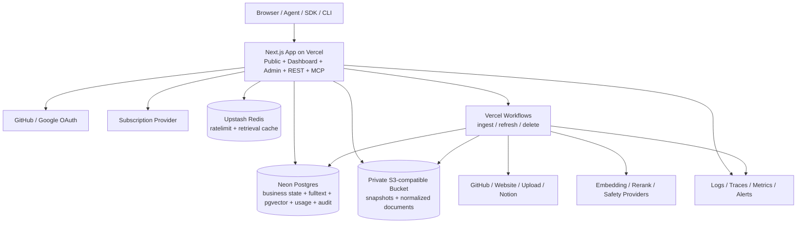
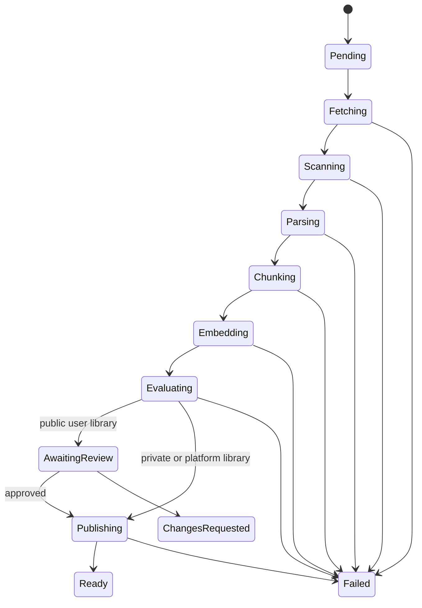

# recall0 开发与部署架构

- 版本：3.0
- 更新日期：2026-08-17
- 状态：MVP 架构基线
- 产品需求：[requirement.md](./requirement.md)
- 设计依据：[knowleg-market.pen](./knowleg-market.pen)
- Context7 基线：[`f3a818d`](https://github.com/upstash/context7/tree/f3a818d69db694e24d58e3bf803454fb20fc66ea)

## 1. 架构结论

recall0 使用一个 TypeScript 代码库交付公共站点、用户 Dashboard、管理后台、REST API 和远程 MCP；耗时的抓取、解析、Embedding、刷新和删除由 Vercel Workflows 执行。

4.0 决策把运行基座从 Vinext/Cloudflare 换到 Vercel + Neon。3.0 换栈的依据是「仓库当前基座是 vinext starter」，而该 starter 已在提交 `306e76a` 中随站点代码一并删除，依据不再成立；仓库目前没有任何应用代码，本次切换的成本仅限文档修订。

| 关注点 | 4.0 决策 |
| --- | --- |
| Web 与 BFF | Next.js App Router，Vercel 原生，不再使用 Vinext 兼容层 |
| 开发者文档站 | [Fumadocs](https://github.com/fuma-nama/fumadocs)，与主应用同一个 Next.js 项目，内容为仓库内 MDX |
| 运行环境 | Vercel Functions |
| 业务数据库 | Neon Postgres + Drizzle |
| 关键词检索 | Postgres 全文检索 + BM25 排序，可重建派生索引 |
| 向量检索 | 同库 pgvector，与 Chunk 同事务 |
| 对象存储 | S3 兼容私有 Bucket，首发 Cloudflare R2 |
| 长任务 | Vercel Workflows |
| 边缘态 | Upstash Redis，只承担匿名限流与检索缓存 |
| 身份 | 可替换 Identity Adapter；首发 GitHub + Google OAuth |
| 支付 | 外部 Subscription Provider Adapter |
| Embedding / Rerank | 外部 AI Provider Adapter，可替换 |
| 契约 | Zod/JSON Schema + OpenAPI，REST 为权威业务入口 |
| 可观测性 | 结构化日志、Trace、Metrics 和错误聚合 |

部署前必须为 Development、Preview、Production 分别创建 Neon Project/分支、对象存储 Bucket 和 Upstash Database，并写入各环境的环境变量，不得依赖开发者本机状态。

### 1.1 核心原则

1. Web、REST、MCP 和 Admin 复用同一 Application Use Case，不复制授权、检索或计量逻辑。
2. Neon 是业务状态、发布指针、关键词索引和向量的唯一权威；对象存储和缓存是可重建或可清理的派生数据。
3. 查询先授权并固定 Library Version、Policy Version，再进行任何关键词或向量召回。
4. Version 不可变；刷新通过原子切换 `current_version_id` 发布。
5. Workflow 的每一步幂等、可恢复，并以 Digest 和 Operation ID 去重。
6. API/MCP 按成功受理的 Call 计量，计费写入只追加 Usage Event；分成写入只追加 Earning Event，与 Usage Event 同事务。
7. 普通用户身份与管理员身份分离，所有高风险后台动作审计。
8. 不把 Context7 未开源的生产 Parser、Crawler、Index 或 Billing 后端当作可用代码。

### 1.2 选型理由与被否决的替代

本节记录 4.0 决策的取舍，避免后续重复讨论。

**为什么用 Neon 取代 D1 + Vectorize。** 决定性理由不是性能或额度，是**一致性边界**。3.0 形态下 Chunk 正文在 D1、关键词索引在 D1、向量在 Vectorize，三者会漂移，所以发布事务只能覆盖 D1 那一部分，向量与对象的一致性靠写入顺序约定和 Recovery 清理兜底。换成 Neon 后，Chunk、全文索引和向量在同一个 Postgres 事务内，§8.3 的发布事务成为真正的 ACID 事务，孤儿数据这一整类故障随之消失。

**为什么保留 S3 兼容对象存储而不用平台自带的对象服务。** 三条理由，按权重排序：

1. **可移植性**：S3 API 有多家实现，同一个 Adapter 可对 R2、S3、MinIO 等；专有对象服务只有一个实现，换平台时适配器作废。本项目已经历一次平台迁移，可移植性在此已被验证有价值。
2. **原生生命周期规则**：直接满足 §7 关于清理失败任务临时对象和过期导出的要求，不需要自建清理任务。
3. **存储单价**：容量按 GB-月常驻累积，单价差会持续放大。

出网费**不是**主要理由。recall0 的检索路径读 Postgres 而非对象存储，真正流向终端用户的只有导出文件和审核用快照，量很小，不是 CDN 型负载。

**为什么 Upstash 只承担两件事。** 匿名限流和检索缓存在上一版是运行平台自带能力，换栈后丢失，Upstash 是补回这两项能力，不是新增能力。明确否决三种扩大用法：

- **不使用 Upstash Vector**：会重新制造「Chunk 与向量分属两个系统」的分裂，直接抵消采用 Neon 的全部收益；
- **不使用 Upstash Workflow / QStash 承担长任务**：Vercel Workflows 已承担该职责，两套持久化执行引擎意味着两套重试语义、两套 Step 状态和两套幂等 Digest 对齐，是负债而非冗余；调度用 Vercel Cron；
- **不把额度计数迁入 Redis**：见 §11.1，Reservation 与 Usage Event 是计费数据，必须与业务库同事务。

**被否决的方案：继续留在 Cloudflare。** 其优势是单一供应商、免费额度更宽、边缘能力自带。放弃它的代价是接受四家供应商的管理面。判断依据是当前处于零代码阶段，Adapter 边界可以一次画对；若已有大量基础设施代码，结论可能相反。

## 2. 与 Context7 的对齐边界

本架构核对了 Context7 同一提交中的 MCP、REST OpenAPI、SDK、CLI、AI SDK Tools、Skills、插件和公开文档。

### 2.1 直接借鉴

- `resolve-library-id` + `query-docs` 两项 MCP 工具；
- 工具的只读、幂等、开放世界注解和敏感查询提示；
- `/mcp` 无状态 HTTP、`/mcp/oauth` 鉴权入口和 stdio 包装器；
- REST 的 Library Search、Context、Policies、Refresh、Add Source 资源形状；
- `/owner/repo`、`/source/slug` 和版本化 Library ID；
- JSON/TXT 双格式，TXT 由结构化结果渲染；
- SDK 的 Bearer Key、超时、有限重试和错误映射；
- CLI 的 setup/remove/library/docs/auth/skill 分发方式；
- 来源侧 JSON 配置、按热度后台刷新、Policy 的 quality/select 模式。

### 2.2 不直接复制

- Context7 MCP 包本质上是其远程 API 的代理，不包含生产检索后端；
- Context7 的生产抓取、解析、Embedding、Rerank、质量评分和计费实现未在公共仓库中完整提供；
- recall0 的 Trust Score 使用 0–100，公开库审核和 Free 私有库规则也不同；
- recall0 使用自己的命名、Schema、API Host、Key 前缀和自有数据平面。

## 3. 系统上下文与部署拓扑



### 3.1 运行边界

Edge App 只执行：

- 页面渲染和短 BFF 请求；
- Session/API Key/OAuth Token 认证；
- 工作空间授权、Policy 和套餐检查；
- Library Search、全文与向量召回、融合、短 Rerank 和格式化；
- Workflow 启动、状态读取和发布/删除入口；
- Payment Webhook 验签与幂等入库。

Workflow 执行：

- Git 抓取、网站爬取、Notion 同步和大文件处理；
- 解压、恶意文件检查、Parser、Chunker 和 Citation；
- Embedding 批处理、全文索引与向量写入（与 Chunk 同事务）；
- 质量评估、刷新、重建和数据删除。

普通请求不得同步等待完整 Ingestion。小型文件仍进入 Workflow，以保持同一状态机和重试语义。

### 3.2 环境隔离

`development`、`preview`、`production` 分别使用：

- 独立 Neon Project 或分支；
- 独立对象存储 Bucket；
- 独立 Upstash Database 与 REST Token；
- 独立 OAuth Client、Payment Environment 和 Provider Key；
- 独立 Workflow 名称和 Webhook Secret。

禁止把 Production 数据复制到 Preview。必要的测试数据必须脱敏或由 Fixture 生成。

## 4. 代码组织

```text
app/
  (public)/
    page.tsx
    pricing/
    playground/
    libraries/
      [...libraryId]/       # Library Detail
      claim/                # 认领向导
    login/
  docs/                     # Fumadocs 开发者文档站
    layout.tsx
    [[...slug]]/page.tsx
  dashboard/
    page.tsx
    libraries/
    api-keys/
    requests/
    policies/
    revenue/
    settings/
  admin/
    login/
    overview/
    users/
    libraries/
    claims/                 # 认领与争议裁定
    platform-libraries/
    plans/
    billing/
    settlements/
    administrators/
    audit/
  api/v1/
    libraries/
    context/
    claims/
    policies/
    usage/
    requests/
    revenue/
    anchors/
    api-keys/
  api/search/               # Fumadocs 搜索索引
  mcp/
content/
  docs/                     # 文档站 MDX 内容
components/
contracts/
  api/
  errors.ts
  schemas.ts
db/
  schema.ts
  migrations/
  queries/
lib/
  source.ts                 # Fumadocs loader
  application/
    auth/
    libraries/
    claims/
    ingestion/
    retrieval/
    playground/
    policies/
    plans/
    revenue/
    administration/
  domain/
  infrastructure/
    postgres/
    objects/
    cache/
    identity/
    payment/
    ai/
    chain/
    connectors/
workflows/
  index-library.ts
  refresh-library.ts
  delete-library.ts
  anchor-versions.ts
  anchor-audit.ts
  settle-revenue.ts
packages/
  sdk/
  mcp/
  cli/
  tools-ai-sdk/
  verifier/
skills/
plugins/
tests/
  contract/
  integration/
  e2e/
  security/
  fixtures/
```

约束：

- Route Handler 和 MCP Tool 只能调用 `lib/application` Use Case；
- `contracts` 是 REST、MCP、SDK、CLI 和前端共同的权威类型来源；
- Provider SDK 只出现在 `lib/infrastructure` 或 Workflow；
- Domain 不依赖 Next.js、Vercel、Neon、Payment、AI SDK 或链 SDK；
- 管理后台不能直连表，必须经过 Admin Use Case 和 Audit Decorator；
- `packages` 只放需要独立发布的薄客户端，不放服务端检索实现；
- `packages/verifier` 不得 import 任何 `lib/` 代码，见 §8.5；
- **文档站是内容，不是应用**：`app/docs` 与 `content/docs` 只读取仓库内 MDX，不访问 Postgres、对象存储或任何 Use Case；它的构建失败不得阻断 API 与 MCP 的部署。

## 5. 身份、工作空间与授权

### 5.1 普通用户身份

Identity Adapter 提供统一接口：

```ts
interface IdentityAdapter {
  beginOAuth(provider: "github" | "google", returnTo: string): Promise<Response>;
  handleCallback(request: Request): Promise<IdentityProfile>;
  getSession(request: Request): Promise<UserSession | null>;
  revokeSession(sessionId: string): Promise<void>;
}
```

Identity Provider 的 Subject 是外部身份主键；邮箱只用于展示和验证，不作为资源外键。账户绑定必须要求现有会话或二次验证。

API Key 格式使用 `mm_live_` / `mm_test_` 前缀。服务端只保存：

- Key ID、Hash、Prefix、Last Four；
- Workspace、名称、环境、Scopes；
- Created/Expires/Revoked/Last Used 时间。

完整 Key 只在创建响应中出现一次。

### 5.2 工作空间授权

所有普通资源绑定 `workspace_id`。授权顺序：

1. 解析 Session、API Key 或 MCP OAuth Token；
2. 检查用户、工作空间和 Key 状态；
3. 检查 Membership Role 与 Key Scope；
4. 加载 Plan Version 和 Policy Version；
5. 对具体 Library 执行公开/私有授权。

不得先全局召回私有内容再在应用层过滤。不可见私有 Library 与不存在 Library 使用相同 404 外观。

### 5.3 管理员身份

管理员单独使用 `administrator`、`admin_session`、`admin_role` 和 `admin_permission`：

- 强制 MFA、较短 Session、闲置超时和重新认证；
- 不接受普通用户 API Key；
- 角色最小化：Reviewer、Support、Operations、Super Admin；
- 高风险动作要求 `reason`，由统一 Audit Decorator 写入日志；
- Super Admin 权限变更不能由被修改者本人单独完成。

### 5.4 来源所有权验证（Claim）

产品规则见 [requirement.md](./requirement.md) 第 7.3 节。这里是授权链路的一部分：`library.owner_workspace_id` 决定谁能改这个库，也决定分成付给谁，因此它的写入路径必须比普通业务写入更严。

- **唯一写入口**：`owner_workspace_id` 只能由「`verified` 的认领」或「管理员争议裁定」写入，不存在第三条路径；Ingestion、审核和刷新都不得触碰该字段；
- **登录身份不是证据**：OAuth Subject 只回答「你是谁」。GitHub 权限校验必须用用户自己的 Token 向 GitHub 查询其对目标仓库的权限级别，并核对返回的仓库 ID 与 `source` 记录一致，不能只比对仓库名字符串；
- **挑战 Token**：高熵随机值，只保存 Hash；与 `(申请人, library_id, 验证方式)` 绑定并带 7 天过期；校验时按 Hash 比对，明文只在生成时返回一次；
- **DNS 与 well-known 校验走同一条出网安全通道**：复用 §15.1 的解析与抓取约束（禁止私网、Metadata Endpoint、Loopback、重定向绕过），验证请求不因用途特殊而放宽；DNS 查询使用受控解析器，不接受用户指定的 nameserver；
- **并发**：同一 `library_id` 的 `pending` 认领由部分唯一索引保证只有一个；校验通过时在单事务内完成「认领置 verified + 写 owner + 追加审计事件」，失败则整体回滚，避免出现有 owner 却无认领记录的状态；
- **限流与冷却**：发起与重试按 `账户` 和 `library_id` 双维度限流，承载在 §11.2 的同一限流设施；连续失败到阈值后锁定入口，需人工解锁；
- **响应最小化**：失败只返回稳定原因码，不回显 GitHub 权限详情、DNS 响应原文或抓取正文；对调用者不可见的 Library，认领接口的响应必须与「不存在」不可区分，避免成为私有库探测面；
- **审计**：发起、通过、失败、争议、转移、撤销全部写入 `audit_log`，其中转移与撤销属于高风险动作，要求 `reason`。

## 6. Postgres 数据模型

### 6.1 身份与商业

| 表 | 核心职责 |
| --- | --- |
| `user` | 普通账户、状态、展示资料 |
| `oauth_account` | Provider Subject 与 User 映射 |
| `user_session` | 普通用户会话摘要和撤销状态 |
| `workspace` | 资源和计费边界 |
| `workspace_member` | Role 与状态 |
| `api_key` | Hash、Scope、环境和使用状态 |
| `plan` | Free/Pro 稳定标识；Additional Calls 是加购包，不是订阅档位 |
| `plan_version` | 不可变价格、月度 Calls、库数量上限、单库字节上限、API Key 上限和能力 JSON |
| `subscription` | Provider Customer/Subscription、周期和状态 |
| `addon_grant` | 已购 Additional Calls 的总量、已用量和剩余余额；**无到期时间**，跨账期结转 |
| `payment_event` | 验签后的外部 Event 幂等记录 |

### 6.2 知识与检索

| 表 | 核心职责 |
| --- | --- |
| `library` | 稳定 ID、Workspace、可见性、生命周期、当前版本 |
| `library_alias` | 旧 ID 到新 ID 的 Redirect |
| `source` | 类型、位置、配置、Credential Reference、刷新策略 |
| `library_version` | Source Digest、解析版本、质量、不可变状态 |
| `document` | 规范化文档元数据和对象存储 Key |
| `chunk` | 正文、Token、Citation、质量和安全状态、`search_vector` 与 `embedding` 列 |
| `library_rule` | 来源维护者规则，按 Version 冻结 |
| `library_review` | 公开审核、反馈和证据 |
| `library_claim` | 认领申请：申请人、验证方式、挑战 Token 摘要、状态、失败原因码、过期时间、裁定记录 |
| `library_score` | Trust/Benchmark 算法版本和分项 |

### 6.3 Policy、Usage 与运营

| 表 | 核心职责 |
| --- | --- |
| `policy_version` | 工作空间不可变 Policy 快照 |
| `policy_library_entry` | Allow/Block/Except 的 Library/Org/Domain 条目 |
| `usage_reservation` | 并发额度预留、提交和释放的操作状态 |
| `usage_event` | 只追加的最终计费事实与诊断字段 |
| `usage_summary` | 周期与日期聚合，可重建 |
| `publisher_account` | 发布者主体、支付服务账户、税务状态、协议版本 |
| `earning_event` | 只追加的分成事实：Usage Event、Library/Version、Plan Version、share_rate、账期、状态 |
| `revenue_period` | 账期净收入、可分配池、可计分成 Call 总数、结算状态 |
| `payout` | 出账金额、Provider 引用、状态与失败原因 |
| `anchor_batch` | 批次类型、Leaf Schema 版本、Merkle Root、Leaf 数、窗口区间、网络、交易哈希、状态、重试次数、确认时间 |
| `anchor_leaf` | 批次 ID、Leaf 哈希、Leaf Schema 版本、Subject 类型与 ID、Leaf 序号、Merkle Proof |
| `workflow_operation` | Ingest/Refresh/Delete 状态、Digest、Attempt、错误 |
| `request_log` | 面向用户的请求摘要，不存 Query 正文 |
| `report` | 举报、侵权和安全事件 |
| `administrator` | 后台账户和 MFA 状态 |
| `admin_role` / `admin_permission` | 后台 RBAC |
| `audit_log` | 管理动作的防篡改审计链 |

### 6.4 ID、约束与时间

- 内部 ID 使用应用生成的 UUIDv7；
- 所有时间保存 UTC ISO 8601 或整数 Epoch，界面按用户时区渲染；
- `library.public_id`、`api_key.key_hash`、`usage_reservation.request_id`、`usage_event.request_id`、`payment_event.external_event_id` 必须唯一；
- `library.current_version_id` 只能指向同一 Library 的 Ready Version；
- `chunk` 必须同时包含 Library、Version、Document 和 Citation；
- `workflow_operation` 对 `(library_id, source_digest, operation_type)` 唯一；
- `anchor_leaf` 对 `(subject_type, subject_id, leaf_schema_version)` 唯一，`anchor_batch.tx_hash` 唯一；Subject 类型为 `version | audit_head | earning_statement`，三者共用同一套批次、Leaf 与 Proof 结构；
- `library_claim` 对 `library_id` 的 `pending` 记录有**部分唯一索引**，保证同一库同时只有一个进行中的认领；挑战 Token 只存 Hash，不存明文；`library.owner_workspace_id` 只能由 `verified` 的认领或管理员裁定写入；
- `addon_grant` 没有到期字段；余额只在消费时递减，账期滚动不得清零或重估；
- 金额保存整数最小货币单位和 ISO 4217 币种，不使用浮点数。

`search_vector` 与 `embedding` 是 `chunk` 上的派生列，随 Chunk 同事务写入，因此不存在独立的向量清单或跨系统清理批次。数据库导出不依赖全文与向量索引；恢复时从 `chunk` 正文重建 `search_vector`，`embedding` 可从正文重新调用 Embedding Provider 生成，也可随备份一并导出以省去重算成本。

## 7. 对象存储布局

Bucket 默认私有且使用 S3 兼容接口，Object Key 不使用用户输入原文：

```text
sources/{workspaceHash}/{libraryId}/{operationId}/snapshot.*
normalized/{libraryId}/{versionId}/{documentId}.json
manifests/{libraryId}/{versionId}/documents.json
manifests/{libraryId}/{versionId}/vectors.json
exports/{workspaceHash}/{exportId}.csv
quarantine/{operationId}/{objectId}
```

- 下载通过短时签名 URL 或服务端流式代理；
- Object Metadata 不保存 Token、邮箱、Query 或私有标题；
- Quarantine 对普通应用不可读，只允许安全 Workflow/Reviewer；
- 上传完成前使用临时 Key，校验成功后再移动到 Source Snapshot；
- 使用存储侧原生生命周期规则清理失败任务临时对象和过期导出，不自建清理任务。

## 8. Ingestion 与发布

### 8.1 Workflow 状态机



### 8.2 幂等步骤

每一步由 Vercel Workflows 的持久化 Step 包装，并在 Postgres 写入状态：

1. `validate-source`：套餐、容量、URL、授权和配置 Schema；
2. `fetch-snapshot`：抓取后计算 Source Digest 并写对象存储；
3. `scan`：恶意文件、Secrets、PII、Prompt Injection 和链接安全；
4. `discover-parse`：只解析允许的文件和页面；
5. `normalize-cite`：产生统一文档格式和 Citation；
6. `chunk`：稳定 Chunk ID、Token 计数和去重；
7. `embed-index`：全文索引与 pgvector，与 Chunk 同事务写入；
8. `evaluate`：Trust、Benchmark 和检索 Golden Set；
9. `review`：公开用户库等待人工结果；
10. `publish`：原子切换发布指针。

Step 输出只保存可序列化摘要；大对象保存在对象存储。外部 Provider 调用保存 Input Digest 和 Provider Request ID，重试时优先查询已有结果。

### 8.3 发布事务

发布前，Version 的文档、Chunk、全文索引和向量必须完整。单个 Postgres 事务执行：

1. 验证 Version 属于 Library 且状态可发布；
2. 把 Version 标记为 Ready/Published；
3. 更新 `library.current_version_id`；
4. 标记上一个 Version 为 Superseded；
5. 追加 Publication Event。

任何一步失败时整个事务回滚。查询在开始时读取并固定 `current_version_id`，因此不会混合新旧 Chunk。

因为全文索引和向量是 `chunk` 上的列，它们与发布指针处在同一事务边界内，不存在「索引已写、指针未切」或「指针已切、向量缺失」的中间态。跨系统需要保序的只剩对象存储：对象必须先于事务提交完成写入，未被任何已发布 Version 引用的对象由生命周期规则和 Recovery 清理。

### 8.4 刷新与删除

- 公开查询只负责尝试创建 Refresh Operation，不等待执行；
- Source Digest 未变化时更新 `last_checked_at` 并结束；
- 私有库默认手动刷新，Webhook 必须验签和去重；
- 删除首先在 Postgres 把 Library 设为不可访问并撤销发布指针；
- Delete Workflow 再删除 Chunk 行（连带全文与向量列）、对象存储对象和缓存；
- 清理失败持续重试并报警，不得恢复查询权限。

### 8.5 存证旁路

链上存证挂在发布之后，完整设计见 [aptos-anchoring-proposal.md](./aptos-anchoring-proposal.md)，此处只写架构约束：

- 存证**不进入 §8.3 的发布事务**，也不进入 §9 的查询链路；把该模块整体移除后系统行为不变；
- Anchor Workflow 由 Cron 触发，通过既有 Publication Event、审计链头和已关账 `revenue_period` 反查生成 Leaf，发布事务和结算事务都不做任何改动；
- 三类 Subject（`version`、`audit_head`、`earning_statement`）共用同一套 Workflow、批次与 Proof 结构，不为结算单新增并行表；
- Anchor Signer 通过 `lib/providers` 的 Signer Adapter 调用云 KMS，私钥不可导出，业务代码不得直接引用 KMS SDK 或链 SDK；
- 链、KMS 或节点不可用时批次停留在 `pending` 并重试告警，发布、刷新、检索、计量、审核和出账全部不受影响；
- Context 与 Search 响应默认不返回 Anchor 字段，避免影响 `maxTokens` 裁剪与响应体积；存证信息走独立的 Anchor 查询接口；
- 公开 Verifier 作为独立包发布，**不允许 import 任何服务端 `lib/` 代码**，以保证「校验不依赖 recall0」这一验收标准成立；
- 存证不产生 Usage Event，不进入 §11 的额度链路。

## 9. 混合检索

### 9.1 向量布局

向量是 `chunk` 表上的 `embedding` 列，不存在独立的向量存储和 Vector ID 映射。租户与版本隔离由同表的 `library_id`、`version_id`、`workspace_id`、`visibility` 列承担，通过 SQL 谓词过滤，不需要额外的 Metadata Index 概念。

- 建立 ANN 索引（HNSW 或等价实现），并把 `library_id + version_id` 作为过滤条件参与查询计划；
- 查询必须至少过滤 `library_id + version_id`；私有库额外过滤 `workspace_id`；
- 过滤条件由 Repository 层强制拼装，不允许调用方传入裸 SQL 或跳过隔离列；
- 正文、Citation 与相似度在同一次查询中取得，不需要「先拿 ID 再回查」的二次往返；
- `quarantined`、`unsafe`、版本不匹配的行在同一 WHERE 子句中排除。

Embedding 维度、距离度量和索引参数版本化，随 `retrievalConfigVersion` 一起参与缓存键。更换 Embedding 模型必须走新 Version 重建，不得在原地覆盖列。

### 9.2 查询链路

```text
authenticate caller
  -> load workspace, plan and scopes
  -> load and pin policy version
  -> resolve library and enforce policy
  -> authorize public/private ownership
  -> pin ready library version
  -> reserve one call idempotently
  -> build query embedding
  -> postgres fulltext recall within library + version
  -> pgvector ann recall with the same sql filters
  -> reciprocal-rank fusion
  -> rerank, deduplicate and safety filter
  -> trim to maxTokens
  -> citations already loaded with the rows
  -> finalize usage event
  -> return canonical JSON or derived TXT
```

### 9.3 召回与融合

- 全文与向量召回各自限制候选数，不能全库扫描；
- 全文查询条件必须包含 `library_id` 和 `version_id`；
- 向量召回的 SQL 过滤必须包含同一标识；
- 两路召回可以合并为单条 SQL，但融合参数与候选上限仍按下列规则版本化；
- Reciprocal Rank Fusion 参数版本化；
- Rerank 只处理融合后的有限候选；
- 近重复 Chunk 按内容 Hash、来源段落和版本去重；
- `quarantined`、`unsafe`、低分或 Citation 缺失 Chunk 不返回；
- `maxTokens` 在格式化前严格裁剪，代码块不得被无提示截断。

### 9.4 缓存

只缓存不可变版本的检索结果。Cache Key 包含：

```text
libraryVersion + policyVersion + queryHash + maxTokens + responseType + retrievalConfigVersion
```

缓存承载在 Upstash Redis，Key 按 Workspace 前缀分区。

缓存命中仍执行身份、Policy、Library 状态和额度检查。私有响应不能进入公共 CDN Cache；服务端私有缓存必须按 Workspace 分区并加密。Library 暂停、Policy 更新或删除时通过版本变化自然失效，安全暂停还必须主动撤销相关 Cache Tag，实现方式是维护 `tag -> key set` 并批量删除。

缓存不可用时直接穿透回源，不影响正确性，只影响 p95；不得因缓存故障拒绝请求。

### 9.5 在线试用的生成链路

在线试用是唯一调用 LLM 的入口，产品规则见 [requirement.md](./requirement.md) 第 5.1 节。架构约束：

```text
调用 §9.2 的同一个检索函数取得 Chunk 与 Citation
  -> 零结果：直接返回 no_relevant_context，不调用模型
  -> 构造 Prompt：系统提示 + Chunk（标注为不可信数据）+ 用户问题
  -> 调用 LLM Provider，带硬性 Token 与超时预算
  -> 引用绑定校验：每条事实性陈述必须映射到本次返回的 chunk_id
  -> 未绑定的段落丢弃或降级为非事实展示
  -> 追加一个 Usage Event（1 Call）
```

- 生成层**只包裹**检索结果，不得自行访问 Postgres、对象存储或缓存，也不得改写 Chunk 正文；
- REST、MCP 与在线试用共用同一个检索函数，Contract Test 对「三者返回相同 Version 与 Citation」有断言；
- 检索阶段的 Usage、Policy 与额度逻辑完全复用 §10 与 §11，生成阶段不再做第二次计量；
- LLM Provider Key 只在服务端 Route Handler 与 Workflow 中读取，不进入前端 Bundle；Provider 通过 `lib/providers` 的 Adapter 隔离，类型不得泄漏到 Domain 或 SDK；
- 模型调用失败或超时时降级为直接返回 Chunk 列表，不返回错误页，也不重试到超过预算；
- 生成结果与 Query 正文适用同一保密要求，不写产品日志与 Analytics；模型 Token 只进成本指标；
- **REST 与 MCP 链路不得引入 LLM 依赖**：移除生成层后，API 与 MCP 的行为必须完全不变。

## 10. Policy Engine

### 10.1 Policy Schema

```ts
type WorkspacePolicy = {
  sourceTypes: Record<SourceType, { enabled: boolean }>;
  libraryFilters: {
    mode: "quality" | "select" | null;
    quality: {
      requireVerified: boolean;
      minTrustScore: number | null;
      maxAgeDays: number | null;
      blockedLibraries: string[];
      exceptedLibraries: string[];
      repoFilters: {
        minStars: number | null;
        allowedLicenses: string[];
      };
      websiteFilters: {
        minBacklinks: number | null;
        minReferringDomains: number | null;
        minOrganicTraffic: number | null;
      };
    };
    select: { allowedLibraries: string[] };
  };
};
```

`PATCH /v1/policies` 使用增量语义：来源类型用 `enable/disable`，名单用 `add/remove/clear`。服务端生成完整、不可变的新 Policy Version，并返回 `accessibleLibraryCount`。

### 10.2 执行位置

- Library Search 在 Postgres 元数据查询阶段应用 Policy；
- Context Retrieval 在生成 Embedding 前完成 Policy 和所有权检查；
- MCP、REST 和 Web 都调用相同 Policy Evaluator；
- Policy Evaluator 返回稳定 Reason Code，调用记录只保存 Reason Code；
- “始终允许”只绕过质量阈值；阻止名单和来源类型开关优先，且不能覆盖私有所有权、安全暂停、账户停用或来源凭证撤销。

## 11. Usage、额度与订阅

### 11.1 Call Reservation

`usage_reservation` 状态为 `pending | committed | released`。在开始检索前使用单个 Postgres 事务完成：

- 根据 Workspace 当前周期统计未释放 Reservation 与最终 Usage Event；
- 检查 Plan Version 基础额度和 Add-on Grant 余额；
- 以唯一 `request_id` 插入 `pending` Reservation；
- 超额或重复时不产生第二个 Reservation。

扣减顺序固定为**先套餐包含额度、后 Add-on 余额**，并在同一事务内记录本次扣减来源，使账单展示和争议复核不依赖事后推断。套餐包含额度按账期重置；`addon_grant` 余额跨账期结转且无到期时间，因此额度判定不能用「当前账期内是否有有效 Grant」这类基于时间窗的条件，只能读余额。降级到 Free 只关闭新的加购入口，不影响已有余额的消费。

禁止使用“先 SELECT 剩余额度，再普通 INSERT”的竞态实现，正确性由 `request_id` 唯一约束和事务内条件写入保证。正常有结果或无结果时，同一事务追加唯一的最终 Usage Event，并把 Reservation 标记为 `committed`；平台内部错误只把 Reservation 标记为 `released`，不产生 Usage Event。超时的 `pending` Reservation 由 Recovery 根据请求终态提交或释放。最终 Usage Event 不再修改或删除。聚合任务从 Usage Event 重建 `usage_summary`，Dashboard 不直接信任浏览器计数。

**额度计数不得迁移到 Redis 或任何缓存层。** Reservation 与 Usage Event 是计费事实，必须与业务库同事务；把计数放到缓存会在收费路径上引入一致性缺口，换取的延迟收益不成比例。§20 把 Usage 条件写入列为演进信号，届时的解法是分区或物化，不是外置计数器。

### 11.2 匿名限流

匿名试用使用短周期限流，承载在 Upstash Redis，键由经过加密/哈希的 IP 与设备信号组成。不得把明文 IP 写进产品日志。匿名限流是防滥用能力，不与月度 Subscription Usage 混合。

- 使用滑动窗口算法，并启用实例内存中的封禁缓存：封禁期内的重复请求在函数本地直接拒绝，不再发起网络调用，使刷量成本落在攻击方而非平台账单；
- 限流服务不可用时 **Fail Closed**，拒绝匿名试用。依据与 §11.3 支付状态不确定时的处理一致：匿名试用是非核心能力，宁可暂时关闭也不能敞开被刷；
- 已认证用户的额度检查不走该路径，见 §11.1。

### 11.3 Payment Webhook

Webhook 处理顺序：

1. 读取原始 Body 并验签；
2. 按 `(provider, external_event_id)` 幂等写入；
3. 将 Provider 状态映射到内部 Subscription；
4. 关联不可变 Plan Version；
5. 记录处理结果，不直接改写历史 Usage。

支付状态不确定时，新增付费能力 Fail Closed；已支付周期读取按配置的 Grace Policy 处理。退款、发票和银行卡信息保留在 Provider，recall0 只保存外部 ID、状态、金额和币种。

### 11.4 分成记账

发布者分成的完整规则见 [publisher-revenue-share.md](./publisher-revenue-share.md)，此处只写架构约束：

- `earning_event` 与 `usage_event` **同事务写入**，理由与 §11.1 一致——分成是计费事实，不能靠异步补写，否则重放与漏写会直接变成付错钱；
- `earning_event` 只追加，携带当时的 `plan_version_id` 与 `share_rate`，历史账期按当时值结算，改价不追溯；
- 写入前要求目标 Library 有 `owner_workspace_id`（即已完成 §5.4 的认领）；无主库不产生 `earning_event`，也不计入可分配池的分子。认领生效时间之前的调用不补写；
- 是否可计分成在写入时判定（公开已发布、非平台库、非自刷、非匿名、未超日上限），判定输入全部来自同一事务内已确定的字段，不依赖后置查询；
- 账期结算是批处理，跑在请求路径之外；结算只读 `earning_event` 与 `revenue_period`，可重复执行且幂等；
- 回冲与作废产生新的 `earning_event` 记录，不修改历史行；
- **检索链路不得读取任何收益字段。** §9 的召回、融合与 Rerank 输入中不存在 `earning_event`、`publisher_account` 或 `payout`。这条与 §10 的 Policy 先于检索同属硬约束：一旦排序可被收益影响，Trust/Benchmark 分数就失去意义；
- 平台不持有资金。`payout` 只保存外部支付服务的引用与状态，不保存银行账号、卡号或税务证件。

## 12. REST API

### 12.1 查询契约

```text
GET /v1/libraries/search
  ?libraryName=Next.js
  &query=server+authentication

GET /v1/context
  ?libraryId=/vercel/next.js
  &query=server+authentication
  &type=json
  &maxTokens=5000
```

认证使用 `Authorization: Bearer mm_live_...`。匿名只允许明确开放的 Search/Context 子集。

权威 Context JSON：

```json
{
  "requestId": "req_...",
  "libraryId": "/vercel/next.js",
  "resolvedVersion": "v16.1.0",
  "codeSnippets": [],
  "infoSnippets": [],
  "rules": {
    "global": [],
    "libraryOwn": [],
    "workspace": []
  },
  "usage": {
    "calls": 1,
    "returnTokens": 0
  },
  "cached": false
}
```

Citation 是每个 Snippet 的必填字段，不另行依赖前端拼接。`type=txt` 由 Formatter 从这个对象生成。

### 12.2 管理契约

普通用户管理 API 位于 `/v1`。管理后台 API 位于 `/internal/admin/v1`，不公开进普通 SDK，并同时要求 Admin Session、Permission 和 CSRF/Origin 检查。

OpenAPI 是发布门槛：

- CI 校验所有 Route 与 Contract Schema；
- SDK 从 OpenAPI/共享 Contract 生成或验证；
- 错误对象统一为 `error`、`message`、`requestId` 和可选 `details`；
- 429 返回 `Retry-After` 与标准额度 Header；
- Library Alias 返回 301 和 `redirectUrl`。

## 13. MCP、SDK、CLI 与插件

### 13.1 MCP Server

MCP 包注册：

```text
resolve-library-id(libraryName, query)
query-docs(libraryId, query)
```

实现要求：

- 每次 HTTP 请求创建无状态 Server Context，不保存 MCP Session；
- `/mcp` 接受匿名请求或 Bearer API Key；
- `/mcp/oauth` 强制 Bearer OAuth，并发布 Protected Resource Metadata；
- stdio 从 `--api-key` 或 `RECALL0_API_KEY` 读取 Key；
- 传递客户端名称、版本、Transport 和随机 Session ID 作为非敏感遥测；
- 后端调用设置明确超时，429/401/404 映射为可操作提示；
- Zod Preprocess 只兼容白名单参数别名，规范 Schema 仍保持稳定；
- Tool Description 与 REST 数据都视为低于系统指令的内容。

### 13.2 SDK

TypeScript SDK：

```ts
const client = new Recall0({ apiKey: process.env.RECALL0_API_KEY });

const libraries = await client.searchLibrary(
  "server authentication",
  "Next.js"
);

const docs = await client.getContext(
  "server authentication",
  "/vercel/next.js",
  { type: "json", maxTokens: 5000 }
);
```

SDK 默认：60 秒总超时、只对网络错误/429/5xx 进行有限指数退避、不重试 4xx、`cache: no-store`、可注入 Base URL 供测试和私有部署。

### 13.3 CLI 与分发

CLI 命令：

```text
recall0 setup [--mcp|--cli] [--client ...]
recall0 remove [--client ...] [--all]
recall0 auth login|logout|status
recall0 library <name> <query>
recall0 docs <library-id> <query>
recall0 skill add|remove|list
```

配置写入必须可预览、可重复执行、保留用户其他配置。Skills、Codex/Claude/Cursor 插件和 AI SDK Tools 只组合 SDK/MCP，不直接访问数据库、对象存储或缓存。

## 14. 管理后台架构

每项管理员操作通过 Command Handler：

```text
authenticate admin
  -> require MFA freshness
  -> authorize permission
  -> validate target and reason
  -> execute domain command
  -> append audit record with before/after digest
  -> return redacted result
```

审核详情只暴露完成判断所需的来源和安全摘要。Reviewer 不得读取无关私有库正文；Support 默认只读用户元数据；Billing 不能修改管理员角色。

Audit Log 采用只追加表，并保存前一条记录 Hash 形成链式校验。每日把审计链头部签名/摘要写入独立对象存储 Object，降低数据库管理员无痕修改风险。导出使用短期对象并审计下载。

## 15. 安全设计

### 15.1 来源安全

- 仅允许 HTTPS 和明确支持的 Git Provider；
- 每次请求和重定向都解析 DNS，拒绝私网、Loopback、Link-local 和 Metadata 地址；
- 固定最大重定向、页面、深度、字节、压缩比、文件数和执行时间；
- Connector Token 使用 Envelope Encryption，只通过 Secret Reference 访问；
- Parser 在隔离运行环境中处理不可信文件，不执行宏、脚本或仓库构建命令；
- Prompt Injection、恶意代码说明、凭证和 PII 分层检测，可疑内容进入 Quarantine。

### 15.2 查询安全

- Query 最大长度和字符策略统一；
- Query/私有 Chunk 不进入普通日志、Analytics、错误追踪 Breadcrumb；
- Library Rules 是返回数据，不具备指令优先级；
- 所有召回先绑定 Library + Version，私有查询再绑定 Workspace；
- API Key 只在服务端使用，浏览器公开页面不得包含 Secret；
- MCP CORS 只开放需要的 Method/Header，OAuth 端点验证 Audience/Issuer/Expiry；
- Response 设置适合私有内容的 Cache-Control 和安全 Header。

### 15.3 应用与后台安全

- OAuth Callback 使用 State、PKCE、Nonce 和严格 Return URL；
- Session Cookie 为 Secure、HttpOnly、SameSite；
- 写操作校验 Origin/CSRF；
- 管理后台强制 MFA、重新认证、IP/设备异常检测；
- Payment/Connector Webhook 使用原始 Body 验签、时间窗和 Event ID 去重；
- Secret 通过平台环境变量与 Secret 管理注入，不写入仓库、数据库或日志。

## 16. 一致性、恢复与备份

- 权限、额度、发布指针和管理员暂停一律读主库，不接受副本延迟；
- 公共目录和非安全统计可使用 Read Replica，并显式标注可容忍的延迟上限；
- Postgres 事务用于发布、Plan Version 激活和需要多表一致的写入；
- 全文索引与向量同属 `chunk` 表，与发布指针同事务，不需要跨系统保序；只有对象存储写入必须先于事务提交，未被引用的对象由生命周期规则和 Recovery 清理；
- 数据库使用 Neon 的时间点恢复与分支能力，并定期导出业务表到私有备份位置；
- `search_vector`、`embedding` 和 `usage_summary` 可从 Chunk 正文与 Usage Event 重建；
- 连接通过 Neon 连接池端点或 Serverless Driver 建立，禁止在函数内建立无池化的长连接；
- 每季度执行恢复演练，验证 Library、Policy、Usage 和 Audit 的恢复点。

## 17. 可观测性与错误处理

### 17.1 Trace 字段

```text
request_id
trace_id
actor_type
actor_hash
workspace_id
library_id
version_id
policy_version_id
workflow_operation_id
entrypoint
status_code
duration_ms
```

禁止记录 Query、Chunk Text、Credential、完整 API Key、OAuth Token 或私有 Source URL。

### 17.2 指标与告警

- REST/MCP p50/p95/p99、错误率、429 和无结果率；
- 全文/向量候选数、融合增益、Citation 缺失和 Rerank 耗时；
- Workflow Step 时长、重试、Pending Age、Quarantine 和失败率；
- Postgres 写入冲突与锁等待、对象存储错误、ANN 索引查询退化、数据库冷启动次数；
- Usage Reservation 与 Summary 差异；
- Payment Webhook 延迟和失败；
- 审核积压、管理员失败登录和高风险动作。

告警中只包含 ID 和稳定错误码，通过受控后台查看必要详情。

## 18. 测试策略

### 18.1 Contract Tests

- OpenAPI 与 Route Schema 一致；
- REST JSON/TXT、MCP、SDK 对相同输入返回同一 Version/Citation；
- 参数别名只在兼容层接受，SDK 只产生规范字段；
- 202/301/400/401/403/404/409/413/422/429/5xx 映射稳定。

### 18.2 Domain 与 Integration Tests

- Free/Pro 知识库数量、容量、Key 和 Calls 边界；
- 并发 Call Reservation 不超额、不重复计量；
- Policy quality/select、Block/Except 和私有所有权组合矩阵；
- Version 发布原子性、刷新失败和 Alias Redirect；
- 全文、向量、RRF、Rerank、去重和 Citation Golden Tests；
- Workflow 每步重放、Provider 超时、Webhook 重放和乱序；
- 对象存储写入成功但事务回滚、以及 Workflow 中途失败后的 Recovery。

### 18.3 安全与 E2E Tests

- SSRF、DNS Rebinding、重定向绕过、恶意压缩和 Parser Payload；
- Prompt Injection、Secrets、PII 和隔离内容不返回；
- 跨 Workspace 私有枚举与 Vector Filter 绕过；
- API Key 显示一次、撤销、Scope 和过期；
- 普通 Session 无法访问 Admin，低权限 Admin 无法执行高权限命令；
- 删除后 API、全文、向量、对象存储、缓存和刷新均不可访问；
- GitHub/Google 登录、添加向导、审核、Pricing、用量和账单页面 E2E。

## 19. 部署与发布

### 19.1 必需环境变量与 Secrets

```text
DATABASE_URL               # Neon 连接池端点
DATABASE_URL_UNPOOLED      # 迁移与 Workflow 用的直连端点
OBJECT_STORE_ENDPOINT      # S3 兼容端点
OBJECT_STORE_BUCKET
OBJECT_STORE_ACCESS_KEY_ID
OBJECT_STORE_SECRET_ACCESS_KEY
UPSTASH_REDIS_REST_URL
UPSTASH_REDIS_REST_TOKEN

GITHUB_OAUTH_CLIENT_ID
GITHUB_OAUTH_CLIENT_SECRET
GOOGLE_OAUTH_CLIENT_ID
GOOGLE_OAUTH_CLIENT_SECRET
SESSION_SIGNING_SECRET
API_KEY_HASH_SECRET
CREDENTIAL_ENCRYPTION_KEY
EMBEDDING_PROVIDER_API_KEY
RERANK_PROVIDER_API_KEY
LLM_PROVIDER_API_KEY           # 仅在线试用的答案生成，见 §9.5
PAYMENT_PROVIDER_SECRET
PAYMENT_WEBHOOK_SECRET
APP_BASE_URL
API_BASE_URL

APTOS_NETWORK                  # 固定 mainnet
APTOS_NODE_URL
APTOS_API_KEY                  # 写入路径凭据
APTOS_INDEXER_URL              # 事件监控
APTOS_INDEXER_API_KEY          # 必须与 APTOS_API_KEY 不同，见提案 §4.9
APTOS_ANCHOR_OBJECT_ADDRESS
APTOS_ANCHOR_ACCOUNT_ADDRESS
APTOS_ANCHOR_SIGNER_KMS_KEY_ID # 云 KMS 密钥标识
APTOS_ANCHOR_SIGNER_KMS_CREDS  # 仅 Sign 权限的调用凭据
ANCHOR_LEAF_SALT_SECRET
```

Secret 不得进入前端 Bundle，只允许在 Server Component、Route Handler 和 Workflow 中读取。三套环境各持一份，不共用任何一项。

链相关项的两条硬约束：Anchor Signer 私钥按 [aptos-anchoring-proposal.md](./aptos-anchoring-proposal.md) 第 4.6 节托管在**云 KMS**，任何环境变量都不得出现私钥材料；Upgrade Authority 私钥不在上表也不得加入，只在执行合约升级时离线取出。

### 19.2 发布顺序

1. 校验 Migration 可前向兼容；
2. 通过直连端点应用 Postgres Schema、全文与 ANN 索引变更；
3. 校验 `pgvector` 等所需扩展已启用且版本匹配；
4. 部署 Workflow；
5. 部署应用；
6. 执行 Contract、Smoke、权限和 MCP Probe；
7. 小流量观察指标后完成发布。

数据库变化使用 Expand/Contract：先加字段和双读写，再迁移数据，最后删除旧字段。Version、Policy 和 Plan Contract 不做原地语义变更。

## 20. 容量与演进门槛

MVP 不预先引入 Kubernetes、Kafka、自建搜索集群或外部 Vector DB。

Upstash Redis 不在此列：它替代的是上一版运行平台自带的限流与缓存能力，属于换栈后的能力补位，不是提前优化。其职责边界在 §1.2 已经写死，扩大用法需要新的架构评审。

出现以下证据时再评估演进：

- Postgres 主写延迟或写入容量连续越过 SLO；
- 全文检索在目标 Library 规模下无法达到 Search/Context p95；
- ANN 索引的构建时长、内存占用或召回率成为真实瓶颈，且调参无法解决；
- 数据库计算规格已达上限，或冷启动导致 p95 持续不达标；
- 单 Workflow 无法满足抓取吞吐或 Provider Rate Limit；
- 跨区域合规要求无法由当前数据位置满足；
- Usage 条件写入成为明显热点（解法是分区或物化，不是外置计数器，见 §11.1）。

迁移必须保持 REST/MCP 契约不变。数据库、全文、向量、对象存储和缓存都通过 Adapter 隔离，不能让 Provider 类型泄漏到 Domain 或 SDK。对象存储只使用 S3 兼容子集，不依赖任何单一供应商的专有 API。

## 21. 实现顺序

1. 建立 App Shell、Contracts、Postgres Schema、身份和工作空间；
2. 完成 Plan Version、API Key、Usage Reservation 和统一错误；
3. 完成对象存储上传、GitHub/Website/Markdown/PDF/OpenAPI Ingestion；
4. 完成全文检索、pgvector、混合检索、Citation 和版本发布；
5. 完成 Library Search、Context REST 和在线试用；
6. 完成远程 MCP、匿名限流和 OAuth 入口；
7. 完成 Dashboard 知识库、调用记录、设置和访问规则；
8. 完成 Payment、Pro、Add-on 和 Notion Connector；
9. 完成公开审核、平台库和管理后台 RBAC/Audit；
10. 完成所有权认领（§5.4）与管理后台的争议裁定；
11. 完成分成记账、账期结算、发布者账户与收益 Dashboard；
12. 完成 Version Anchor、Audit Anchor、Proof API 与公开 Verifier；
13. 完成 Earning Anchor；
14. 发布 SDK、CLI、AI SDK Tools、Skills 和插件。

认领排在分成之前不是编排偏好：`owner_workspace_id` 是分成的收款主体，没有它 `earning_event` 无法确定归属，先做分成会产生一批无主的收益记录。

分成的实际出账（Payout）排在第 10 步之后，前置条件是账期分配数据可用 Usage Event 独立复算，见 [publisher-revenue-share.md](./publisher-revenue-share.md) 第 9 节。

链上存证已进入基线，设计见 [aptos-anchoring-proposal.md](./aptos-anchoring-proposal.md)。它是 §8.5 的旁路能力：第 11–12 步整体延后或失败都不影响第 1–10 步的交付与运行。Anchor Signer 自第一步引入时就托管在云 KMS，不存在「先用环境变量、后迁 KMS」的中间态；因此 Earning Anchor（第 12 步）只等分成侧跑出可复算的真实数据，不再等密钥托管升级。云 KMS 对 Ed25519 的支持范围必须在第 11 步开工前核实，见提案 §4.6。

## 22. 参考资料

### Context7 源码基线

- [MCP Server](https://github.com/upstash/context7/blob/f3a818d69db694e24d58e3bf803454fb20fc66ea/packages/mcp/src/index.ts)
- [MCP API Adapter](https://github.com/upstash/context7/blob/f3a818d69db694e24d58e3bf803454fb20fc66ea/packages/mcp/src/lib/api.ts)
- [TypeScript SDK](https://github.com/upstash/context7/blob/f3a818d69db694e24d58e3bf803454fb20fc66ea/packages/sdk/src/client.ts)
- [CLI](https://github.com/upstash/context7/tree/f3a818d69db694e24d58e3bf803454fb20fc66ea/packages/cli)
- [OpenAPI](https://github.com/upstash/context7/blob/f3a818d69db694e24d58e3bf803454fb20fc66ea/docs/openapi.json)
- [Policies](https://github.com/upstash/context7/blob/f3a818d69db694e24d58e3bf803454fb20fc66ea/docs/howto/policies.mdx)
- [Library Owners](https://github.com/upstash/context7/blob/f3a818d69db694e24d58e3bf803454fb20fc66ea/docs/library-owners.mdx)
- [Library Updates](https://github.com/upstash/context7/blob/f3a818d69db694e24d58e3bf803454fb20fc66ea/docs/library-updates.mdx)

### 运行平台能力依据

- [Vercel Workflows](https://vercel.com/docs/workflows)
- [Vercel Functions 时长配置](https://vercel.com/docs/functions/configuring-functions/duration)
- [Vercel Cron Jobs](https://vercel.com/docs/cron-jobs)
- [Neon Serverless Driver](https://neon.com/docs/serverless/serverless-driver)
- [Neon 连接池](https://neon.com/docs/connect/connection-pooling)
- [Neon 读副本](https://neon.com/docs/introduction/read-replicas)
- [Neon pgvector 与 HNSW](https://neon.com/docs/extensions/pgvector)
- [Upstash Ratelimit](https://upstash.com/docs/redis/sdks/ratelimit-ts/overview)
- [Upstash Redis 全球复制](https://upstash.com/docs/redis/features/globaldatabase)

### 待验证事项

- 全文检索的中文分词方案：Postgres 原生 FTS 需要 `zhparser`、`pg_bigm` 或退回 trigram，需先确认 Neon 的扩展支持范围；
- BM25 排序的实现路径：使用扩展提供的 BM25 还是在应用层实现，需比较可用性与成熟度；
- 对象存储从 Workflow 写入 100 MB 量级快照的实际表现，上线前须压测。
