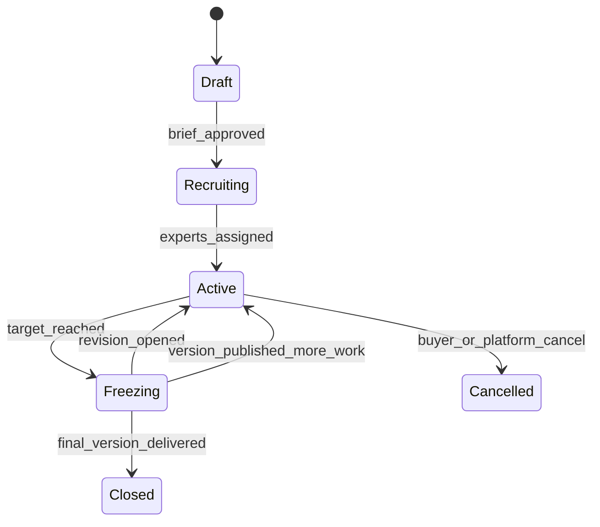
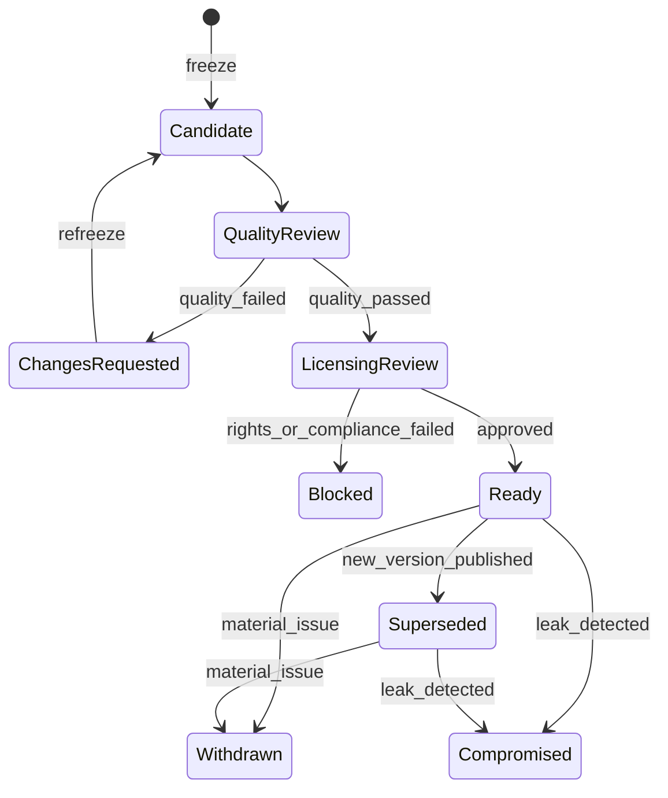
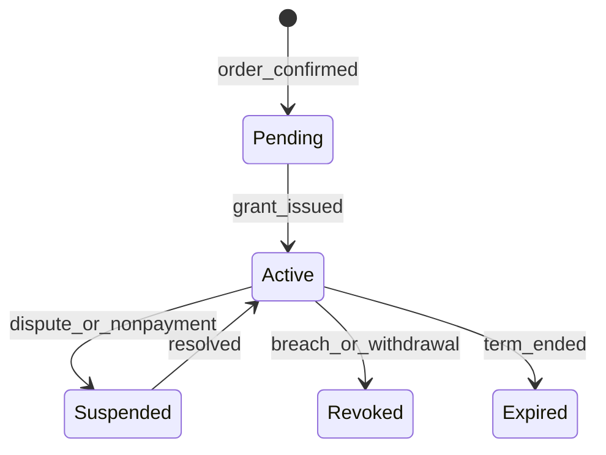

# Re0 专家数据与评测赛道集成方案

- 版本：0.2
- 日期：2026-09-11
- 状态：待评审实施方案
- 冻结范围：第 0–4 节、第 17–22 节为本轮评审对象；第 5–16 节是技术设计草案，在阶段 0 门禁（签约买方）通过前不冻结，允许随买方需求重写
- 依赖基线：[requirement.md](./requirement.md)、[architecture.md](./architecture.md)、[publisher-revenue-share.md](./publisher-revenue-share.md)
- 建议首个试点领域：中文制造业供应链、质量工程与企业运营任务

## 0. 执行摘要

Re0 在现有版本化知识库之外增加一条独立的 **Expert Data & Evals（专家数据与评测）** 产品线，把专家经验转化为可授权、可训练、可评测、可持续更新的数据资产。

本方案不是给知识库增加一个“出售原始文件”的按钮，也不改变现有 Free、Pro、Additional Calls 套餐。专家赛道以买方项目为起点，由平台组织专家生产以下资产：

1. 真实专业任务及输入材料，覆盖文本、图片、PDF 与办公文档、音频、视频等多模态形式；
2. 专家参考成果、推理依据和错误边界，参考成果同样可以是多模态的（标注图、讲解音频、操作演示视频）；
3. 可执行或结构化评分规则；
4. 训练、开发、公开评测、隐藏评测四类隔离数据；
5. 数据来源、权利声明、审核过程和版本摘要；
6. 模型基线报告与持续回归评测。

实施上采用“旁路模块”原则：复用 Re0 的身份、工作空间、对象存储、Workflow、审计、版本化、外部支付和可选存证能力，但不复用 `library`/`chunk` 作为训练样本容器，不把专家收入写入现有 `earning_event`，不让训练数据业务进入知识检索和 Call 计费链路。

运营模式是**订单驱动**：先承接模型公司的数据或评测订单，再根据订单的领域、语言和任务类型从专家池中委派专家定制生产。平台不预先生产资产等买方来买。

专家侧与之配套的是**预注册池**：专家可以在没有订单时先注册、提交专业领域的能力证明并通过平台审核，进入待命状态；订单到来时优先从池中按领域匹配委派。预注册不承诺任务量和收入，也不产生任何付款义务。

首期不开放双边市场，先以一个付费买方、20–30 名专家和 200–500 个任务完成封闭试点。只有通过第 17 节的门禁后，才开放目录、自动授权和规模化招募。

## 1. 产品决策与基线变更

### 1.1 已决事项

- 专家赛道是现有知识库产品的扩展模块，不替换知识库检索产品。
- 产品最小交易单位是一个不可变的 `Data Asset Version`，不是一个专家、一个文档或一个 Chunk。
- 训练数据与隐藏评测数据物理隔离；隐藏评测只通过托管评测服务使用，不允许下载。
- “隐藏”的确切含义：Hidden Eval 的参考成果、Rubric 私有部分和 Item 与 Gold 的对应关系不离开平台；任务输入在评测时必然送达执行模型的一方，无法在技术上做到不暴露。首期隐藏评测只支持平台主动调用买方登记的模型端点（`evaluation_model_config`），不提供输入下载；买方自行上传模型输出的方式只对 `public_eval` 和 `dev` 开放。买方的端点仍然可以记录收到的输入，因此对输入的保护依靠合同禁止留存、Run 配额、Canary 和子集轮换（§8.4），而不是技术隔离；这一点必须在 Data License 和数据卡中如实披露。
- 专家贡献以“重新创作、脱敏、可审查”为默认方式，不接受未经授权的雇主、客户或第三方原始材料。
- 买方项目、授权范围、交付和验收采用 B2B 合同；它不是新的自助 `Enterprise` 套餐。
- 专家收入按明确的制作、复核、验收和续费事件记账，不按知识库调用量计算。
- 链上存证仍是旁路能力，只证明版本摘要未被改写，不证明权属、正确性或训练效果。
- 首期采用平台运营人员创建项目和买方账户的邀请制，不在公共站点展示可购买的数据正文。
- 专家预注册是首期唯一面向公众开放的入口：任何用户都可以建立专家档案、提交能力证明并等待审核；审核通过的专家进入领域标签化的待命池。委派只发生在订单确认之后，按领域匹配、验证状态、过往一致率和可用时间排序，池内专家优先于临时招募。
- 预注册不是雇佣关系，不设保底、不设排队承诺；专家档案的领域标签只影响匹配，不对外展示身份。
- 首期资产类型只有 `instruction_dataset` 和 `evaluation_suite`；`preference_dataset`、`correction_dataset`、`knowledge_corpus` 在有买方需求时按新版本追加，`agent_environment` 及其隔离沙箱不在前三个阶段的范围内。
- 专家只通过浏览器提交；Expert API 与对应 API Key Scope 推迟到阶段 4，首期不增加这部分攻击面。
- **Task Schema 和 Rubric 的设计是专家任务。** 每个项目启动时先委派 `design` 任务给一到两名资深专家，产出该项目的任务模板、Rubric 草案和 3–5 个示例任务；运营和买方确认后冻结进 Brief。平台不自行编写领域 Rubric。
- **审阅其他专家提交的任务是专家的正式任务类型之一。** 复核任务与制作任务一样通过委派进入专家的任务队列，有截止时间、计价和验收，复核结论进入被审阅任务的审核事件；同一个专家在同一项目里可以既做制作又做复核，但不能复核自己的任务或与自己有利益冲突声明的专家的任务。
- **专家是独立模块，不是普通用户的附加档案。** 专家注册、专家领域知识的沉淀和训练集生产都在专家模块内完成，与知识库用户的 Workspace、Dashboard、Library、API Key 和套餐彼此不可见。登录复用同一套 OAuth 身份（一个 `user` 可以同时是知识库用户和专家），但专家身份是单独的 `expert_account`，有自己的注册流程、入口 `/expert`、会话上下文、导航和权限边界；普通 Dashboard 不出现专家入口，专家区也不出现知识库功能。
- 专家产出的领域知识存放在专家模块自己的容器（Expert Knowledge Base，见 §3.5），不是 `library`；它不进入公开检索、Context API、MCP 和 Call 计费，只作为训练集和评测集的生产来源。
- **专家贡献的知识是多模态的。** 除文本外，专家可以贡献图片、PDF 与办公文档、音频、视频，作为多模态模型的训练和评测素材。每个素材带明确的模态标签、来源模式和权利声明。视频的主要形式是屏幕录屏和操作演示；任务发布时明确要求**视频中不得出现人脸**，出现即拒收而不是打码；屏幕上的文字是知识本身，不做打码，只做内容扫描（§9.5）。多模态素材的存储、扫描和导出成本按模态单独计价（§12.1）。

### 1.2 对现有基线的影响

[requirement.md](./requirement.md) §2.3 当前明确排除了“模型训练、原始文件交易、Enterprise 套餐与复杂合同计费”。因此本方案不能被解释为现有 MVP 的一部分。requirement.md 3.1 版已在 §2.4 把它登记为 **MVP 后扩展轨**，边界如下：

- Free、Pro、Additional Calls 的价格、额度和能力不变；
- `/v1/context`、`/v1/libraries/search`、MCP、SDK 与 CLI 的现有契约不变；
- 公开知识库仍然不按库收费；
- 专家数据订单不进入 `Plan Version` 和 Usage Call；
- 现有发布者分成不因专家项目收入扩大或缩小；
- 专家赛道关闭后，知识库发布、刷新、检索、计量、审核与分成完全不受影响。

### 1.3 非目标

首期不做：

- 任意专家上传文件后自动挂牌出售；
- 数据拍卖、代币、NFT 或链上资金流；
- 未经人工评审的全自动训练集生成；
- 向买方承诺“领域知识完整”或“训练后必然提升”；
- 把隐藏评测集作为下载附件交付；
- 通用 RL 训练平台或自建大规模模型训练集群；
- `agent_environment` 资产与隔离执行沙箱；
- 面向专家的 REST API；
- 医疗诊断、法律意见、军工、生物安全等高风险垂直领域的首期交付；
- 平台持有专家资金、银行卡或税务证件。

## 2. 用户与核心场景

### 2.1 角色

| 角色 | 现有身份复用 | 新增能力 |
| --- | --- | --- |
| Expert | `user` 登录身份 + 独立 `expert_account`，不使用 `workspace` | 在 `/expert` 注册、维护专家档案与领域知识库、接受项目、提交任务、响应修改 |
| Expert Reviewer | Expert 承接的复核类任务，不是单独身份 | 在任务队列中接受复核任务、按 Rubric 独立评分、给出返修意见、填写冲突声明 |
| Buyer | `workspace` | 提交数据需求、查看已授权资产、发起导出和评测 |
| Data Operator | `administrator` | 创建项目、分配专家、冻结版本、管理交付 |
| Compliance Reviewer | `administrator` | 审核权利、隐私、商业秘密与出口范围 |
| Finance Operator | `administrator` | 查看订单、专家结算和外部支付状态 |

首期不新增登录系统，OAuth 登录后由用户选择进入知识库 Dashboard 还是专家区。专家模块有独立的账户对象、页面前缀、Use Case 目录和数据表，与普通用户的 Workspace 体系不共享任何列表、导航或配额；运营、合规和财务继续使用独立管理员身份、MFA、Permission 和 Audit Decorator。

### 2.2 买方场景

1. 买方给出目标能力、模型形态、样本格式、允许用途、交付规模和验收指标，运营录入为 Order Request；
2. 平台组织专家完成需求拆解与试产报价，买方确认报价并签署合同，Order 进入 `confirmed`，此时才创建 Project；
2a. 平台把需求冻结为版本化 Project Brief；
3. 专家创建任务，复核专家审核，平台进行安全与权利检查；
4. 系统在冻结时划分训练集和评测集，构建不可变资产版本；
5. 买方按 Brief 约定的抽样方案验收：平台交付验收样本，买方在验收期内逐项给出接受、返修或拒绝，形成 Acceptance Record；验收通过后 License Grant 生效；
6. 买方依据 License Grant 下载被允许的训练部分，或运行隐藏评测；
7. 系统生成固定版本的评测报告和改进建议；
8. 新知识、新规则或买方反馈通过新版本交付，不修改历史版本。

### 2.3 专家场景

预注册阶段（不依赖任何订单）：

1. 用户建立专家档案，选择领域、子领域、语言和地区，提交最少必要的能力证明（执业资格、任职证明、代表性成果的脱敏摘要、同行推荐之一即可）；
2. 平台或验证服务完成身份、履历和利益冲突审核，档案进入 `verified` 待命状态，或以原因码退回补充；
2a. 验证通过后专家在其领域完成一组资格测试任务（`qualification`，每个领域 2–3 个平台预置任务，含一个制作和一个复核），由资深专家按 Rubric 评分；通过后档案获得该领域的 `qualified` 标记，只有 `qualified` 的领域才参与委派；未通过可在冷却期后重测一次；
3. 专家签署 Expert Contributor Agreement（平台级，一次签署长期有效），此时不签任何项目 NDA；
4. 待命期间专家只看到自己的档案状态和平台对该领域的需求提示，看不到任何买方或项目信息。

订单委派阶段：

5. 订单确认后，运营按领域从待命池筛选并发出定向邀请，专家接受后签署项目 NDA；
6. 专家只看到自己被分配的项目范围和资料；
7. 专家在结构化编辑器中提交任务、参考成果、依据、Rubric 和权利声明；
7a. 专家在同一队列中接受复核任务：阅读另一名专家的提交，按 Project Rubric 逐项评分并给出通过、返修或驳回的建议；复核任务有独立截止时间，逾期未完成会重新委派；
8. 审核通过、返修、驳回和采用均形成不可修改的事件；
9. 符合付款条件的事件进入持有期，之后通过外部支付服务出账。

## 3. 产品对象

### 3.0 Expert Order

订单驱动模式的起点，先于 Project 存在：

- `Order Request`：运营录入的买方需求摘要、联系人、期望模态、规模、预算区间和时间窗；
- `Quote`：平台给出的报价版本，包含 Setup、Production、License、Evaluation 各项及试产范围；一个 Order 可以有多版 Quote，买方确认的那一版冻结；
- `Contract Reference`：外部签署系统的合同引用与版本；
- 状态：`draft → quoted → confirmed → in_delivery → accepted → closed`，以及 `declined` 与 `cancelled`。

只有 `confirmed` 的 Order 才创建 Project 并触发专家委派；`accepted` 由验收流程推进（§3.6）。订单不进入自助套餐和 Usage Call。

### 3.1 Expert Project

买方需求的执行边界，由一个 `confirmed` 的 Order 创建，至少包含：

- 目标领域、子领域、语言、地域和任务类型；
- 模型使用方式：预训练、SFT、偏好优化、Agent、评测；
- 目标样本数、难度分布、输入和输出格式；
- 数据允许来源与禁止来源；
- 质量指标、验收抽样、争议和返修规则；
- 数据分类、跨境限制、保留期限与删除要求；
- 预算、专家计价、平台服务费和付款门禁；
- Project Brief 版本、合同版本和 NDA 版本。

Project Brief 一经进入 `active` 不原地修改；范围变化创建新的 Brief Version。

### 3.2 Data Asset

稳定业务对象，类似 `library`，但服务于训练和评测。完整类型集合如下，其中首期只实现前两类（见 §1.1）：

- `instruction_dataset`：任务、上下文和参考成果（首期）；
- `evaluation_suite`：任务、评分规则、专家基线（首期）；
- `preference_dataset`：候选答案、排序与偏好原因；
- `correction_dataset`：错误答案、错误类型和修订结果；
- `agent_environment`：初始状态、工具、轨迹和验证器（阶段 4 之后）；
- `knowledge_corpus`：经过独立授权、允许训练使用的专业语料。

资产可为 `private` 或 `catalog`。`catalog` 只公开数据卡、覆盖范围、样本数量和评测方法，不公开任务正文、参考答案、授权证据或专家身份。

### 3.3 Data Asset Version

不可变的交付版本，固定：

- Project Brief Version；
- 使用的 `library_version_id`（如果由 Re0 知识库提供背景资料）；
- Dataset Schema Version；
- 数据项和附件摘要；
- Train、Dev、Public Eval、Hidden Eval 的划分；
- 权利清单、质量清单和限制清单；
- Reviewer、评分算法与评测环境版本；
- 数据卡、Manifest 和 License Template Version；
- 发布时的统计和基线报告。

新版本通过原子切换 `data_asset.current_version_id` 发布；历史版本不覆盖、不补写任务正文。

### 3.4 Data Item

一个可独立审核、分割和计价的任务单元。不得复用 `chunk`：Chunk 是检索单元，Data Item 是训练或评测单元，两者的权限、版本、结构和泄漏风险完全不同。

建议首个 Schema：

```json
{
  "schemaVersion": "expert-task.v1",
  "itemId": "item_...",
  "language": "zh-CN",
  "domain": "manufacturing.quality",
  "modalities": { "input": ["text", "document"], "output": ["text"] },
  "task": {
    "instruction": "根据来料检验记录判断主要异常并提出处置方案",
    "inputAssets": [
      { "path": "attachments/incoming-inspection.xlsx", "mediaType": "application/vnd.openxmlformats-officedocument.spreadsheetml.sheet" }
    ],
    "constraints": ["只能使用给定记录", "必须标注不确定项"]
  },
  "reference": {
    "outputPath": "reference/item_....md",
    "rationalePath": "reference/item_....rationale.json",
    "mediaAssets": []
  },
  "rubric": {
    "version": "quality-disposition.v1",
    "criteria": [
      { "id": "identify_defect", "weight": 30, "grader": "model", "graderVersion": "judge.v1" },
      { "id": "calculation", "weight": 30, "grader": "executable" },
      { "id": "disposition", "weight": 40, "grader": "expert" }
    ]
  },
  "provenance": {
    "creationMode": "expert_created",
    "sourceLibraryVersionId": null,
    "publicSources": []
  },
  "rightsDeclarationId": "rights_...",
  "difficulty": "hard",
  "tags": ["incoming-inspection", "root-cause"]
}
```

`reference` 在买方训练导出中是否包含，由 License Grant 和 Split 决定；Hidden Eval 永不返回参考答案或 Rubric 的非公开部分。

`modalities` 取值固定为 `text | image | document | audio | video`，输入和输出分别声明。`inputAssets` 和 `reference.mediaAssets` 中的每个素材都有 `mediaType`、字节数、时长或页数、Digest，以及指向 `media_asset` 的引用；素材本身不内嵌在 Payload 里。音视频素材可以附带平台生成的派生物（转写文本、关键帧、章节标记），派生物有自己的 Digest 和生成器版本，导出时与原始素材一起或单独授权。

同一 Suite Version 内，每个 Criterion 只绑定一种 Grader（`executable`、`rule`、`model`、`expert`、`pairwise`），不允许 `human_or_model` 这类运行时再选的写法，否则 §8.3 要求的可复现性不成立。`model` Grader 还必须固定 `graderVersion`，它指向提示、模型、参数和采样次数的一个版本。

### 3.5 Expert Knowledge Base

专家在模块内沉淀领域知识的容器，按专家和领域划分，服务于任务生产而不是检索：

- 每个 `expert_account` 可以有多个领域知识库，每个知识库绑定一个领域标签，内容是专家重新创作的案例、规则、模板、术语表和错误清单；
- 内容以结构化条目存储（`expert_knowledge_entry`），条目类型包括文本、图片、PDF 与办公文档、音频、视频，以及它们的组合（例如一段现场讲解视频加一份对应的检验记录）；每条带模态、Creation Mode 和 Rights Declaration，和 Data Item 使用同一套权利模型；
- 音视频条目上传后由平台生成转写和关键帧供审核使用；专家可以校对转写，校对后的转写是独立的派生条目；
- 它是 Data Item 的上游素材库：委派任务时专家可以从自己的知识库引用条目生成任务，引用关系写入 `data_item.provenance`；
- 它不建立向量索引、不进入 `chunk`、不参与 `/v1/context`、不对买方或其他专家可见；只有本人、被指派的 Reviewer 和 Compliance Reviewer 可读；
- 专家可以在没有订单时持续维护它，平台按领域标签和条目数量了解池内专家的覆盖面，作为委派排序的输入之一；
- 知识库内容本身不出售；只有经过项目流程、审核和发布的 Data Asset Version 才是交易对象；
- 条目记录被哪些 Asset Version 引用。被独占授权项目引用过的条目进入 `locked_exclusive` 状态，在该独占期内不能再被其他项目引用；非独占项目引用过的条目可以复用，但复用关系写入两侧的 provenance 并在数据卡披露。

### 3.6 Buyer Acceptance

验收是订单与付款之间的正式环节，有自己的对象和状态：

- `acceptance_round`：Project、Asset Version 候选、抽样方案版本、验收样本清单、开始与截止时间、状态（`open / passed / failed / expired`）；
- `acceptance_item_decision`：Round、Item、决定（`accept / revise / reject`）、原因码、买方评语；只追加；
- 通过标准由 Brief 冻结（例如抽样 10% 且接受率不低于 95%）；`failed` 触发返修批次并开启新一轮，`expired` 按合同视为通过或顺延；
- `passed` 是 License Grant 从 `Pending` 到 `Active`、`buyer_acceptance_bonus` 记账和 Order 进入 `accepted` 的唯一入口；
- 买方在 Buyer Console 完成验收，验收样本按 Grant 尚未生效前的临时访问规则读取，只能看验收清单内的 Item。

## 4. 与现有系统的集成边界

| 现有能力 | 集成方式 | 硬边界 |
| --- | --- | --- |
| `user` / OAuth | 只复用登录身份 | OAuth 只证明身份，不证明专业资历或内容权利；专家身份是独立的 `expert_account` |
| `workspace` / Member | 只作为买方和资产所有权边界 | 专家不使用 Workspace；首期买方 Workspace 由管理员建立；团队邀请另行上线 |
| Dashboard / 导航 | 不复用 | 专家区是独立前缀 `/expert`，有自己的布局、导航和 i18n 命名空间；普通 Dashboard 不展示专家入口 |
| `api_key` | 新增买方数据 Scope（`assets:*`、`evals:run`） | 现有 Key 默认没有数据导出与评测权限；专家 Scope 推迟到阶段 4 |
| `library_version` | 可作为数据项背景知识的固定来源 | 不把 Data Item 写进 `chunk`，不通过 Context API 导出训练集 |
| 对象存储 | 复用 `ObjectStore` Adapter（当前实现是 Vercel Blob 私有 Store） | 专家附件、隐藏评测与普通上传使用不同前缀；访问隔离在应用层用例中实现，不依赖存储侧角色 |
| Workflow | 复用持久化 Step、幂等和恢复模式 | 使用独立 Operation Type，不进入 Library Refresh 队列状态机 |
| `audit_log` | 记录高风险管理动作 | 正文、PII、证件和商业秘密不得进入日志 |
| Payment Provider | 复用外部收付款原则 | 不复用 Call 计费和发布者收入池，不保存收款账户明细 |
| Anchor | 后续增加新的 Subject 类型 | 不阻塞发布、授权、导出、评测或付款 |
| Policy Engine | 复用“先授权再读数据”的模式 | 不直接复用 Library SourceType/质量筛选语义 |

知识库的读取权限、公开可见性或来源认领，均不自动授予模型训练权。任何从 `library_version` 派生的 Data Asset 都必须重新完成训练用途的 Rights Declaration 和 License Review；“网上公开”“允许 RAG 检索”和“允许商业模型训练”是三种不同的权利状态。

### 4.1 模块下线不变量

删除 `app/expert`、`app/admin/(console)/expert*`、`lib/application/expert-data`、对应 Workflow 和调度入口后：

- Library Search 与 Context 行为不变；
- MCP 两个工具及其计费不变；
- Library Version 发布事务不变；
- `usage_event`、`earning_event` 和 `revenue_period` 不变；
- 发布者分成与专家结算互不成为对方的输入；
- 不需要修改或回填任何 `chunk`。

## 5. 数据模型

所有 ID 使用应用生成的 UUIDv7；时间使用 UTC；金额使用整数最小货币单位和 ISO 4217 币种。正文、证件和大型结构化 Payload 存私有对象存储，Postgres 只存元数据、状态、摘要和 Object Key。

### 5.1 身份与项目

| 表 | 关键字段 | 约束 |
| --- | --- | --- |
| `expert_account` | `user_id`、创建时间、状态、协议版本 | 每个 User 至多一行；专家模块内所有对象以它为所有者，不引用 `workspace` |
| `expert_profile` | `expert_account_id`、展示名、领域标签、语言、地区、状态、可用性、最近委派时间 | 每个 Account 一行；公开展示名与法定身份分离；状态为 `draft / pending_review / verified / rejected / suspended / expired`；委派要求档案 `verified` 且目标领域 `qualified` |
| `expert_qualification` | Profile、领域标签、测试任务集版本、得分、结果、评分者、有效期 | `(profile_id, domain)` 最新一条生效；资格测试任务集由平台维护，正文不进入任何资产 |
| `expert_knowledge_base` | `expert_account_id`、领域标签、标题、状态 | 见 §3.5；不建索引，不进入检索 |
| `expert_knowledge_entry` | Knowledge Base、类型、模态、Payload Key/Digest、Creation Mode、Rights Declaration、状态、独占锁定至 | 只追加版本；被 Data Item 引用后不可删除正文，只能标记撤回；被独占项目引用后锁定 |
| `expert_knowledge_entry_usage` | Entry、Data Item、Asset Version、Grant 独占性 | 引用关系；发布事务在独占 Grant 下检查条目未被其他项目引用 |
| `expert_verification` | `expert_profile_id`、类型、Evidence Key、Evidence Digest、状态、过期时间、Reviewer、退回原因码 | 证据默认只有 Compliance Reviewer 可读；一个档案可有多条不同类型的验证，档案状态由有效验证集合推导 |
| `expert_agreement_acceptance` | Expert、协议类型、协议版本、内容摘要、接受时间、IP/地区 | 只追加；项目激活时固定所需版本 |
| `expert_order` | Buyer Workspace、状态、需求摘要 Key/Digest、期望模态、预算区间、时间窗、当前 Quote、合同引用 | 订单是 Project 的前置；`confirmed` 后才能创建 Project |
| `expert_order_quote` | Order、版本、报价明细 JSON/Digest、试产范围、有效期、状态 | `(order_id, version)` 唯一；买方确认的版本冻结 |
| `expert_project` | Order、Buyer Workspace、标题、领域、状态、数据分类、当前 Brief Version | 买方和项目生命周期边界；一个 Order 对应一个 Project |
| `expert_project_brief_version` | Project、版本、Spec JSON、Spec Digest、合同引用、创建者 | `(project_id, version)` 唯一；激活后不可变 |
| `expert_assignment` | Project、Expert、角色（`designer` / `creator` / `reviewer` / `adjudicator`）、状态、计价版本、利益冲突声明 | `(project_id, expert_id, role)` 唯一；一个专家可以同时持有 creator 和 reviewer |
| `expert_task` | Assignment、任务类型（`qualification` / `design` / `create` / `review` / `revise` / `adjudicate`）、目标 Item（复核、返修和裁决时）、截止时间、状态、委派者 | 专家队列的统一单位；`review` 任务的目标 Item 的 Creator 不能是本人，也不能是冲突声明中列出的专家；同一 Item 的 `review` 任务逾期未完成时可撤回并重新委派 |

### 5.2 资产、数据项与审核

| 表 | 关键字段 | 约束 |
| --- | --- | --- |
| `data_asset` | `public_id`、Project、Owner Workspace、类型、可见性、状态、当前 Version | 存活 `public_id` 唯一；删除使用墓碑 |
| `data_asset_version` | Asset、Label、Brief Version、Corpus Library Version、Schema Version、Manifest Key/Digest、状态、统计 | `(asset_id, label)` 唯一；Ready 后不可变 |
| `data_item` | Asset Version、稳定 Item Key、Split、输入/输出模态、Payload Key/Digest、Creator、Rights Declaration、状态、难度、标签 | `(asset_version_id, item_key)` 唯一 |
| `media_asset` | Owner（Knowledge Entry 或 Data Item）、模态、Media Type、字节数、时长/页数/分辨率、Key/Digest、扫描结果（人脸、人声、屏幕内容分类） | 检出人脸的视频与图片直接拒收，不保留；通过扫描的对象即权威对象，不区分原件与脱敏件 |
| `media_derivative` | Media Asset、类型（转写、关键帧、章节、缩略图）、生成器版本、Key/Digest、状态 | 可重建；导出时按 License 决定是否包含 |
| `voice_release` | Media Asset、说话人（专家本人或其他）、授权来源、状态 | 音频与视频音轨中只允许出现专家本人的声音，由 Contributor Agreement 一次性覆盖；检出其他人声的素材拒收 |
| `data_item_review` | Item、Reviewer、来源 `expert_task`、Review Stage、Outcome、Rubric Scores、Feedback Key、时间 | Reviewer 不能等于 Creator；复核只追加；每条复核必须对应一个已完成的 `review` 任务 |
| `rights_declaration` | Creator、Creation Mode、来源、雇主/客户授权状态、PII/商业秘密状态、证据 Key/Digest、协议版本 | 每个可发布 Item 必须关联一条通过的声明 |
| `quality_report` | Asset Version、算法版本、抽样方案、重复率、协议一致率、失败分布、报告 Key/Digest | 发布时冻结 |
| `acceptance_round` | Project、Asset Version、抽样方案版本、样本清单 Key/Digest、开始/截止、状态 | 见 §3.6；同一 Version 可有多轮 |
| `acceptance_item_decision` | Round、Item、决定、原因码、评语 Key | 只追加；`(round_id, item_id)` 唯一 |

`data_item.split`：

```text
train | dev | public_eval | hidden_eval
```

发布事务必须拒绝以下情况：

- Item 没有通过 Rights Declaration；
- Creator 对自己的 Item 做最终批准；
- Hidden Eval Item 与 Train/Dev 存在相同 Payload Digest，或近重复检查（§7.2 第 12 步）未通过；
- Hidden Eval 数量低于 Brief 约定下限，或任一 Split 中单个创建者占比超过 Brief 约定上限（§8.1）；
- 任何 Split 存在重复稳定 Item Key；
- 项目为独占授权，而某个 Item 引用的知识库条目已被其他项目引用；
- Version 没有数据卡、Manifest、质量报告或 License Template Version；
- 项目所需协议未签署或专家验证已经过期；
- 数据分类不允许当前存储区域或跨境交付；
- 视频或图片中检出人脸，音轨中检出专家本人以外的人声；
- 屏幕录屏中含有未清除的第三方内容：可识别的真实客户或供应商名称、真实人员姓名与联系方式、Secret 与凭证、受版权保护的付费文档正文，或背景音乐。

### 5.3 授权、导出与评测

| 表 | 关键字段 | 约束 |
| --- | --- | --- |
| `license_template_version` | 模板名、版本、Scope Schema、正文摘要、状态 | 已使用版本不可修改 |
| `license_grant` | Buyer Workspace、Asset Version、模板版本、用途 Scope、地区、期限、模型范围、独家性、状态 | 授权校验绑定精确 Asset Version |
| `expert_project_order` | Project、Buyer、外部订单/发票引用、金额、币种、状态、Provider 观察时间 | 与自助订阅收入分开；Webhook 乱序保护和幂等 |
| `data_export` | Grant、Asset Version、允许 Split、状态、Manifest Digest、Object Key、过期时间、创建者 | 不得包含 `hidden_eval`；短期签名下载 |
| `evaluation_model_config` | Buyer Workspace、Provider、端点、模型、参数、Credential Ref、用途、状态 | 与在线试用 `llm_config` 隔离；买方模型凭证不能沿用 `llm_config` 的环境变量方式，需要一个按 Workspace 隔离的 Secret 存储（用 Cookie 密封密钥加密入库，或接入外部 Secret 服务），表里只存引用 |
| `evaluation_run` | Buyer、Suite Version、Model Config/外部输出标识、Runner Version、输入摘要、状态、报告 Key/Digest | 固定 Suite Version、Model Config 和 Runner Version；Hidden Eval Run 必须关联 Model Config，外部输出标识只允许用于 Public Eval；每个 Grant 对每个 Suite Version 的 Hidden Eval Run 次数受配额限制 |
| `evaluation_result` | Run、Item、Score、Grader Type/Version、证据 Key/Digest、是否需裁决 | Hidden Eval 不向买方返回 Item 正文或 Gold |

License Scope 使用权威 Schema 校验，至少固定：

```ts
type DataLicenseScope = {
  allowPretraining: boolean;
  allowFineTuning: boolean;
  allowPreferenceOptimization: boolean;
  allowEvaluation: boolean;
  allowDistillation: boolean;
  allowDerivativeModels: boolean;
  allowRedistribution: boolean;
  allowedSplits: Array<"train" | "dev" | "public_eval">;
  allowedModelFamilies: string[];
  allowedRegions: string[];
  retentionEndsAt: string | null;
};
```

布尔值缺失一律视为 `false`，数组缺失一律视为空，禁止使用“未写即允许”的宽松语义。

### 5.4 专家记账与出账

| 表 | 关键字段 | 约束 |
| --- | --- | --- |
| `expert_payee_account` | Expert、Provider Account ID、KYC/Tax 状态、协议版本 | 平台不保存银行或证件明文 |
| `expert_compensation_event` | Assignment、Item/Review、事件类型、计价版本、金额、币种、状态、原因 | 只追加；幂等键唯一 |
| `expert_settlement` | Payee、账期、应计、调整、可付、持有到期、状态、Statement Digest | 可从 Compensation Event 独立复算 |
| `expert_payout` | Settlement、金额、Provider 引用、状态、失败原因 | 外部支付服务是资金事实来源 |

事件类型首期只允许：

```text
qualification_accepted | design_accepted | creation_accepted | review_accepted |
revision_accepted | adjudication_accepted | buyer_acceptance_bonus |
license_renewal_share | reversal | void
```

不得将 Trust、质量分数或模型成绩直接作为未版本化的付款乘数。计价规则必须在 Assignment 激活时冻结为 `pricing_version`。

## 6. 对象存储

建议新增布局：

```text
expert-verification/{expertHash}/{verificationId}/evidence.*
expert-projects/{projectId}/briefs/{briefVersion}/brief.json
expert-projects/{projectId}/submissions/{assignmentId}/{submissionId}/...
data-assets/{assetId}/{versionId}/items/{itemId}/payload.json
data-assets/{assetId}/{versionId}/items/{itemId}/attachments/...
data-assets/{assetId}/{versionId}/reference/{itemId}/...
media/{ownerType}/{ownerId}/{mediaAssetId}/media.*
media/{ownerType}/{ownerId}/{mediaAssetId}/derivatives/{type}.*
data-assets/{assetId}/{versionId}/manifests/manifest.json
data-assets/{assetId}/{versionId}/reports/datasheet.md
data-assets/{assetId}/{versionId}/reports/quality.json
data-exports/{buyerHash}/{exportId}/package.*
eval-runs/{buyerHash}/{runId}/outputs/...
eval-runs/{buyerHash}/{runId}/reports/...
quarantine/expert-data/{operationId}/{objectId}
```

存储形态的前提：架构基线已于 2026-09-05 改为 Vercel Blob 私有 Store（architecture.md §7）。Blob 没有按前缀的 IAM 角色，也没有生命周期规则，所以下面的隔离和过期全部是应用层责任，不能寄望存储侧配置：

- Store 全部私有；Object Key 不含姓名、邮箱、项目标题或客户名；
- Expert Verification、Hidden Eval、普通 Data Item 使用不同前缀，每个前缀只允许对应的 Use Case 读写；`ObjectStore` 之上加一层按前缀校验调用方的 Guard，任何绕过 Guard 直接调用 Adapter 的代码视为缺陷；
- 应用进程不能直接读取法定身份证明，只有合规 Use Case 可签发短期访问；
- Hidden Eval 的 Gold 与 Rubric 私有部分只能由 Eval Runner 读取；
- 导出对象的过期时间记录在 `data_export.expires_at`，由 drain 收尾时的清理任务删除对象（与 `purge-uploads` 同一模式），签名 URL 的 TTL 不得长于该时间；过期后保留导出摘要和审计记录；
- 撤回（`withdrawn`）的 Asset Version 保留 Payload 对象到合同约定的争议期结束，之后只保留 Manifest 与摘要；争议期内只有 Compliance Reviewer 可读，每次读取写审计；
- 日志只记录 Object ID、Digest、大小和分类，不记录原始路径中的用户输入；
- 删除数据前先撤销 Grant 和下载 URL，再排队执行对象清理；
- 音视频通过 Blob 分片直传，单个素材大小和时长上限由 Project Brief 约定并在上传前校验；平台不做实时转码，派生物由 Workflow 异步生成；扫描未通过的素材在拒收时删除对象，只保留 Digest 和拒收原因；
- 多模态素材的对象存储和出口流量是可变成本的主要来源，必须按 Project 计量并进入 §14.2 的单 Item 成本。

## 7. 核心工作流

### 7.1 状态机

Project、Asset Version 和 License Grant 是三个生命周期不同的对象，各自一个状态机，不合并画在一张图里。

Expert Project：



Data Asset Version：



`Superseded` 只表示不再是 `current_version_id`，已有 Grant 仍可继续导出和评测，因此它同样可以被撤回或标记泄漏。

License Grant：



“Delivered”不是 Version 的状态，而是“存在至少一个 Active Grant 指向该 Version”这一派生事实。`Blocked`、`Withdrawn`、`Compromised`、`Revoked` 必须携带原因码。已经导出的版本不能假装从未存在；撤回只会阻止新的导出和评测，并按合同触发通知、删除或补救流程。

### 7.2 单个 Data Item 工作流

1. `validate-assignment`：验证项目、角色、协议、专家状态和截止时间；
2. `upload-submission`：直传临时前缀，限制类型、大小、文件数和压缩比；
3. `scan`：恶意文件、Secret、PII、商业秘密特征、Prompt Injection 和链接安全；视频与图片检测人脸，检出即拒收；音轨检测说话人数，检出专家本人以外的人声即拒收；屏幕录屏对帧内文字做 OCR，识别真实客户与供应商名称、人员姓名与联系方式、Secret、付费文档正文和第三方界面，命中后进入人工复核而不是自动打码；
4. `derive`：为音视频生成转写、关键帧、章节标记和帧内 OCR 文本，为 PDF 与办公文档生成页图与文本层，供后续审核和评分使用；
5. `sanitize`：剥离文件元数据、重新封装容器；不对画面和音轨做任何打码或变声，屏幕上的文字保持原样；扫描命中且人工复核确认有问题的素材退回专家重新录制或裁剪，平台不代为修改内容；
6. `normalize`：生成权威 Payload，计算稳定摘要，摘要覆盖素材和派生物；
7. `rights-review`：检查 Creation Mode、来源、必要证据和音轨的 `voice_release`；
8. `domain-review`：作为 `review` 类型的 `expert_task` 委派给另一名专家，按 Project Rubric 逐项评分；视频复核基于原视频、转写和关键帧；复核结论是通过、返修或驳回的建议，最终采用由 Operator 或裁决确认；
9. `adjudicate`：分歧超过阈值时由第三名 Reviewer 或 Operator 裁决；
10. `accept-or-revise`：写入只追加审核和补偿事件；
11. `freeze`：达到目标后创建 Asset Version 候选；
12. `split-dedupe`：按内容簇而非逐行随机切分，避免近重复跨 Split；音视频的近重复用感知哈希和转写相似度联合判断；
13. `baseline-eval`：至少在三个固定模型配置上运行基线；
14. `publish`：单事务固定版本、Manifest、质量报告并切换当前版本；
15. `license-export`：授权检查后生成买方专属 Manifest 和短期下载；
16. `anchor`：可选旁路，不影响前述步骤完成。

每一步使用持久化 Step，并保存 Input Digest、输出摘要和 Provider Request ID。重试必须复用幂等键，不得重复生成补偿事件或导出。

### 7.3 发布事务

单个 Postgres 事务完成：

1. 锁定 `data_asset`；
2. 验证候选 Version 属于该 Asset 且所有门禁通过；
3. 把 Version 标记为 `ready` 并写 `published_at`；
4. 切换 `data_asset.current_version_id`；
5. 将上一 Version 标记为 `superseded`；
6. 追加 Publication Audit Event；
7. 提交后异步进入可选锚定队列。

对象存储的 Manifest、Data Card 和质量报告必须先于事务写入。事务失败时未被引用的对象由 Recovery 清理。

## 8. 数据划分与评测隔离

### 8.1 Split 规则

- 划分由 Project Brief 固定；Hidden Eval 按绝对数量而不是百分比约定，试点建议不少于 120 条，低于该数时报告必须标注置信区间过宽；
- 试点规模（200–500 条）下 Public Eval 按 5% 只有 10–25 条，没有统计意义，因此试点不设 Public Eval，Dev 兼作买方可见的样例集；剩余部分进入 Train；
- 同一来源、案例变体、附件模板和语义近重复必须落入同一 Split；
- 同时按创建者分层：任何一个 Split 中单个创建者的占比不得超过 Brief 约定上限（建议 25%），避免 Hidden Eval 被少数专家的风格主导；
- Split 在 Version 发布时冻结，不能通过更新一列把 Eval 数据改成 Train；
- 需要改变 Split 时创建新版本，并在数据卡中披露变化；
- Hidden Eval 不进入搜索索引、知识库 Chunk、普通导出、日志或前端页面缓存。

### 8.2 评分优先级

按以下顺序选择 Grader：

1. 可执行验证：计算结果、结构约束、单元测试、状态变化；
2. 确定性规则：关键词不是首选，只用于明确格式和必备字段；
3. 模型评分：必须固定模型、提示、温度和版本，并与专家判断校准；
4. 专家评分：用于开放式专业成果和争议裁决；
5. 成对偏好：用于难以绝对打分但可以比较质量的产物。

每个 Rubric Criterion 必须记录：定义、权重、通过阈值、Grader 类型、证据要求、已知局限。总分之外必须返回分项和失败类型，避免一个数字掩盖关键错误。

多模态输出（标注图、生成音频、操作视频）的评分优先使用可执行或结构化检查（标注框与参考的重叠度、转写与参考文本的对齐、关键步骤是否出现），模型评分的 `graderVersion` 必须固定所用多模态模型；专家评分可以同时使用原素材和派生物。

### 8.3 基线与报告

每个 Evaluation Suite Version 至少包含：

- 专家基线和抽样方法；
- 三个以上固定模型配置的基线；基线只在与平台签有零数据保留条款的 Provider 上运行，否则基线只在 Dev 集上跑，Hidden Eval 不做外部模型基线；
- 不使用背景知识、使用 Re0 Context、使用买方工具三种模式中适用的对照；
- 总分、分项、置信区间和失败分布；
- Human/Model Judge 一致性抽样；
- 数据覆盖、限制、潜在偏差和已知泄漏风险；
- Runner、Rubric、模型和依赖版本。

### 8.4 防泄漏

- Hidden Eval 由平台调用买方登记的模型端点生成输出，服务端完成评分；买方自行上传输出只对 Public Eval 和 Dev 开放；
- 多模态 Hidden Eval 要求买方端点能接收对应模态的输入；平台以短期签名 URL 或内联字节把素材送到端点，派生物和扫描结果不随请求发送；
- 每个 Grant 对同一 Suite Version 的 Hidden Eval Run 次数有配额（建议每个合同期不超过 10 次），超出需运营审批；高价值 Suite 按合同轮换 Hidden Eval 子集，防止买方通过反复提交按分数调参；
- 返回 Item 级结果时只给稳定匿名 ID、分项和改进方向，不返回 Gold；
- 下载、预览、管理员读取 Hidden Eval 均写审计；
- 对高价值 Suite 注入不影响语义的可追踪 Canary；
- 发现泄漏时标记 Version `compromised`，停止新 Run 并发布新版本；
- Eval Creator 与 Train Item Creator 可以属于同一项目，但同一个具体任务不得跨 Split 复用；
- 买方自带数据默认专属，不进入其他项目、公开目录或通用训练资产。

## 9. 权利、隐私与合规

### 9.1 Creation Mode

每个 Data Item 必须且只能选择一种主来源：

| 模式 | 默认处理 |
| --- | --- |
| `expert_created` | 允许进入审核；要求专家确认未复制受限材料 |
| `public_licensed` | 保存 URL、许可证、抓取时间和内容摘要 |
| `buyer_supplied` | 仅按买方项目用途处理，不进入平台通用资产 |
| `third_party_licensed` | 必须上传或关联授权证据并由 Compliance 审核 |
| `employment_derived` | 默认拒绝，除非存在明确雇主授权和脱密证明 |

“来自个人经验”不能替代权利声明。项目编辑器应逐项询问是否包含雇主材料、客户信息、个人信息、未公开经营信息或受限制出口的数据。

### 9.2 必需协议

上线前由合格法律顾问定稿，系统至少要版本化管理：

- Expert Contributor Agreement；
- Project NDA；
- Expert Code of Conduct 与 Conflict Disclosure；
- Buyer Data License / Data Use Agreement；
- Buyer-Supplied Data Processing Addendum；
- Privacy Notice、删除和申诉流程；
- 侵权投诉、暂停交付和补救规则。

系统只管理协议版本、摘要、接受事实和外部签署引用，不在代码里硬编码法律正文。

### 9.3 数据分类

Project 和 Asset 必须标记：

```text
public | internal | confidential | restricted
```

`restricted` 首期不允许跨境、不允许普通运营预览、不允许离线导出。音视频素材的规则是“不出现人脸、只出现专家本人的声音”（§9.5），因此人脸与他人声音这类敏感个人信息不会进入资产；检出即拒收，不走逐人授权和脱敏流程。跨境评估不按项目逐个做：试点的组合是中国大陆专家加上大概率的境外买方，数据出境、重要数据和行业数据的判断在阶段 0 对整个试点领域一次完成，结论写入 Project Brief 模板；阶段 0 判断为需要申报或不可出境时，试点改为境内买方或停止。涉及医疗、未成年人、生物识别、国家秘密、重要数据或高风险行业时，在完成专项法律和安全评审前拒绝创建项目。

### 9.5 多模态素材的权利

任务发布时对多模态素材的硬性要求写进 Project Brief 和提交页面，专家在上传前必须确认：

- **不出现人脸**：视频与图片中不得出现任何人的面部，包括专家本人；主要形式是屏幕录屏、操作演示、设备与工件特写；检出人脸即拒收，平台不打码；
- **只出现专家本人的声音**：讲解旁白允许，且由 Contributor Agreement 一次性授权（`voice_release`）；检出其他人声即拒收；
- **屏幕文字保持原样**：屏幕上的文字是知识内容，不打码；但录屏前专家必须自行清理真实客户与供应商名称、人员姓名与联系方式、Secret 与凭证、受版权保护的付费文档正文；平台 OCR 扫描命中后退回重录，不代为修改；
- **不含背景音乐和第三方界面**：录屏中出现的第三方软件界面按 `third_party_licensed` 处理，需要该软件的许可允许录制用于训练，否则只能使用平台提供的演示环境或开源工具；
- **拍摄场所**：在雇主、客户或供应商场所拍摄的素材按 `employment_derived` 处理，需要场所方书面授权；专家自建场景或平台提供的演示环境不受此限。

专家撤回本人声音授权时，相关素材标记撤回、新版本移除该素材；已导出的历史版本按 §9.4 处理，合同必须写明平台不能从买方已训练的模型中删除该素材。

### 9.4 删除与撤回

- 未发布 Submission：在不存在法定保留要求时允许删除正文，保留最小审计摘要；
- 已发布 Asset Version：不能静默改写，使用 `withdrawn` 和新版本纠正；
- 已导出数据：按 License 触发买方通知、停止新授权、删除证明或继续使用条款；
- 已训练模型：不得承诺技术上可以从权重中精确删除单个样本，合同必须明确补救边界；
- 链上摘要不可删除，此事实必须在专家和买方协议中披露；
- KYC、税务和付款资料由外部 Provider 按其政策处理。

## 10. API 与契约

所有新契约放入 `contracts/expert-data.ts`，再由 `contracts/api/index.ts` 导出。Route Handler 只能调用 `lib/application/expert-data` Use Case；错误体沿用现有 `ApiErrorBody`（`error.code`、`error.message`、`error.requestId`，可选 `error.reason`），不新增 `details` 字段。

### 10.1 Expert API（阶段 4）

首期专家只通过浏览器提交，不开放以下 API，也不新增对应 Scope。列在这里是为了固定命名，避免以后与 Buyer API 冲突：

```text
GET    /v1/expert/profile
PUT    /v1/expert/profile
POST   /v1/expert/verifications
GET    /v1/expert/assignments
GET    /v1/expert/assignments/{assignmentId}
POST   /v1/expert/assignments/{assignmentId}/submissions
POST   /v1/expert/submissions/{submissionId}/finalize
POST   /v1/expert/items/{itemId}/reviews
GET    /v1/expert/earnings
```

API Key Scope：`expert:profile`、`expert:submit`、`expert:review`。默认 API Key 不自动获得这些 Scope；浏览器写操作继续要求 Session、Origin/CSRF 和项目授权。

### 10.2 Buyer API

```text
GET    /v1/data-assets
GET    /v1/data-assets/{assetId}
GET    /v1/data-assets/{assetId}/versions/{version}
GET    /v1/data-assets/{assetId}/versions/{version}/datasheet
POST   /v1/data-exports
GET    /v1/data-exports/{exportId}
POST   /v1/evaluation-runs
POST   /v1/evaluation-runs/{runId}/outputs
GET    /v1/evaluation-runs/{runId}
GET    /v1/evaluation-runs/{runId}/report
```

`POST /v1/evaluation-runs/{runId}/outputs` 只接受 Public Eval 和 Dev 的输出；Hidden Eval Run 在创建时必须指定 `modelConfigId`，由平台调用买方端点，对 Hidden Eval Run 调用该接口返回 `hidden_eval_protected`。

API Key Scope：`assets:read`、`assets:export`、`evals:run`。每次读取先固定 Buyer Workspace、License Grant、Asset Version 和允许的 Split，再读取任何正文或生成下载 URL。

### 10.3 Admin 用例

仓库没有独立的管理 REST API：管理后台是 `app/admin/(console)` 下的页面直接调用 `lib/application/administration` 用例，`app/api/admin` 只有登录。专家赛道沿用这个模式，新增用例放在 `lib/application/expert-data/administration/`：

```text
expert-profiles     列表、验证审核、暂停
expert-projects     创建、Brief 版本、状态流转
expert-assignments  指派、移除、计价版本
data-assets         冻结、质量报告、发布、撤回
rights-reviews      权利审核队列与裁决
license-grants      创建、暂停、撤销
expert-settlements  账期、调整、出账
```

建议新增 Permission：

```text
expert_identity.review
expert_project.manage
expert_content.review
expert_rights.review
data_asset.publish
data_license.manage
expert_finance.read
expert_finance.manage
```

内容审核、权利审核、资产发布和财务操作不得由一个宽泛的 `expert.manage` 权限覆盖。

### 10.4 稳定错误码

`contracts/errors.ts` 的 `ERROR_CODES` 是封闭数组且是公开契约。专家赛道的错误码并入该数组（新增码是 minor change），不另起命名空间；下列码在首期实现的用例范围内至少包含：

```text
expert_not_verified
expert_agreement_required
assignment_not_active
project_brief_superseded
submission_scan_failed
rights_declaration_required
rights_review_failed
self_review_forbidden
review_conflict
asset_version_not_ready
license_required
license_scope_denied
license_expired
split_not_exportable
hidden_eval_protected
data_region_denied
export_expired
evaluation_runner_failed
```

失败响应不得泄露隐藏评测内容、资历证据、另一位 Reviewer 身份、合同正文或买方私有项目是否存在。

## 11. Web 页面

### 11.0 通知与沟通

- 委派、截止提醒、返修意见、复核结论、验证与资格结果、验收结果通过邮件和站内通知送达；邮件只含事件类型和入口链接，不含任务正文、评分或买方信息；
- 每个 `expert_task` 有一条评论线程，专家与 Operator 在线程内澄清问题；买方与 Operator 的沟通在 Acceptance Round 的线程内进行；专家与买方之间不建立直接沟通渠道；
- 线程内容视为任务的一部分，随任务归档，不进入普通日志。

### 11.1 Expert Dashboard

专家区是独立前缀，不挂在 `/dashboard` 下，有自己的 Layout、导航和空状态：

```text
/expert                       入口与注册
/expert/profile               档案、能力证明、审核状态
/expert/knowledge             领域知识库列表
/expert/knowledge/[id]        知识库条目维护
/expert/opportunities         定向邀请
/expert/assignments
/expert/assignments/[id]
/expert/reviews                被委派的复核任务队列
/expert/earnings
```

首期 `opportunities` 只展示定向邀请，不做公开抢单。`assignments` 和 `reviews` 共用同一个任务模型（`expert_task`），只是按任务类型分页展示；复核页面呈现被审阅任务的全部素材与派生物、Project Rubric 的逐项评分表和返修意见输入，提交前要求确认与 Creator 无利益冲突。`profile` 是预注册入口，在没有任何订单时也可用：展示档案状态、待补材料和退回原因，不展示任何项目。编辑器按 Task Schema 动态渲染，并在提交前强制完成权利问题和利益冲突确认。

### 11.2 Buyer Console

```text
/dashboard/data-projects
/dashboard/data-assets
/dashboard/data-assets/[id]
/dashboard/data-exports
/dashboard/evaluations
/dashboard/evaluations/[id]
```

买方只能看到本 Workspace 的 Project、Grant、Export 和 Run。Catalog Asset 也只展示脱敏数据卡；请求授权进入运营流程，不直接付款下载。

### 11.3 Admin

```text
/admin/experts
/admin/expert-projects
/admin/data-assets
/admin/rights-reviews
/admin/data-licenses
/admin/expert-settlements
```

列表页只显示状态和风险摘要；查看证据、Hidden Eval 或财务详情需要更高 Permission 和新鲜 MFA，并写审计。

所有新增中英文文案继续先写 `lib/i18n/messages/zh.ts`，再补 `en.ts`，组件不得硬编码；专家区文案使用独立的 `expert.*` 命名空间。

## 12. 定价、合同与收入分配

### 12.1 买方收费

首期采用项目制报价，拆分为：

- Project Setup：需求拆解、Schema、Rubric 和试产；
- Data Production：按验收的数据项或批次收费，多模态数据项按模态和时长/页数分档，视频最高、文本最低；
- Media Processing：扫描、转写、派生物生成和存储流量按实际用量计费，不包含在 Data Production 单价内；
- License：按用途、版本、期限、模型范围和独家性收费；
- Managed Evaluation：按 Evaluation Run、模型数量或年度订阅收费；
- Refresh：按新增规则、案例和新版本收费。

订单和发票仍由外部 Payment Provider 处理。Re0 只保存合同外部引用、订单/发票投影、金额、币种和状态。专家项目收入不得混入自助订阅 `revenue_period`。

`expert_project_order` 使用自己的外部订单幂等键和收入分类。即使底层复用 Payment Adapter，也不能让现有 `billing_document` 聚合或 `revenue_period` 把项目收入误认为自助订阅净收入。

### 12.2 专家收入

试点建议：

- Rubric 与模板设计：按项目固定设计费，Brief 冻结后记账；
- 资格测试：通过后按固定单价记账，未通过不付费；测试任务的正文不进入任何资产；
- 接受制作：固定单价；
- 裁决：按次固定裁决费，由平台承担，不从任何一方的制作或复核费中扣减；
- 接受复核：固定复核费，按被复核任务的模态和体量分档，视频复核费高于文本；复核费在复核任务完成并被 Operator 采纳时记账，与被复核任务最终是否通过无关；
- 通过买方最终验收：批次奖励；
- License 续费：仅对合同明确约定的贡献者按固定版本规则分配；
- 返修：区分原任务缺陷与买方范围变化，前者通常不重复付费，后者创建新事件；
- 驳回：最终驳回的 Item 不产生制作费，复核费照付；专家在 Contributor Agreement 中知悉这一点，单个专家的驳回率进入 §14.2 指标但不进入付款计算。

先记账后出账：补偿事件至少运行一个完整项目并完成独立复算，再启用实际 Payout。持有期、最低出账金额和退款回冲必须在上线前配置化定档。

### 12.3 与发布者分成隔离

- `earning_event` 只代表知识库可归因 Call；
- `expert_compensation_event` 只代表专家项目交付；
- 两套事件可以共享外部 Payment Adapter，但不能共享收入池、计价规则或结算批次；
- 查询排序、Asset 排序、专家任务分配不得读取个人预期收益来改变质量判断；
- 同一人既是 Publisher 又是 Expert 时，两类收入分别在 `/dashboard` 和 `/expert` 展示，不做汇总。

## 13. 安全设计

### 13.1 授权顺序

所有数据正文读取固定执行：

```text
authenticate
  -> resolve workspace
  -> authorize role/scope
  -> resolve active license grant or assignment
  -> pin asset version
  -> enforce split and data region
  -> create audited access decision
  -> read object
```

禁止先生成对象存储 URL，再检查 License。任何下载 URL 必须绑定 Export ID、过期时间和单一 Buyer Workspace。

### 13.2 隔离与最小暴露

- Expert 看不到买方未明确开放的身份和合同价格；
- Buyer 默认看不到 Expert 法定身份、联系方式和资历证据；
- Domain Reviewer 看不到 Creator 的付款信息；
- Finance Operator 看不到任务正文；
- 普通 Operator 看不到 KYC/Tax 原像；
- 评测服务只获取运行所需的 Hidden Eval 和买方输出；
- Query、任务正文、参考答案和专家证据不进入普通日志与 Analytics。

### 13.3 内容安全

沿用现有上传安全策略，并增加：

- Office/PDF 中的批注、隐藏 Sheet、修订记录和文件属性清理；
- 图片、音频、视频的 EXIF、GPS、设备标识和录制元数据剥离；
- 音视频只接受受限的容器与编码白名单，上传后重新封装，不透传原始容器；
- 结构化 PII 检测和人工复核队列；
- 相似度检查，识别复制的付费报告、题库和雇主模板；
- 任务附件中的宏、脚本和外部链接默认禁用；
- （阶段 4）Agent Environment 在隔离沙箱运行，禁止访问生产网络和平台 Secrets；
- 高风险内容使用独立项目、权限和保留政策，不与普通专家任务共用队列。

## 14. 可观测性与审计

### 14.1 Trace 字段

允许记录：

```text
request_id, trace_id, actor_digest, workspace_id, project_id,
asset_id, asset_version_id, item_id, assignment_id, license_grant_id,
export_id, evaluation_run_id, operation, status, latency_ms,
input_digest, output_digest, object_bytes
```

禁止记录：任务正文、Gold、Rubric 私有部分、合同正文、证件、邮箱、完整模型输出和签名下载 URL。

### 14.2 指标

- Expert 验证通过率和平均周期；
- 招募、接受、首稿、返修和最终验收周期；
- Item 首次通过率、返修率、驳回原因；
- Reviewer 一致性、裁决率和 Rubric 分项差异；复核任务的按时完成率和重新委派率；
- 权利审核失败率及原因；
- Split 重复率、泄漏事件和 Hidden Eval 访问次数；
- Export 成功率、过期清理和授权拒绝；
- Eval Run 成功率、成本、时长和 Grader 分歧；
- 每个被接受 Item 的完全成本和毛利；
- Compensation Event、Settlement 与 Payout 的可复算差异。

### 14.3 必须审计的动作

- 查看或下载专家验证证据；
- 修改 Project Brief 状态；
- 指派或移除专家；
- 权利审核、人工裁决和资产发布；
- 创建、暂停、撤销 License Grant；
- 生成或重复生成 Export；
- 查看 Hidden Eval 原文；
- 撤回已交付 Asset Version；
- 创建调整、作废、Settlement 和 Payout。

## 15. 代码组织与迁移

### 15.1 建议目录

```text
app/
  expert/
  dashboard/data-assets/
  dashboard/evaluations/
  admin/experts/
  admin/expert-projects/
  admin/data-assets/
  api/v1/data-assets/
  api/v1/data-exports/
  api/v1/evaluation-runs/
contracts/
  expert-data.ts
lib/
  domain/expert-data/
  application/expert-data/
    administration/
    accounts/
    profiles/
    knowledge/
    projects/
    submissions/
    reviews/
    assets/
    licensing/
    exports/
    evaluations/
    compensation/
  infrastructure/
    evaluation/
workflows/
  process-expert-submission.ts
  build-data-asset.ts
  build-data-export.ts
  run-expert-evaluation.ts
  settle-expert-compensation.ts
```

保持现有分层约束：Domain 不依赖 Next.js、Vercel、Payment 或模型 SDK；Route 与管理页面不能直连表；模型和评分 Provider 只出现在 Infrastructure 或 Workflow。

### 15.2 Migration 拆分

当前最新迁移为 `0036`；实际实施时按仓库最新序号重排。建议四个 Expand-only Migration：

1. `0037_expert_identity_and_projects.sql`
   - Expert Account、Profile、Verification、Qualification、Agreement、Knowledge Base、Knowledge Entry、Order、Quote、Project、Brief、Assignment、Task；
2. `0038_expert_data_assets.sql`
   - Asset、Version、Item、Media、Review、Rights、Quality、Acceptance；
3. `0039_data_licenses_exports_and_evals.sql`
   - License、Grant、Project Order、Export、Evaluation Model Config、Run/Result；
4. `0040_expert_compensation.sql`
   - Payee、Compensation Event、Settlement、Payout。

这些迁移不修改 `library`、`chunk`、`usage_event`、`earning_event` 的既有列。只有确有需要时为 `api_key` Scope Schema 和 Anchor Subject Enum 做单独 Expand Migration。

### 15.3 Feature Gate

不使用公开套餐名控制。首期以数据库资格控制：

- 进入 `/expert` 需要 `expert_account` 存在；被委派需要 `expert_profile.status = verified` 且目标领域存在有效 `expert_qualification`；
- 知识库 Dashboard 的任何页面、API 和 MCP 工具不读取专家模块的表；
- Buyer Workspace 必须有有效 Project 或 License Grant；
- Admin 用例需要新 Permission；
- 公共导航只有在产品正式开放后才展示入口；
- 未获资格的访问统一返回 404（对象不存在）而不是 403，403 本身就是存在性信号；只有已被授权但 Scope 不足的情况返回 `access_denied`。

## 16. 测试策略

### 16.1 Contract Tests

- Route 与 `contracts/expert-data.ts` 一致；
- 缺失 License、过期 License、错误 Split 和错误 Region 返回稳定错误；
- API、Dashboard 和 Worker 对同一访问决定固定相同 Asset Version；
- Hidden Eval 响应永不包含 Payload、Gold 或 Rubric 私有字段；
- API Key 默认无新增 Scope，显式授权后才可调用。

### 16.2 Domain 与 Integration Tests

- Expert 验证、协议版本和 Assignment 组合矩阵；
- Creator 不能最终复核自己的 Item；
- 审核、返修和裁决事件只追加且幂等；
- Rights Declaration 未通过不能进入 Ready Version；
- 近重复 Item 不能跨 Train 和 Eval；
- 发布事务失败不切换 `current_version_id`；
- Export 只包含 Grant 允许的 Split 和字段；
- Grant 在导出进行中被撤销时 Fail Closed；
- Eval Run 固定 Suite、Runner、Rubric 和 Model Config；
- Compensation Event 重试不重复记账，Settlement 可独立复算。

### 16.3 Security 与 E2E Tests

- 跨 Workspace 枚举 Asset、Project、Export 和 Eval Run 失败；
- 签名 URL 过期、篡改或跨 Buyer 复用失败；
- Reviewer、Finance、Operator 的内容可见性符合最小权限；
- 恶意 Office/PDF、宏、外链、Secret、PII 和压缩炸弹进入隔离；
- Hidden Eval 不进入搜索索引、缓存、日志和导出；
- 撤回资产后新导出和新评测立即失败，历史审计仍可读；
- 删除模块后现有 Search、Context、MCP、Usage 和 Publisher Revenue 测试全部保持通过。

## 17. 实施路线与上线门禁

### 阶段 0：需求验证与制度准备（2–4 周）

交付：

- 与至少 5 家潜在买方访谈，其中至少 2 家共同提供真实需求样例；
- 确定首个领域、Task Schema、Rubric、交付格式和预算，并明确首个订单需要哪些模态；文本与文档模态首期必做，音视频模态只在首个订单明确需要时进入阶段 1，否则推到阶段 2；
- 完成 Contributor Agreement、NDA、Data License 的法律评审；
- 上线专家预注册页面和管理后台的验证审核队列（这是阶段 0 唯一进入代码库的功能，Migration 1 中与 Expert Profile、Verification、Agreement 相关的部分提前到此阶段）；
- 通过预注册池积累并审核 20–30 名候选专家，验证资历和单位成本；为首个领域预置资格测试任务集，让首批专家完成资格测试；池中已验证且合格专家的领域覆盖同时作为对买方的销售材料；
- 用人工流程制作 20 个样例并在至少 3 个模型上跑基线；
- 付款可行性：现有发布者分成假设 Stripe Connect 一类服务承担 KYC 与税务，但 Stripe Connect 不支持中国大陆个人收款，且向大陆个人支付劳务报酬有代扣代缴义务。阶段 0 必须选定能向试点专家出账的 Provider 并确认税务处理方式，否则专家收入条款无法签署；
- 跨境可行性：对试点领域完成一次数据出境与重要数据判断（§9.3），确定首个买方所在法域是否可交付。

门禁：至少 1 个付费试点或具有预算与验收人的正式采购意向；付款和跨境两项可行性有明确结论；任一项不满足则停止开发，不先建设开放市场。预注册池不受此门禁约束，可以持续开放和审核，但没有订单时不做任何委派。

### 阶段 1：内部运营 MVP（4–6 周）

阶段 1 先用最少的软件把第一个资产版本做出来，验证的是 §19.3 第二条：专家数据是否与公开资料和模型生成数据有可测差异。专家提交、复核和权利声明用表单和私有对象存储承接，Manifest、Split 和质量报告由脚本生成，只有 Migration 1–2 和管理后台的最小闭环进入代码库。结构化编辑器、自动扫描队列、裁决流程等到第二个项目再建。

交付：

- Migration 1–2；
- Admin Order、Project、Assignment 与 Rights Review 的最小闭环（列表、状态流转、审核结论录入）；
- `design` 任务产出首个领域的 Task Schema 与 Rubric 并冻结进 Brief；
- Expert Profile 与 Assignment 页面；提交本身用表单加私有对象存储承接，不做结构化编辑器；复核任务在同一页面以最小形式提供（素材预览、逐项评分、返修意见）；
- 脚本化的扫描、Payload Digest、冻结、Split 与 Version Manifest；
- 200–500 个任务的首个资产版本；
- 暂不启用自动导出、自动付款和公共 Catalog；结构化编辑器、自动扫描队列和裁决流程推迟到第二个项目。

门禁：

- 100% 已接受 Item 有通过的 Rights Declaration；
- 100% 最终复核由非 Creator 完成；
- Train 与 Eval 的精确及近重复检查通过；
- 资产版本可由 Manifest Digest 完整重建和核对；
- 每个 Item 的实际成本、周期和返修原因可统计。

### 阶段 2：买方交付与隐藏评测（4–6 周）

交付：

- Migration 3；
- License Grant、Export 和短期下载；
- Hidden Eval Runner、基线和报告；
- Buyer Console 与 API；
- Buyer Acceptance Round 与验收样本访问；
- 数据撤回、授权撤销和泄漏响应演练。

门禁：

- 对禁止 Split 的导出为零；
- 任取 Export 可证明其精确 Asset Version、Grant 和 Manifest；
- Hidden Eval 在普通应用角色、日志、缓存和导出中均不可见；
- 评测结果与专家人工抽样达到 Project Brief 约定的一致性；
- 买方完成书面验收或形成明确返修清单。

### 阶段 3：专家结算与可重复运营（4–6 周）

交付：

- Migration 4；
- Compensation Event、Settlement、收益 Dashboard；
- 先记账一个完整项目并独立复算；
- 接入外部 Payout；
- 项目级毛利、交付周期和质量 Dashboard。

门禁：

- 任取 Settlement 可从 Compensation Event 独立复算；
- 幂等重试不产生重复收益；
- 调整与回冲使用新事件，不修改历史事实；
- 外部 Provider 的支付状态与本地投影一致；
- 首个项目在包含专家、审核、模型、存储和运营成本后毛利为正。

### 阶段 4：目录化与规模化

只有前三阶段通过后再交付：

- 脱敏 Catalog 和授权申请；
- 预注册池的自动匹配与排序（首期由运营手工从池中筛选）；
- 多买方 License 和续费分配；
- 资产持续更新与回归评测；
- 可选 Data Asset Version、Eval Report 和 Settlement Anchor；
- 更多垂直领域。

## 18. 试点领域方案

建议以“中文制造业供应链与质量工程中的数字化桌面任务”为首个垂直方向，原因是：

- 中国和亚洲具有较密集的专业人才供给；
- 通用互联网语料难覆盖真实表格、报告、异常处置和跨角色流程；
- 很多结果可以通过计算、结构规则和专家 Rubric 联合验证；
- 可以使用专家重新创作的脱敏案例，减少直接使用企业原始文件；
- 相比医疗和法律，首期责任风险相对可控。

首批任务簇：

1. 供应商交付风险识别与分级；
2. 来料检验和制程异常归因；
3. 8D/CAPA 报告审查与修订；
4. 库存、交期和缺料数据分析；
5. BOM、变更单和版本冲突检查；
6. SOP 与现场记录一致性检查；
7. 质量成本和良率改善方案；
8. 中英双语供应商沟通与证据整理。

任务优先选择“输入明确、输出可检查、错误有业务后果但不直接涉及人身安全”的场景。所有样例使用重新构造或获得买方授权的数据，不接受专家直接上传前雇主表格。

## 19. 成功指标与停止条件

### 19.1 产品指标

- 有效买方需求到首个可评测样例的时间；
- 每个通过 Item 的完全成本和生产周期；
- 首次通过率、返修率和专家流失率；
- Reviewer 一致性和人工裁决率；
- 模型基线是否暴露稳定、可解释的能力差距；
- 训练或提示优化后相对 Hidden Eval 的提升；
- 买方验收率、复购率和版本续费率；
- 每个项目的贡献毛利。

### 19.2 合规与安全指标

- 已接受 Item 的 Rights Declaration 覆盖率必须为 100%；
- 未经授权的 Hidden Eval 读取和导出必须为 0；
- 跨 Workspace 内容泄漏必须为 0；
- 资历证据、PII、合同和 Gold 进入普通日志的数量必须为 0；
- 任何版本、导出、评测和结算必须能用摘要与事件独立复核。

### 19.3 停止或收缩条件

出现任一情况，应停止开放市场扩张，回到项目制或终止该领域：

- 没有买方愿意为试产和评测付费；
- 专家主要贡献无法与公开资料或模型生成数据形成可测差异；
- 单位审核和合规成本长期高于买方可接受价格；
- 买方只需要短期人力外包，不需要可复用的数据资产；
- 无法可靠隔离训练数据和隐藏评测；
- 权利证据无法覆盖目标领域的多数任务；
- 模型迭代速度使资产在交付前已经饱和且无法通过持续更新改善。

## 20. 首批工程任务清单

按依赖顺序实施：

1. ~~将本方案的产品边界写入下一版 `requirement.md`~~（已完成，见 requirement.md §2.4）；
2. 新建 `contracts/expert-data.ts`，先冻结 Project、Item、Rights、License 和 Eval Schema；
3. 实现 Migration 1 和 Domain Invariants；
4. 实现 Admin Project/Assignment 与 Expert Profile/Assignment 页面；
5. 用表单和私有对象存储承接 Submission，脚本完成扫描、Payload Digest 和 Quarantine；
6. 实现 Rights Review 和 Domain Review 的结论录入与自审禁止；裁决先由 Operator 人工处理；
7. 实现 Migration 2、Asset Freeze、Split/Dedupe、Manifest 和原子发布；
8. 完成 20 个真实任务的内部纵切验证，再扩到 200–500 个；
8a. 第二个项目启动前再建结构化编辑器、自动扫描队列和裁决流程；
9. 实现 Migration 3、License Decision、Export 和 Hidden Eval Runner；
10. 完成权限、泄漏、撤回和 Recovery 演练；
11. 买方书面验收后实现 Migration 4 和一个项目的影子结算；
12. 影子结算可复算后才启用实际 Payout；
13. 连续两个项目达到质量、合规和毛利门禁后，再建设 Catalog；
14. 最后评估是否把 Data Asset Version、Eval Report 和 Expert Settlement 纳入存证。

## 21. 待评审决策

这些问题必须在对应阶段开始前定档，但不阻塞阶段 0：

1. 首个付费买方及其数据是否允许形成非独家通用资产；
2. 首个领域的 Task Schema、Rubric、Hidden Eval 数量下限和创建者占比上限；
3. 专家资历验证由平台完成还是接入第三方；预注册阶段接受哪些能力证明类型、验证有效期多长；
4. Buyer Workspace 在团队功能上线前的管理方式；
5. 数据和 Hidden Eval 的首个部署区域；
6. 允许的模型 Provider、模型输出保留期和是否允许外发评分；
7. 任务制作、复核、返修、奖励和续费分成的计价版本；
8. License 的标准期限、模型范围、独家性和删除证明；
9. 哪些质量门禁使用平台统一阈值，哪些由 Project Brief 指定；
10. 存证 Subject 扩展是否具有真实买方需求；
11. 能向中国大陆个人专家出账的 Payment Provider 及税务处理方式（阶段 0 前定档）；
12. 试点领域的数据出境结论与首个买方所在法域（阶段 0 前定档）；
13. 买方模型凭证的 Secret 存储方案（阶段 2 前定档）；
14. Hidden Eval Run 配额与子集轮换规则（阶段 2 前定档）；
15. 首期支持的模态范围、单素材大小与时长上限、人脸与人声检测的技术手段和误拒申诉流程（阶段 1 前定档）；
16. 专家本人声音授权在 Contributor Agreement 中的条款、撤回后的补救边界，以及录屏中第三方软件界面的许可判断规则（阶段 1 前定档）；
17. 复核任务的委派规则：每个 Item 需要几名 Reviewer、复核截止时长、逾期重新委派的条件、复核费分档（阶段 1 前定档）；
18. 裁决规则：触发裁决的分歧阈值（建议 Rubric 总分差超过 20 分或通过/驳回结论相反）、裁决者的资格、裁决结论如何回写 Reviewer 一致率（阶段 1 前定档）；
19. 通知渠道：邮件 Provider 的选择与模板、站内通知的保留期、评论线程是否允许附件（阶段 1 前定档）；
20. 知识库条目的独占锁定期与非独占复用的披露方式（阶段 2 前定档）；
21. 资格测试任务集的题量、通过线、冷却期与重测次数（阶段 0 前定档）；
22. 验收抽样方案的默认参数与 `expired` 的合同后果（阶段 2 前定档）。

## 22. 外部依据

- OpenAI 说明模型数据来源包括公开信息、第三方合作以及用户、研究人员和人工训练者提供或生成的数据：<https://help.openai.com/en/articles/7842364-how-chatgpt-and-our-language-models-are-developed/>
- OpenAI GDPval 使用有经验的行业专业人士构建真实工作任务和专家评测：<https://openai.com/index/gdpval/>
- Anthropic 建议专业评测使用领域专家、专家基线、非训练数据和可复现文档：<https://www.anthropic.com/news/a-new-initiative-for-developing-third-party-model-evaluations>
- 中国《生成式人工智能服务管理暂行办法》要求训练数据来源合法、尊重知识产权、保护个人信息并开展标注质量管理：<https://www.cac.gov.cn/2023-07/13/c_1690898327029107.htm>
- 欧盟 GPAI 规则要求版权政策和训练内容摘要：<https://digital-strategy.ec.europa.eu/en/faqs/guidelines-obligations-general-purpose-ai-providers>
